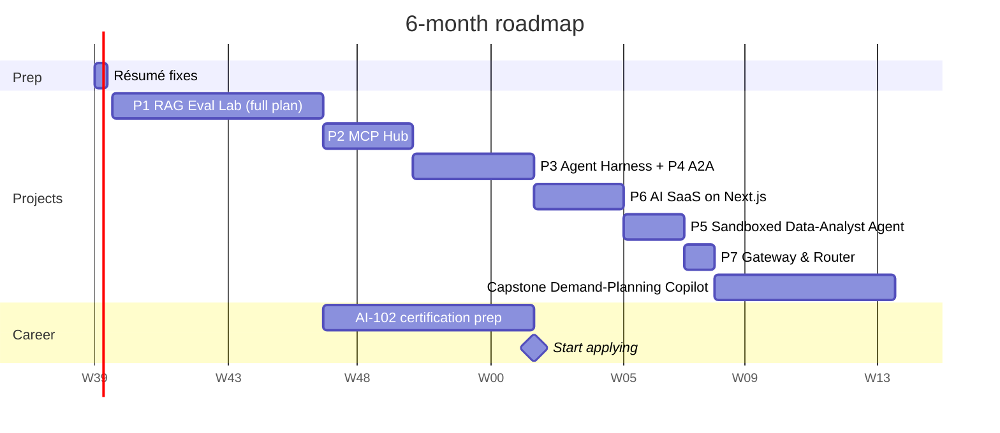

# 6-Month Roadmap (≈12–15 hrs/week)

This assumes your current profile (LangGraph, MCP, RAG, guardrails, FastAPI, React, Azure/AWS). The
roadmap skips fundamentals and goes straight to your gaps: **evals → observability → agent breadth →
Next.js → public portfolio**.

> **Updated:** Project 1 now follows its **full build plan** including the new **agentic mode**
> (20 features, about 94 h, **7 weeks**; see
> [Project 1 build plan](projects/01-rag-eval-lab/docs/08-build-plan/README.md)). Everything after it
> moves back accordingly. The durations for Projects 2–7 and the capstone are still estimates and will be
> revised as each project's build plan is written.

| Weeks | Focus | Project | Gap closed | Output |
|---|---|---|---|---|
| **0 (3 days)** | Résumé fixes | — | Typos, timeline issues, headline | Updated CV + LinkedIn |
| **1–7** | Evals + observability + agentic RAG | #1 RAG Eval Lab (full plan) | Ragas/DeepEval, CI gates, Langfuse/OTel, rerankers, pgvector, LangGraph agent + trajectory evals, Terraform on Azure | Deployed demo + ablation report + agent-vs-pipeline report + post |
| **8–10** | Remote MCP | #2 MCP Hub | OAuth 2.1, MCP client, gateway, tool-design evals | Open-source MCP server + gateway |
| **11–14** | Agent reliability | #3 Agent Harness (+ #4 A2A) | Agent SDKs, HITL, memory, framework comparison, A2A | Framework comparison report |
| **15–17** | Full-stack | #6 AI SaaS on Next.js | Next.js, Vercel AI SDK, resumable streams, billing | Deployed SaaS |
| **18–19** | Sandboxing + generative UI | #5 Data-Analyst Agent | E2B, sandbox security, generative UI | Repo + threat model |
| **20** | Cost engineering | #7 Gateway & Router | Semantic cache, routing, cost metrics | Cost report |
| **21–26** | Capstone | 🏆 Demand-Planning Copilot | Brings everything together | Public demo + video + blog |

## Project 1 in detail (weeks 1–7)

| Week | Milestone | Features | Exit check |
|---|---|---|---|
| 1 | M1 Skeleton | F0 Foundation · F1 EDGAR fetch · F2 Parsing · F3a fixed-512 chunking | Parsed filings with sections for 2 companies |
| 2 | M1 → M2 | F4 Embedding · F5a Dense retrieval · F8a Basic generation · F9 API/SSE · F10 Observability | Streamed answer via `curl`; traces in Langfuse |
| 3 | M2 Measure | F11a Golden set v0 (30 Qs) · F12 Eval runner | **Baseline A0 recorded** |
| 4 | M3 Improve | F3b Structural/tables/ctx · F5b Hybrid + filters · F6 Reranking · F7 Query understanding · F8b Citations + abstention · F14a Ablations | A0–A7 results table |
| 5 | M4 Protect | F11b Golden set v1 (150 + 20 holdout), judge labels · F13 CI gate | Demo bad PR **blocked** by the gate |
| 6 | M5 Agentic | F18 LangGraph research agent (tools, guard, router, `step` events) · F19 Trajectory evals, agent vs pipeline | Agent-vs-pipeline report; `auto` router set from the numbers |
| 7 | M6 Ship | F15 Streamlit UI · F16 Azure deploy · F17 Feedback loop · F14b Report + blog | Public demo URL, README results, post |

**Start applying at week 14**, once Projects 1–3 are public: evals and CI gates, agentic RAG with
trajectory evals, an MCP platform, and an agent framework comparison, on top of your experience. Keep building while you interview; the capstone
makes a good "what are you working on now?" answer. If you need to apply sooner, **week 7** is a
reasonable earlier point, because Project 1 alone already closes the biggest gap (evals + observability)
and shows agent evaluation too. Short on time? Project 1's agentic milestone (week 6) can be skipped
without breaking anything else; the agent work then happens in Project 3.

## Weekly rhythm
- About 60% building, 20% reading docs/papers, 20% writing (README, LinkedIn post).
- Every Friday, record that week's numbers: quality, latency, cost.

## Certification
- **Azure AI Engineer Associate (AI-102)**: this fits your Azure experience and gets you past ATS filters
  at Indian GCCs, consultancies and Middle-East enterprises. You can do it alongside weeks 8–14.
- Optional: AWS Certified Generative AI Developer, if you're targeting AWS-heavy companies.

## Interview prep alongside

| Role | System design practice | Deep-dive topics |
|---|---|---|
| GenAI Engineer | Enterprise RAG at scale; eval pipeline; LLM gateway | Embeddings, reranking, chunking trade-offs, judge calibration |
| Agent Engineer | Agent platform with MCP gateway, HITL, memory; multi-agent failure handling | MCP spec (transports, auth, elicitation), A2A, trajectory evals, sandboxing |
| AI Full-stack Engineer | Streaming chat/agent SaaS end to end; generative UI | RSC/streaming, resumable streams, multi-tenancy, rate limiting, billing |

Behavioural stories you already have:
- Leading 5 engineers
- The Unilever Funnel Automation (+50% accuracy)
- Building the Responsible-AI middleware
- API-contract governance between Python and TypeScript teams

## Keywords for your résumé and LinkedIn

**Already true:** Python · FastAPI · LangGraph · LangChain · AutoGen · MCP · FastMCP · Multi-agent Systems ·
RAG · Hybrid Search · Pinecone · Azure AI Search · Azure OpenAI · Azure AI Foundry · AWS Bedrock ·
Structured Outputs · Pydantic · Guardrails · PII Redaction · Prompt-Injection Defense · HITL ·
React · TypeScript · Kafka · Docker · Kubernetes · Terraform

**Add as you finish each project:** Evals (Ragas, DeepEval, promptfoo) · LLM-as-Judge · Agentic RAG ·
Trajectory Evals · Langfuse · LangSmith · OpenTelemetry · Rerankers · pgvector · Remote MCP / OAuth 2.1 ·
A2A · OpenAI Agents SDK · Claude Agent SDK · E2B / Sandboxed Code Execution · Next.js ·
Vercel AI SDK · Generative UI · Semantic Caching · LiteLLM · Model Routing
