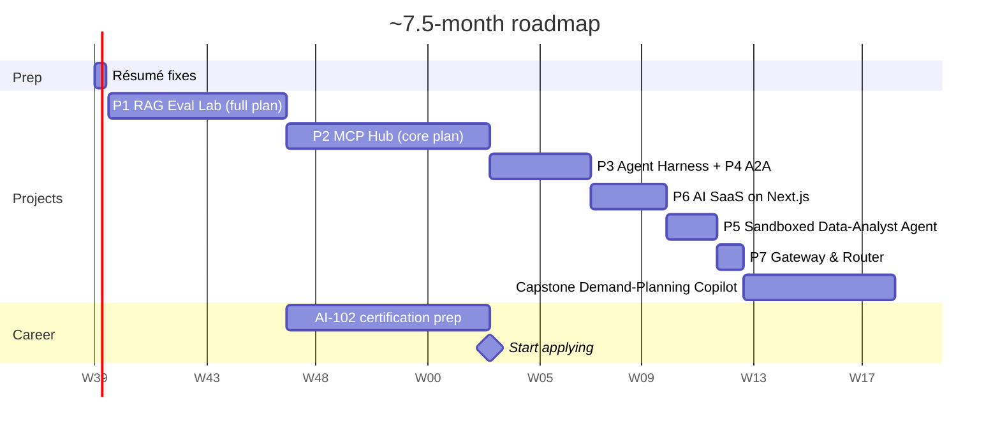

# ~7.5-Month Roadmap (≈12–15 hrs/week)

This assumes your current profile (LangGraph, MCP, RAG, guardrails, FastAPI, React, Azure/AWS). The
roadmap skips fundamentals and goes straight to your gaps: **evals → observability → agent breadth →
Next.js → public portfolio**.

> **Updated:** Projects 1 and 2 now follow their detailed build plans:
> - **Project 1:** full plan incl. agentic mode, 20 features, ~94 h, **7 weeks**
>   ([build plan](projects/01-rag-eval-lab/docs/08-build-plan/README.md))
> - **Project 2:** **core plan (Option B)**, 20 features, ~103 h, **8 weeks**
>   ([build plan](projects/02-mcp-hub/docs/09-build-plan/README.md)); admin console, Tasks and the GitHub
>   upstream are deferred
>
> Together that's 5 weeks more than the original 6-month plan, so the whole roadmap is now about
> **31 weeks (~7.5 months)**. Durations for Projects 3–7 and the capstone are still estimates and will be
> revised as each project's build plan is written.

| Weeks | Focus | Project | Gap closed | Output |
|---|---|---|---|---|
| **0 (3 days)** | Résumé fixes | — | Typos, timeline issues, headline | Updated CV + LinkedIn |
| **1–7** | Evals + observability + agentic RAG | #1 RAG Eval Lab (full plan) | Ragas/DeepEval, CI gates, Langfuse/OTel, rerankers, pgvector, LangGraph agent + trajectory evals, Terraform on Azure | Deployed demo + ablation report + agent-vs-pipeline report + post |
| **8–15** | Remote MCP + MCP security | #2 MCP Hub (core plan) | MCP 2026-07-28, OAuth 2.1 (CIMD, token exchange), MCP gateway, OPA, TS SDK, tool-design + security evals | Open-source server on PyPI/npm + MCP Registry, secure gateway, 3 reports |
| **16–19** | Agent reliability | #3 Agent Harness (+ #4 A2A) | Agent SDKs, HITL, memory, framework comparison, A2A | Framework comparison report |
| **20–22** | Full-stack | #6 AI SaaS on Next.js | Next.js, Vercel AI SDK, resumable streams, billing | Deployed SaaS |
| **23–24** | Sandboxing + generative UI | #5 Data-Analyst Agent | E2B, sandbox security, generative UI | Repo + threat model |
| **25** | Cost engineering | #7 Gateway & Router | Semantic cache, routing, cost metrics | Cost report |
| **26–31** | Capstone | 🏆 Demand-Planning Copilot | Brings everything together | Public demo + video + blog |

## Project 1 in detail (weeks 1–7)

| Week | Milestone | Features | Exit check |
|---|---|---|---|
| 1 | M1 Skeleton | F0 Foundation · F1 EDGAR fetch · F2 Parsing · F3a fixed-512 chunking | Parsed filings with sections for 2 companies |
| 2 | M1 → M2 | F4 Embedding · F5a Dense retrieval · F8a Basic generation · F9 API/SSE · F10 Observability | Streamed answer via `curl`; traces in Langfuse |
| 3 | M2 Measure | F11a Golden set v0 (30 Qs) · F12 Eval runner | **Baseline A0 recorded** |
| 4 | M3 Improve | F3b Structural/tables/ctx · F5b Hybrid + filters · F6 Reranking · F7 Query understanding · F8b Citations + abstention · F14a Ablations | A0–A7 results table |
| 5 | M4 Protect | F11b Golden set v1 (150 + 20 holdout), judge labels · F13 CI gate | Demo bad PR **blocked** by the gate |
| 6 | M5 Agentic | F18 LangGraph research agent (tools, guard, router, `step` events) · F19 Trajectory evals, agent vs pipeline | Agent-vs-pipeline report; `auto` router set from the numbers |
| 7 | M6 Ship | F15 Streamlit UI · F16 Azure deploy · F17 Feedback loop · F14b Report + blog | Public demo URL, README results, post |

## Project 2 in detail (weeks 8–15, core plan)

| Week | Milestone | Features | Exit check |
|---|---|---|---|
| 8 | M1 Useful server | F0 Foundation · F1 AMFI ingestion · F2 read tools (start) | NAVs for all schemes in Postgres |
| 9 | M1 → M2 | F2 read tools + maths · F3 transports + release · F4 Keycloak | **india-mf-mcp v0.1 on PyPI + MCP Registry** |
| 10 | M2 Identity | F5 user + interactive tools · F6 own client (OAuth, MRTR) | Client login (CIMD/PKCE) + disambiguation form work |
| 11 | M3 Gateway core | F7 edge & authn · F8 registry & pinning · F9 routing (start) | Two replicas; rug pull quarantined |
| 12 | M3 Gateway core | F9 token exchange + stdio bridge · F10 OPA · F11 confirmations | Stateless confirmations across replicas |
| 13 | M3 → M4 | F12 rate limits, filters, audit chain · F13 fx-rates-mcp (TS) | Audit chain verifies; cross-server task works |
| 14 | M5 Measure | F17 tool-design evals (T1, T2, T4) · F18 security evals (start) | Tool-design report with CIs |
| 15 | M5 → M6 Ship | F18 (finish) · F19 conformance + perf · F20 CI gate · F21 Azure · F22 reports + blog | ASR with vs. without defences; public demo; post |

**Start applying at week 15**, once Projects 1 and 2 are public. Together they already show the biggest
gaps closed: evals and CI gates, observability, agentic RAG with trajectory evals, an MCP platform on the
current spec, and measured MCP security, on top of your experience. With the longer roadmap, waiting for
Project 3 (week 19) would delay applications by a month for a smaller gain, so keep building Project 3
while you interview; it and the capstone make good "what are you working on now?" answers.

- **Earliest option: week 7**, after Project 1 alone (evals + observability + agent evaluation).
- **Short on time?** Project 1's agentic milestone (its week 6) can be skipped, and Project 2's deferred
  features stay deferred. Each project's build plan says what can be dropped without breaking anything.

## Weekly rhythm
- About 60% building, 20% reading docs/papers, 20% writing (README, LinkedIn post).
- Every Friday, record that week's numbers: quality, latency, cost.

## Certification
- **Azure AI Engineer Associate (AI-102)**: this fits your Azure experience and gets you past ATS filters
  at Indian GCCs, consultancies and Middle-East enterprises. You can do it alongside weeks 8–15 (about 2 extra hours a week), so the certificate is on your CV when you start applying.
- Optional: AWS Certified Generative AI Developer, if you're targeting AWS-heavy companies.

## Interview prep alongside

| Role | System design practice | Deep-dive topics |
|---|---|---|
| GenAI Engineer | Enterprise RAG at scale; eval pipeline; LLM gateway | Embeddings, reranking, chunking trade-offs, judge calibration |
| Agent Engineer | Agent platform with MCP gateway, HITL, memory; multi-agent failure handling | MCP spec (transports, auth, elicitation), A2A, trajectory evals, sandboxing |
| AI Full-stack Engineer | Streaming chat/agent SaaS end to end; generative UI | RSC/streaming, resumable streams, multi-tenancy, rate limiting, billing |

Behavioural stories you already have:
- Leading 5 engineers
- The Unilever Funnel Automation (+50% accuracy)
- Building the Responsible-AI middleware
- API-contract governance between Python and TypeScript teams

## Keywords for your résumé and LinkedIn

**Already true:** Python · FastAPI · LangGraph · LangChain · AutoGen · MCP · FastMCP · Multi-agent Systems ·
RAG · Hybrid Search · Pinecone · Azure AI Search · Azure OpenAI · Azure AI Foundry · AWS Bedrock ·
Structured Outputs · Pydantic · Guardrails · PII Redaction · Prompt-Injection Defense · HITL ·
React · TypeScript · Kafka · Docker · Kubernetes · Terraform

**Add as you finish each project:** Evals (Ragas, DeepEval, promptfoo) · LLM-as-Judge · Agentic RAG ·
Trajectory Evals · Langfuse · LangSmith · OpenTelemetry · Rerankers · pgvector · Remote MCP / OAuth 2.1 ·
A2A · OpenAI Agents SDK · Claude Agent SDK · E2B / Sandboxed Code Execution · Next.js ·
Vercel AI SDK · Generative UI · Semantic Caching · LiteLLM · Model Routing
