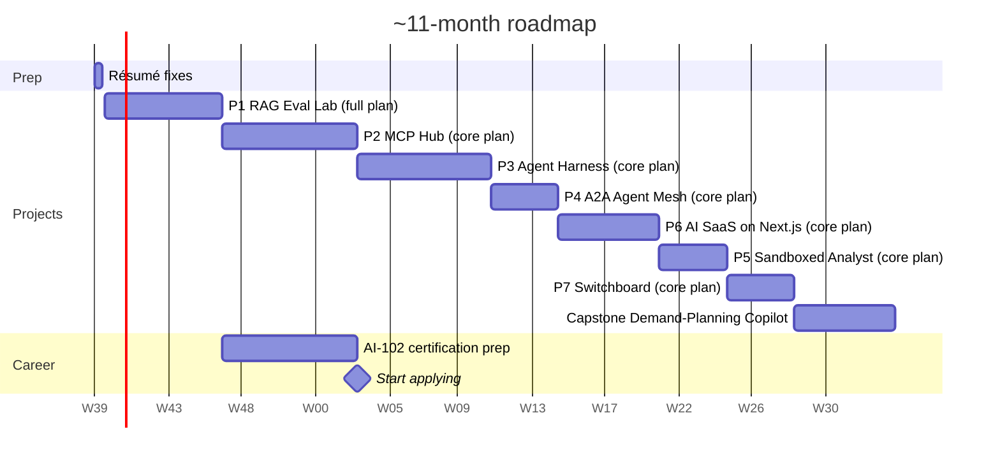

# ~11-Month Roadmap (≈12–15 hrs/week)

This assumes your current profile (LangGraph, MCP, RAG, guardrails, FastAPI, React, Azure/AWS). The
roadmap skips fundamentals and goes straight to your gaps: **evals → observability → agent breadth →
Next.js → public portfolio**.

> **Updated:** Projects 1–7 now follow their detailed build plans:
> - **Project 1:** full plan incl. agentic mode and the 2026 market-review updates, 20 features, ~102 h,
>   **7 weeks** at ~14.5 h/week
>   ([build plan](projects/01-rag-eval-lab/docs/08-build-plan/README.md))
> - **Project 2:** **core plan (Option B)** incl. the 2026 market-review updates, ~114 h, **8 weeks** at ~14 h/week
>   ([build plan](projects/02-mcp-hub/docs/09-build-plan/README.md)); admin console, Tasks and the GitHub
>   upstream are deferred
> - **Project 3:** **core plan (Option B)**, ~108 h, **8 weeks** at ~13.5 h/week
>   ([build plan](projects/03-agent-reliability-harness/docs/09-build-plan/README.md)); memory, the
>   multi-agent variant and the Azure demo are deferred
> - **Project 4:** **core plan (Option B)**, ~58 h, **4 weeks** at ~14.5 h/week
>   ([build plan](projects/04-a2a-agent-mesh/docs/09-build-plan/README.md)); the partner tenant and the
>   poisoned-postmortem attack are deferred
> - **Project 6:** **core plan (Option B)**, ~82 h, **6 weeks** at ~13.7 h/week
>   ([build plan](projects/06-ai-saas-nextjs/docs/09-build-plan/README.md)); the settings and audit-log
>   pages are deferred
> - **Project 5:** **core plan (Option B)**, ~59 h, **4 weeks** at ~14.5 h/week
>   ([build plan](projects/05-sandboxed-data-analyst/docs/09-build-plan/README.md)); dataset uploads, UI
>   exports, two extra experiments and the concurrency ramp are deferred
> - **Project 7:** **core plan (Option B)**, ~60.5 h, **4 weeks** at ~15 h/week
>   ([build plan](projects/07-llm-gateway-router/docs/09-build-plan/README.md)); the Anthropic
>   pass-through, hedged requests, the agent workload, the external routing benchmark, the
>   managed-gateway comparison and the P1/P5 integrations are deferred
>
> Together that's 21 weeks more than the original 6-month plan, so the whole roadmap is now about
> **47 weeks (~11 months)**. The capstone's duration is still an estimate and will be revised when its
> build plan is written.

| Weeks | Focus | Project | Gap closed | Output |
|---|---|---|---|---|
| **0 (3 days)** | Résumé fixes | — | Typos, timeline issues, headline | Updated CV + LinkedIn |
| **1–7** | Evals + observability + agentic RAG | #1 RAG Eval Lab (full plan) | Ragas/DeepEval, CI gates, Langfuse/OTel, rerankers, BM25 + pgvector, XBRL structured facts, long-context vs RAG, LangGraph agent + trajectory evals, MCP, Terraform on Azure | Deployed demo + ablation report + agent-vs-pipeline report + post |
| **8–15** | Remote MCP + MCP security | #2 MCP Hub (core plan) | MCP 2026-07-28, OAuth 2.1 (CIMD, token exchange), MCP gateway, Cedar policies, tool search, MCP Apps, TS SDK, tool-design + security evals | Open-source server on PyPI/npm + MCP Registry, secure gateway, 3 reports |
| **16–23** | Agent reliability | #3 Agent Reliability Harness (core plan) | LangGraph, OpenAI Agents SDK, Claude Agent SDK, pass^k reliability evals, HITL with signed approvals, crash/resume + idempotency, injection evals, cross-framework OTel tracing | Framework comparison report + OpsDesk benchmark on PyPI + post |
| **24–27** | Agent interop | #4 A2A Agent Mesh (core plan) | A2A 1.0, Google ADK + Gemini, cross-framework interop (4 frameworks), signed + pinned Agent Cards, token exchange with `act`, cross-agent approval via `auth-required`, push/resume, A2A TCK | TCK + interop matrix, security + resilience reports, measured MCP-vs-A2A report + post |
| **28–33** | Full-stack | #6 AI SaaS on Next.js: ClauseDesk (core plan) | Next.js 16 (Server Components/Actions, `"use cache"`, `proxy.ts`), AI SDK 7 (agent, typed UI parts, approvals, resumable streams), durable workflows, Better Auth orgs + Postgres RLS, Stripe usage billing, previews with DB branches, Playwright E2E | Deployed SaaS + CUAD extraction, isolation and billing reports + post |
| **34–37** | Sandboxing + generative UI | #5 Sandboxed Data-Analyst Agent: Analyst (core plan) | Sandboxed code execution on E2B Firecracker microVMs + self-hosted gVisor, MCP sandbox broker, output-handling security, safe Vega-Lite generative UI, code-writing agent with self-repair, data-agent evals (AnalystBench-50, DABstep) | Escape-suite + provider reports, benchmark + DABstep results, demo + post |
| **38–41** | Cost engineering | #7 LLM Gateway & Cost Router: Switchboard (core plan) | OpenAI-compatible gateway on the official SDKs, virtual keys + reserve-then-settle budgets, stream-aware retries/breakers/fallbacks, prompt/exact/scoped semantic caching with poisoning tests, five routing policies on Pareto curves, trace replay, FinOps dashboards, supply-chain hardening | Cost report (C0–C6), cache + poisoning study, routing study, overhead + build-vs-buy vs LiteLLM, ClauseDesk before/after + post |
| **42–47** | Capstone | 🏆 Demand-Planning Copilot | Brings everything together | Public demo + video + blog |

## Project 1 in detail (weeks 1–7)

| Week | Milestone | Features | Exit check |
|---|---|---|---|
| 1 | M1 Skeleton | F0 Foundation · F1 EDGAR fetch + XBRL facts · F2 Parsing (+ hidden-text guard) · F3a fixed-512 chunking | Parsed filings with sections for 2 companies |
| 2 | M1 → M2 | F4 Embedding · F5a Dense retrieval · F8a Basic generation · F9 API/SSE · F10 Observability | Streamed answer via `curl`; traces in Langfuse |
| 3 | M2 Measure | F11a Golden set v0 (30 Qs) · F12 Eval runner | **Baseline A0 recorded** |
| 4 | M3 Improve | F3b Structural/tables/ctx · F5b Hybrid + BM25 + filters · F6 Reranking · F7 Query understanding · F8b Citations + abstention · F14a Ablations (A0–A7, A2b, A-emb, A-rr) | Ablation results table |
| 5 | M4 Protect | F11b Golden set v1 (150 + 20 holdout), judge labels · F13 CI gate | Demo bad PR **blocked** by the gate |
| 6 | M5 Agentic | F18 LangGraph research agent (tools, guard, router, `step` events) · F19 Trajectory evals, agent vs pipeline | Agent-vs-pipeline report; `auto` router set from the numbers |
| 7 | M6 Ship | F15 Streamlit UI · F9 MCP interface · F16 Azure deploy · F14b A-LC + report + blog · (F17 feedback loop, stretch) | Public demo URL, README results, post |

## Project 2 in detail (weeks 8–15, core plan)

| Week | Milestone | Features | Exit check |
|---|---|---|---|
| 8 | M1 Useful server | F0 Foundation · F1 AMFI ingestion · F2 read tools (start) | NAVs for all schemes in Postgres |
| 9 | M1 → M2 | F2 read tools + maths · F3 transports + release · F4 Keycloak | **india-mf-mcp v0.1 on PyPI + MCP Registry** |
| 10 | M2 Identity | F5 user + interactive tools · F6 own client (OAuth, MRTR) | Client login (CIMD/PKCE) + disambiguation form work |
| 11 | M3 Gateway core | F7 edge & authn · F8 registry, pinning, scanner, tool search · F9 routing (start) | Two replicas; rug pull quarantined |
| 12 | M3 Gateway core | F9 token exchange + stdio bridge · F10 Cedar policies · F11 confirmations | Stateless confirmations across replicas |
| 13 | M3 → M4 | F12 rate limits, filters, audit chain · F13 fx-rates-mcp (TS) · F15 MCP Apps chart | Audit chain verifies; cross-server task works |
| 14 | M5 Measure | F17 tool-design evals (T1, T2, T4, T6) · F18 security evals (start) | Tool-design report with CIs |
| 15 | M5 → M6 Ship | F18 (finish) · F19 conformance + perf · F20 CI gate · F21 Azure · F22 reports + blog | ASR with vs. without defences; public demo; post |

## Project 3 in detail (weeks 16–23, core plan)

| Week | Milestone | Features | Exit check |
|---|---|---|---|
| 16 | M1 Environment | F0 Foundation · F1 OpsSim core · F2 opsdesk-mcp (start) | Seeded ShopLite; bad deploy → rollback → recovery in unit tests |
| 17 | M1 → M2 | F2 (finish) · F3 scenarios + oracle · F4 spec + guards | **Oracle solves 10 scenarios through MCP**; bad policies caught |
| 18 | M2 Baseline | F5 approvals · F6 raw loop · F7 runner + graders (start) | Raw loop resolves a scenario with approval; backstop blocks an unapproved rollback |
| 19 | M2 → M3 | F7 (finish) · F8 stats + report v0 · **prompt freeze** · F9 (start) | **Baseline report v0** with CIs |
| 20 | M3 Frameworks | F9 LangGraph · F10 OpenAI Agents SDK | Both pass stub tests + dev smoke with HITL |
| 21 | M3 → M4 | F11 Claude Agent SDK · F12 one trace view · F13 scenarios (start) | Four implementations in one Langfuse view |
| 22 | M4 | F13 (finish, test split frozen) · F14 chaos + idempotency · F17 inbox | 45 scenarios frozen with hashes; crash/resume results |
| 23 | M5 → M6 | F18 experiments · F19 failure taxonomy · F20 CI + PyPI · F22 report + post | Framework comparison on the test split; `opssim` on PyPI; post |

## Project 4 in detail (weeks 24–27, core plan)

| Week | Milestone | Features | Exit check |
|---|---|---|---|
| 24 | M1 → M2 | F0 foundation + 3 spikes · F1 executor base · F2 Triage on A2A · F5 registry (start) | **Triage passes the A2A TCK** and completes an `auth-required` approval round trip |
| 25 | M2 → M3 | F5 (finish) · F6 identity · F3 research agent · F4 comms agent · F7 (start) | Three signed agents pinned; tokens carry `act`; attacks A1–A7 blocked |
| 26 | M3 → M4 | F7 ADK Commander · F8 push/resume · F9 tracing · F10 TCK + interop · F11 (start) | **One incident through four frameworks, one trace, one cross-agent approval** |
| 27 | M4 → M5 | F11 (finish) · F12 security · F13 resilience · F14 MCP vs A2A · F15 CI · F17 reports | Security, resilience and MCP-vs-A2A reports; post published |

## Project 6 in detail (weeks 28–33, core plan)

| Week | Milestone | Features | Exit check |
|---|---|---|---|
| 28 | M1 Skeleton | F0 foundation + spikes · F1 auth + orgs · F2 schema + RLS | Sign up → org → invite on a preview with its own DB branch; RLS tests pass |
| 29 | M2 Documents | F3 AI service · F4 upload + ingestion workflow · F6 CUAD seed · F5 (start) | 50 CUAD contracts ingested through the workflow |
| 30 | M2 → M3 | F5 viewer · F7 chat agent · F8 resumable streams · F9 (start) | **Cited answers open the viewer highlighted; refresh mid-answer resumes** |
| 31 | M3 → M4 | F9 approvals · F10 extraction · F11 playbook workflow · F12 (start) | 50-document playbook run survives a redeploy |
| 32 | M4 → M5 | F12 register review · F13 Stripe · F14 metering + quotas · F16 (start) | Test-mode upgrade works; out-of-credit blocks before any model spend |
| 33 | M6 | F16 E2E · F17 isolation + billing · F18 evals · F19 performance · F20 launch | Green E2E on previews; 0 leaks; CUAD report; public demo + post |

## Project 5 in detail (weeks 34–37, core plan)

| Week | Milestone | Features | Exit check |
|---|---|---|---|
| 34 | M1 Sandbox core | F0 foundation + spikes · F1 image + harness · F2 gVisor host + runner · F3 (start) | A cell runs in gVisor with network, DNS and metadata blocked |
| 35 | M1 → M2 | F3 E2B provider · F4 broker core · F5 output filter · F6 datasets · F7 (start) | Broker MCP tools work on both providers; HTML/SVG/pickle dropped |
| 36 | M2 → M3 | F7 agent · F8 analysis UI · F9 escape suite · F10 (start) | **Question → notebook cells → safe chart**; escape suite green on both providers |
| 37 | M3 → M5 | F10 · F11 AnalystBench · F12 experiments + DABstep · F13 provider bench · F14 capstone hook · F15 ship | Reports committed; DABstep submitted; demo + post |

## Project 7 in detail (weeks 38–41, core plan)

| Week | Milestone | Features | Exit check |
|---|---|---|---|
| 38 | M1 Gateway core | F0 foundation + supply-chain CI + spikes · F1 mock provider · F2 adapters + API · F3 keys, limits, budgets | Streamed tool-calling request to both providers; planted `.pth` fails CI; no overspend under 200 parallel requests |
| 39 | M1 → M2 | F4 cost + ledger · F5 reliability · F6 dashboards · F7 prompt-cache helper · F8 exact cache | **Outage demo:** breaker opens, fallback serves; ledger matches provider usage |
| 40 | M2 → M4 | F9 semantic cache · F10 router training data · F11 routing policies · F12 traces + replayer | Scoped semantic hits with verify-on-hit; ONNX router ≤ 2 ms; W1 + W2 replay with quality scores |
| 41 | M4 → M5 | F13 cache study + poisoning · F14 Pareto study · F15 cost report · F16 overhead + LiteLLM · F17 ClauseDesk switch · F18 ship | Reports committed; ClauseDesk before/after; demo + post + video |

```mermaid
gantt
    title ~11-month roadmap
    dateFormat YYYY-MM-DD
    axisFormat W%W
    section Prep
    Résumé fixes                        :r0, 2026-10-01, 3d
    section Projects
    P1 RAG Eval Lab (full plan)         :p1, 2026-10-05, 7w
    P2 MCP Hub (core plan)              :p2, after p1, 8w
    P3 Agent Harness (core plan)        :p3, after p2, 8w
    P4 A2A Agent Mesh (core plan)       :p4, after p3, 4w
    P6 AI SaaS on Next.js (core plan)   :p6, after p4, 6w
    P5 Sandboxed Analyst (core plan)    :p5, after p6, 4w
    P7 Switchboard (core plan)          :p7, after p5, 4w
    Capstone Demand-Planning Copilot    :cap, after p7, 6w
    section Career
    AI-102 certification prep           :cert, after p1, 8w
    Start applying                      :milestone, after p2, 0d
```

**Start applying at week 15**, once Projects 1 and 2 are public. Together they already show the biggest
gaps closed: evals and CI gates, observability, agentic RAG with trajectory evals, an MCP platform on the
current spec, and measured MCP security, on top of your experience. Waiting for Project 3 (week 23)
would delay applications by two months for a smaller gain, so build Project 3 while you interview. Its
baseline report (week 19) and framework comparison (week 23) arrive mid-search, followed by the A2A
mesh (week 27), the ClauseDesk SaaS (week 33), the sandboxed Analyst (week 37) and the Switchboard cost report (week 41). They make strong "what are you working on now?" answers, as does the capstone.

- **Earliest option: week 7**, after Project 1 alone (evals + observability + agent evaluation).
- **Short on time?** Project 1's agentic milestone (its week 6) can be skipped, and Project 2's deferred
  features stay deferred, as do Project 3's (memory, multi-agent, Azure demo) Project 4's (partner tenant, poisoned-KB attack), Project 6's (settings and audit-log pages) Project 5's (uploads, exports, extra experiments) and Project 7's (pass-through, hedging, extra workloads and comparisons). Each project's build plan says what can be dropped without breaking anything.

## Weekly rhythm
- About 60% building, 20% reading docs/papers, 20% writing (README, LinkedIn post).
- Every Friday, record that week's numbers: quality, latency, cost.

## Certification
- **Azure AI Engineer Associate (AI-102)**: this fits your Azure experience and gets you past ATS filters
  at Indian GCCs, consultancies and Middle-East enterprises. You can do it alongside weeks 8–15 (about 2 extra hours a week), so the certificate is on your CV when you start applying.
- Optional: AWS Certified Generative AI Developer, if you're targeting AWS-heavy companies.

## Interview prep alongside

| Role | System design practice | Deep-dive topics |
|---|---|---|
| GenAI Engineer | Enterprise RAG at scale; eval pipeline; LLM gateway | Embeddings, reranking, chunking trade-offs, judge calibration |
| Agent Engineer | Agent platform with MCP gateway, HITL, memory; multi-agent failure handling | MCP spec (transports, auth, elicitation), A2A, trajectory evals, sandboxing |
| AI Full-stack Engineer | Streaming chat/agent SaaS end to end; generative UI | RSC/streaming, resumable streams, multi-tenancy, rate limiting, billing |

Behavioural stories you already have:
- Leading 5 engineers
- The Unilever Funnel Automation (+50% accuracy)
- Building the Responsible-AI middleware
- API-contract governance between Python and TypeScript teams

## Keywords for your résumé and LinkedIn

**Already true:** Python · FastAPI · LangGraph · LangChain · AutoGen · MCP · FastMCP · Multi-agent Systems ·
RAG · Hybrid Search · Pinecone · Azure AI Search · Azure OpenAI · Azure AI Foundry · AWS Bedrock ·
Structured Outputs · Pydantic · Guardrails · PII Redaction · Prompt-Injection Defense · HITL ·
React · TypeScript · Kafka · Docker · Kubernetes · Terraform

**Add as you finish each project:** Evals (Ragas, DeepEval, promptfoo) · LLM-as-Judge · Agentic RAG · BM25 ·
XBRL / structured + unstructured retrieval · Long-context vs RAG · Cedar · MCP Apps · Tool Search ·
OWASP Agentic Top 10 ·
Trajectory Evals · Langfuse · LangSmith · OpenTelemetry · Rerankers · pgvector · Remote MCP / OAuth 2.1 ·
A2A · OpenAI Agents SDK · Claude Agent SDK · E2B / Sandboxed Code Execution · Next.js ·
Vercel AI SDK · Generative UI · Semantic Caching · LiteLLM · Model Routing
