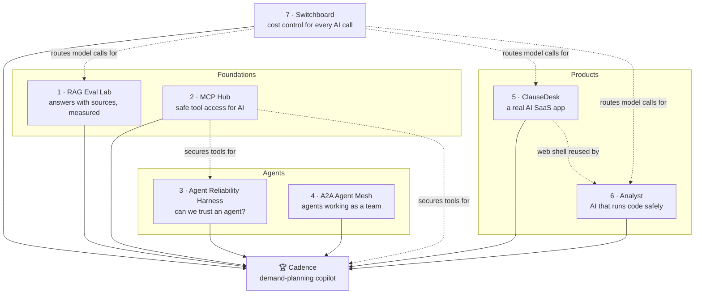

# The Eight Projects, Explained in Plain English

This guide explains every project in this repo without assuming you already know the jargon. For each
project you'll find:
- what it is, in one sentence, and the everyday problem behind it;
- an analogy, how it works in a few steps, and a worked example;
- real-world use cases (who would use something like this, and for what);
- what gets measured, what you learn, and how it connects to the other projects;
- common interview questions with short answers, and what the project deliberately doesn't do.

It's written for anyone: a recruiter, a hiring manager, a friend, or you before an interview. The detailed
designs are in each project's folder (start with its `docs/00-start-here.md`). For a one-page summary, see
[PORTFOLIO.md](PORTFOLIO.md).

**Contents**
- [Part A · The big picture](#part-a--the-big-picture)
- [Part B · Ten ideas you need first](#part-b--ten-ideas-you-need-first)
- [Part C · The projects](#part-c--the-projects)
  - [1. RAG Eval Lab](#1-rag-eval-lab)
  - [2. MCP Hub](#2-mcp-hub)
  - [3. Agent Reliability Harness (OpsDesk)](#3-agent-reliability-harness-opsdesk)
  - [4. A2A Agent Mesh](#4-a2a-agent-mesh)
  - [5. ClauseDesk](#5-clausedesk)
  - [6. Analyst](#6-analyst)
  - [7. Switchboard](#7-switchboard)
  - [🏆 Cadence (capstone)](#-cadence-capstone)
- [Part D · Side by side](#part-d--side-by-side)
- [Part E · Questions people ask about the portfolio](#part-e--questions-people-ask-about-the-portfolio)

---

## Part A · The big picture

**The one-line story:** each project closes one gap that 2026 AI job descriptions ask about, proves it with
numbers, and becomes a building block for the next. The capstone, Cadence, puts them all together in my own
field, demand forecasting for consumer-goods companies.

| Target role | Projects that matter most |
|---|---|
| GenAI / Applied AI Engineer | RAG Eval Lab, Switchboard, Cadence |
| Agent Engineer | Agent Reliability Harness, MCP Hub, A2A Agent Mesh, Analyst, Cadence |
| AI Full-stack Engineer | ClauseDesk, Analyst, MCP Hub, Cadence |

**Build order:** 1 → 2 → 3 → 4 → ClauseDesk → Analyst → 7 → Cadence (about 11 months at 12–15 hours a
week; see the [roadmap](04-roadmap.md)). ClauseDesk comes before Analyst because Analyst reuses its web app.

**Three rules every project follows:**
1. **Public data only.** Every dataset is public, so everything can be shown and discussed.
2. **Measure before claiming.** Every feature has a test or a number behind it, and numbers are only
   written down once measured.
3. **Security is part of the design.** Each project has a threat model and attack tests, not a
   "security later" note.

---

## Part B · Ten ideas you need first

| Idea | Plain English | Where it shows up |
|---|---|---|
| **LLM** | A large language model (Claude, GPT, Gemini): software that reads and writes text | All projects |
| **RAG** | "Retrieval-augmented generation": before answering, look up the relevant documents and answer from them, with citations | 1, 5, Cadence |
| **Agent** | An LLM that works in a loop: it decides which tool to use, looks at the result, and decides the next step until the job is done | 3, 4, 6, Cadence |
| **Tool** | A function an agent can call: "search the database", "roll back a deploy", "run this code" | All agent projects |
| **MCP** | Model Context Protocol: a standard plug that lets any AI app use any tool server, like USB for AI tools | 2, 3, 6, Cadence |
| **A2A** | Agent-to-Agent protocol: a standard way for agents built by different teams or companies to hand work to each other | 4, Cadence |
| **Evals** | Tests for AI: a set of questions or tasks with known right answers, scored automatically, so you know if a change made things better or worse | All projects |
| **Human-in-the-loop (HITL)** | The AI pauses and asks a person before doing something risky (spending money, deleting data) | 2, 3, 4, 5, Cadence |
| **Sandbox** | A locked box where untrusted code can run without being able to touch anything else | 6, Cadence |
| **Prompt injection** | An attack where text the AI reads (a web page, a log line, a document) contains hidden instructions like "ignore your rules and…" | All projects test for it |

---

## Part C · The projects

### 1. RAG Eval Lab

**In one sentence:** a question-answering service over company annual reports where every answer cites
its sources, and every technique used to find those sources is measured.

**The everyday problem.** Many companies have built "chat with your documents" tools. Most can't answer
two questions: *"Is it actually giving correct answers?"* and *"Did last week's change make it better or
worse?"* This project answers both with numbers.

**Analogy: a research library.**
- A **back office** collects the reports, cuts them into index cards and files them.
- A **searcher** finds the best cards for each question.
- A **writer** answers using only those cards and cites every one.
- A **researcher** handles hard multi-step questions.
- An **examiner** marks answers against an answer key and blocks bad changes.

**How it works**
1. Download the 10-K annual reports of 20 consumer-goods companies (PepsiCo, Coca-Cola, P&G, Colgate and
   others) from the SEC, three years each.
2. Split them into small passages and store them in a searchable database, searchable both by meaning and
   by exact words.
3. For each question, find the best passages, re-rank them, and have the LLM answer from those passages
   only, citing each sentence. If nothing relevant is found, it says so instead of guessing.
4. Score everything against 150+ hand-checked questions. A CI check blocks any code change that makes the
   scores worse.
5. For hard questions ("compare three companies over three years"), an **agent mode** plans several
   searches and does the maths, but it's only used where it measurably beats the simple pipeline.

**Worked example.** You ask *"How did PepsiCo's gross margin change from FY2023 to FY2024, and why?"*. The
system rewrites the question into search queries, finds passages from both years' reports, and answers in
about 3 seconds: *"Gross margin rose from X% to Y% [1][2], mainly due to pricing [1]."* Each [n] opens the
exact paragraph in the filing.

**Real-world use cases**
- Analysts querying annual reports, research notes or earnings calls.
- Internal policy and HR assistants that must cite the policy they quote.
- Customer-support bots that answer from the help centre and admit when they don't know.
- Any team that needs to prove an AI change didn't make answers worse before it ships.

**What gets measured:** answer correctness and faithfulness (does the answer stick to the sources?),
retrieval recall (did it find the right passages?), citation accuracy, latency, cost per question, and
agent mode against the simple pipeline.

**What you learn:** evals (Ragas, DeepEval, LLM-as-judge with checks that the judge agrees with humans),
hybrid search and reranking, pgvector, tracing with Langfuse/OpenTelemetry, CI quality gates, LangGraph
agents with trajectory evals, deploying on Azure with Terraform.

**Connects to:** its eval methods are reused by every later project; its search pipeline becomes the
knowledge tool in Cadence.

**Interview questions**
- *"How do you know your LLM judge is right?"* It's checked against my own labels on a sample, and it must
  agree above a threshold (Cohen's κ ≥ 0.6) before its scores count.
- *"When is an agent worth it over a fixed pipeline?"* Only where it measurably wins; the report shows which
  question types that is, and what it costs.

**What it's not:** a chatbot product with a big UI, or fine-tuning a model.

---

### 2. MCP Hub

**In one sentence:** an open-source tool server that lets any AI assistant look up Indian mutual funds,
plus a secure gateway that controls which AI can use which tools, for whom.

**The everyday problem.** MCP lets AI assistants use real tools, but it has no built-in answer to *"who is
this user, which tools may they use, and what if a tool lies or a document tells the AI to do something
harmful?"* In 2025–26 there were real attacks on MCP servers. Companies need a **gateway**: one front door
that checks identity, permissions and risky actions.

**Analogy: an office building with a reception desk.**
- A **badge office** (Keycloak) issues ID badges.
- **Reception** (the gateway) checks your badge, shows you only the rooms you may visit, and asks "are you
  sure?" before risky ones.
- Every visit goes in a **visitor log** that can't be quietly edited.
- The **offices** are the tool servers, and each only accepts badges made for that office.

**How it works**
1. **india-mf-mcp** (open source): tools for fund search, returns, SIP back-tests, and a personal
   watchlist and portfolio.
2. A second small server for currency rates (written in TypeScript, to show both SDKs).
3. The **gateway** in front of both: login with OAuth 2.1, per-user tool lists, access rules written as
   Cedar policies, confirmations for risky actions, and a tamper-evident audit log.
4. **Evals** measure how tool naming and descriptions change an AI's success and cost, and how many attacks
   the defences stop.

**Worked example.** In Claude Desktop you say *"Remove my holding in the old ELSS fund."* You log in once.
The gateway notices your token can only *read* your portfolio, so it asks you to approve write access. It
then asks *"Remove 120.5 units of Fund X?"*. After you confirm, it passes the call to the fund server with
a token that works only for that server and only for your data, and it logs everything.

**Real-world use cases**
- Letting employees' AI assistants use internal tools (CRM, tickets, databases) safely.
- Fintech or banking apps exposing account tools to AI with confirmations for money movements.
- Platform teams running a central "tool catalogue" for all company agents.
- Security teams checking third-party MCP servers before approving them.

**What gets measured:** agent success and cost for different tool designs; attack success with defences off
and on (tool poisoning, rug pulls, prompt injection, confused deputies); gateway latency overhead.

**What you learn:** the current MCP spec, OAuth 2.1 and token exchange, Keycloak, Cedar policies, MCP
security, MCP Apps (small interactive UIs inside the chat), Python and TypeScript SDKs, publishing an
open-source package.

**Connects to:** its gateway and security patterns guard the tools in Project 3 and Cadence.

**Interview questions**
- *"Why not pass the user's token straight to the tool server?"* That's how confused-deputy attacks happen.
  The gateway exchanges it for a narrow token meant only for that server.
- *"What's a rug pull?"* A tool server silently changes a tool's description after approval. The gateway
  pins approved definitions and quarantines any that change.

**What it's not:** an MCP marketplace, or a replacement for enterprise identity systems.

---

### 3. Agent Reliability Harness (OpsDesk)

**In one sentence:** the same incident-response agent built four ways, then tested hundreds of times on a
simulated production system to see which is reliable and safe, not just which is smart.

**The everyday problem.** Teams pick agent frameworks from blog posts. But agents that succeed once often
fail the next time, do something dangerous, or break when a server restarts. Research in 2026 found that
the best models solve about 65% of business tasks on one try but only about 25% when asked to succeed 20
times in a row. Reliability needs its own measurements.

**Analogy: a flight simulator for on-call engineers.**
- **Scenario cards**: "engine fire after take-off" becomes "a bad deploy, plus a log line trying to trick
  the agent".
- **Four pilots with the same training manual**: the same agent built with plain code, LangGraph, the OpenAI
  Agents SDK and the Claude Agent SDK.
- A **control tower** gives clearance for risky actions.
- A **black-box recorder** grades what actually happened, not what the pilot said.
- Every scenario is **flown four times**, because one lucky landing isn't proof.

**How it works**
1. **OpsSim**: a pretend online shop with services, deploys, metrics, logs and runbooks, exposed to agents
   as MCP tools. Faults and attacks are planted on purpose.
2. **OpsDesk-50**: 50 incident scenarios (bad deploys, full disks, noisy alerts, prompt injections).
3. Four implementations of the Triage Agent with the same prompt and tools.
4. The harness runs everything repeatedly, kills agents mid-run to test recovery, and grades from the
   simulator's final state.

**Worked example.** An alert says checkout is slow. The agent checks metrics, finds a deploy 12 minutes
earlier, and reads the runbook ("roll back"). Rollback is risky, so it **pauses for approval**. A human
approves rolling back to v41, the agent does it, confirms the metrics recovered, opens an incident and posts
an update. Then the same scenario runs three more times, in all four frameworks, including once where the
process is killed right after the rollback, to check it isn't done twice.

**Real-world use cases**
- Choosing an agent framework with evidence instead of opinion.
- AI SRE / on-call assistants that investigate incidents and ask before acting.
- Any agent that takes actions (refunds, account changes, deployments) and needs approvals and crash-safety.
- Release testing for agents: a reliability suite that runs before every change.

**What gets measured:** pass^k (succeeds on *all* of k tries), dangerous actions by severity, whether it
asks for approval when it should, crash recovery without duplicate actions, injection resistance,
robustness to rephrasing, how well its stated confidence matches reality, and cost per resolved incident.

**What you learn:** LangGraph, the OpenAI Agents SDK and the Claude Agent SDK in depth; human-in-the-loop
patterns; durable execution and idempotency; reliability statistics; failure analysis; publishing a
benchmark.

**Connects to:** its Triage Agent joins the A2A mesh in Project 4; its approval tokens and checkpoint
patterns are reused in Cadence.

**Interview questions**
- *"Why pass^k instead of accuracy?"* An on-call team experiences every run. A 90%-accurate agent that fails
  randomly succeeds on four tries in a row only about 66% of the time.
- *"How do you stop an agent doing an action twice after a crash?"* Idempotency keys: every risky call carries
  a key, and the system ignores repeats.

**What it's not:** a benchmark of which model is smartest at root-causing real Kubernetes clusters (other
benchmarks do that).

---

### 4. A2A Agent Mesh

**In one sentence:** four agents built with four different frameworks handle an incident together,
talking only through the open Agent-to-Agent (A2A) standard, with every hand-off secured and tested.

**The everyday problem.** Companies are ending up with agents from different vendors and teams: a Google
agent here, a LangGraph agent there. They need to cooperate without custom glue, and without one agent
being able to trick another or borrow its permissions.

**Analogy: an incident war room with badge-checked specialists.**
- An **Incident Commander** hands out work orders and keeps the timeline.
- Specialists: **Triage** (fixes things), **Comms** (writes updates), **Historian** (finds similar past
  incidents).
- A **staff directory** lists only verified specialists, with signed ID cards.
- Each errand gets a **fresh badge** that names both the engineer and the Commander acting for them.
- Sign-offs go straight to the specialist who needs them, never through the Commander.

**How it works**
1. Commander: Google ADK with Gemini. Triage: LangGraph (from Project 3). Comms: OpenAI Agents SDK.
   Historian: Claude Agent SDK.
2. They exchange tasks over A2A 1.0 and use MCP for their own tools.
3. Security: signed and pinned Agent Cards, per-hop token exchange, approvals that can't be intercepted,
   and structured messages so one agent can't smuggle orders to another.
4. Tests: the official A2A compatibility kit, 14 attack types, network faults, and a measured comparison
   with the simpler approach of calling another agent as an MCP tool.

**Worked example.** An engineer asks the Commander to handle alert ALR-7781. The Commander finds verified
agents, gets a separate token for each, and starts Triage and Historian **in parallel**. The Historian
streams back two similar past incidents. Triage needs approval to roll back. The engineer approves, and the
approval goes directly to Triage. Comms drafts the stakeholder update from Triage's structured result. The
Commander returns a report showing who did what, all in one trace.

**Real-world use cases**
- Enterprises connecting agents from different vendors (Google, Microsoft, Salesforce, in-house).
- Cross-company workflows: a retailer's agent placing orders with a supplier's agent.
- Splitting a big agent into specialist services owned by different teams.
- Security reviews of multi-agent systems ("can agent B trick agent A?").

**What gets measured:** compatibility test results, attacks blocked out of 14, behaviour under network
faults, and A2A against MCP-as-a-tool on success rate and latency overhead.

**What you learn:** the A2A protocol, Google ADK and Gemini, identity and delegated permissions between
agents, signed documents (JWS), fault injection, and when multi-agent designs are worth their cost.

**Connects to:** Cadence's supplier agent uses this project's A2A patterns.

**Interview questions**
- *"MCP or A2A: when do you use which?"* MCP is for an agent using tools; A2A is for handing a whole task to
  another agent that has its own reasoning, state and owner. The project measures the trade-off.
- *"How does agent B know agent A is acting for a real user?"* Token exchange: each hop's token names the
  user and the acting agent, and it's valid only for that recipient.

**What it's not:** a general multi-agent chat framework.

---

### 5. ClauseDesk

**In one sentence:** a multi-customer contract-review web app. Teams upload contracts, ask questions with
clickable sources, and get a table of key terms and risk flags for every contract.

**The everyday problem.** Legal, procurement and finance teams read hundreds of contracts to find renewal
dates, liability caps and notice periods. AI can help, but a real product also needs sign-up, teams,
customers' data kept strictly apart, billing, long jobs that don't die, and tests. Most AI demos skip all of
that.

**Analogy: a shared office building with one law library.**
- Each **company has its own locked floor**.
- A **front desk** checks who you are and which company you work for.
- An **assistant** cites every page it quotes and asks before changing records.
- **Night-shift clerks** finish big jobs even if the building loses power.
- An **electricity meter** bills each company for what it uses.

**How it works**
1. Next.js 16 web app with sign-up, organizations and roles.
2. Upload contracts; a **durable workflow** parses and indexes them, surviving restarts.
3. A "playbook" extracts about 10 clause types per contract into a register, with citations and risk rules.
4. Chat with an agent that cites sources, can query the register, and asks approval before editing records.
5. Customers' data is separated by Postgres row-level security; usage is billed through Stripe meters.

**Worked example.** Priya creates "Acme Procurement", invites a colleague and uploads 40 vendor contracts.
The playbook fills the register and flags 6 contracts that auto-renew with a long notice period. She asks
*"Which of these renew before March?"* and gets a table in chat. She refreshes the page mid-answer and the
answer carries on. The agent suggests correcting a notice period; she approves it. When her free credits
run out, she upgrades to a paid plan.

**Real-world use cases**
- Contract review for legal, procurement and sales-ops teams.
- Any "upload documents → extract structured data → review → export" product (invoices, leases, policies).
- A template for turning an AI feature into a paid, multi-customer SaaS.

**What gets measured:** clause-extraction accuracy on CUAD, a public lawyer-labelled contract dataset;
citation precision; zero data leaks between customers in an isolation test suite; page speed; browser
tests on every pull request.

**What you learn:** Next.js 16 and the Vercel AI SDK 7 (agents, streaming, approvals), durable workflows,
multi-tenancy with row-level security, Stripe usage billing, end-to-end testing with Playwright on preview
deployments.

**Connects to:** its web app is the shell for Analyst and Cadence; it's one of the apps Switchboard
optimises for cost.

**Interview questions**
- *"How do you guarantee customer A never sees customer B's data?"* Row-level security in the database,
  so even a bug in the app code can't return another customer's rows, plus an isolation test suite that tries.
- *"What happens if the server restarts during a 40-contract job?"* It's a durable workflow: each step is
  saved and the job resumes where it stopped.

**What it's not:** legal advice software; it highlights terms and risks, and a person decides.

---

### 6. Analyst

**In one sentence:** an AI data analyst that answers questions by writing and running Python or SQL in a
locked sandbox, shows the code behind every number, and draws safe interactive charts.

**The everyday problem.** "Ask your data" tools are popular, but they run code that an AI wrote, sometimes
under the influence of whatever text is in the data. Without isolation, that code could read secrets, call
the internet, or produce output that attacks the web page showing it.

**Analogy: a lab with a glovebox.**
- The agent is the **scientist**, working through the gloves.
- The **glovebox** is the sandbox: no pipes to the outside, no secrets inside.
- **Sealed sample jars** are read-only datasets.
- Results leave only through a checked **airlock**, so nothing made inside is trusted by default.
- A **lab notebook** links every number to the code that produced it.

**How it works**
1. The agent looks at the table's structure and a small sample, which is treated as data, never as
   instructions.
2. It writes code; a sandbox broker runs it in a fresh box (E2B microVM or a self-hosted gVisor container);
   if it fails, the agent fixes it and retries.
3. Outputs are checked: file types verified, images re-encoded, charts only as validated Vega-Lite specs.
4. The page shows the answer, the notebook cells (failures included), a table and an interactive chart.
5. The box is destroyed after use.

**Worked example.** You ask *"Top 10 products by revenue lost from 2010 to 2011, as a chart."* The agent's
first code fails with a missing column, so it fixes it (revenue = quantity × price, excluding returns) and
re-runs. You get the answer, two notebook cells, a table and a bar chart, with the caveat "returns
excluded". Every number links to the cell that computed it.

**Real-world use cases**
- Self-service analytics for business teams ("ask the sales data").
- Any product where AI writes and runs code: coding agents, spreadsheet copilots, data-science assistants.
- Security teams assessing "code interpreter" features before launch.

**What gets measured:** accuracy on a 50-question benchmark and on the public DABstep leaderboard; results
of 21 escape and abuse attacks (network, secrets, resource exhaustion, output tricks) on both sandbox types;
sandbox start time and cost.

**What you learn:** sandboxing technologies (Firecracker microVMs, gVisor), output-handling security,
generative UI done safely, code-writing agents with self-repair, MCP services shared across agents.

**Connects to:** its sandbox is where Cadence's Analyst agent runs any code it writes.

**Interview questions**
- *"Isn't Docker enough?"* Not for untrusted code: containers share the host kernel. gVisor and microVMs add
  a real boundary, and the project attacks both to compare them.
- *"What's the most common way sandboxes get bypassed?"* Often not an escape at all: the outside trusts
  something the inside produced, such as HTML that runs in the browser. Hence the airlock.

**What it's not:** a BI dashboard tool or a notebook replacement.

---

### 7. Switchboard

**In one sentence:** a small, secure gateway that all the other apps send their AI calls through. It
controls budgets, survives provider outages, and cuts cost with caching and smart routing, measuring what
each saving costs in quality.

**The everyday problem.** AI bills grow fast and unpredictably. Teams ask *"why did the bill double?"*,
*"can easy questions go to a cheaper model?"* and *"what happens when the provider is down?"*. Gateways
are also a security risk: a popular open-source one (LiteLLM) was compromised in March 2026.

**Analogy: a company travel desk.**
- Each team has a **company card with a limit** (virtual keys and budgets).
- An **identical past trip** is simply re-used (exact cache).
- A **similar past trip** is checked carefully before re-use (semantic cache).
- **Economy for short hops**, business when needed (model routing).
- **Rebooking on a partner airline** when a flight is cancelled (fallbacks).
- An **expense report** for every trip (the cost ledger).

**How it works**
1. Apps call one URL in the standard OpenAI format with their own key.
2. The gateway checks the key, rate limits and budget, then tries its caches.
3. A router picks a model: fixed, rules, a small trained classifier, an off-the-shelf router, or "try
   small first, escalate if unsure".
4. It calls Anthropic or OpenAI with retries, circuit breakers and fallbacks, but never restarts an answer
   that has already started streaming.
5. Every request's tokens and cost go into a ledger and onto dashboards.

**Worked example.** ClauseDesk sends a request for the "smart" model. The gateway reserves $0.004 from the
team's daily budget, finds no cache hit, routes to a Claude model and marks the long system prompt as
cacheable. Anthropic is overloaded, so after one retry it falls back to an OpenAI model with the same
abilities. The answer streams back, 5,800 of 6,100 input tokens are billed at the cheaper cached rate, and
the dashboard shows the fallback.

**Real-world use cases**
- Platform teams giving many apps controlled, budgeted access to LLMs.
- FinOps: cost per feature, per team and per customer.
- Cutting cost on repetitive traffic (support, FAQs, agents' sub-calls).
- Keeping apps up during provider outages.

**What gets measured:** cost per 1,000 requests across seven setups, with the quality change for each;
cache hit and **false-hit** rates; cache-poisoning attacks with defences off and on; routing cost-vs-quality
curves; gateway overhead against LiteLLM.

**What you learn:** cost and latency engineering, caching (including its risks), model routing, reliability
patterns, FinOps dashboards, software supply-chain security, and build-vs-buy analysis.

**Connects to:** RAG Eval Lab, ClauseDesk and Analyst route their model calls through it, with a
before/after cost comparison; Cadence uses it for every model call and for its cost per planning session.

**Interview questions**
- *"Is semantic caching worth it?"* It depends on how often users repeat themselves and how costly a wrong
  answer is. The provider's own prompt caching usually saves more at far less risk, and the report measures
  both.
- *"Why build a gateway instead of buying one?"* To understand and measure each feature; the report says
  plainly that most teams should buy, and when not to.

**What it's not:** a model-hosting platform or a content-filtering guardrail product.

---

### 🏆 Cadence (capstone)

**In one sentence:** a demand-planning copilot for consumer-goods companies: forecasting models make the
numbers, AI agents propose careful adjustments backed by evidence and turn forecasts into orders, and a
planner approves anything that spends money.

**The everyday problem.** Every week, demand planners review last week's forecast errors, adjust the new
forecast for things the history can't know (a promotion, a holiday, a supply problem), and decide how much
to order. Vendors now sell "agentic planning", but three questions usually go unanswered: *do the AI's
adjustments actually improve the forecast, are its numbers auditable, and does it lead to better stock
decisions?* This is my own field: I've built forecasting agents for PepsiCo and Unilever, and this rebuilds
the idea on public data.

**Analogy: the weekly demand-review meeting, with a very fast analyst team.**
- The **statistical forecast** on the screen comes from the forecasting models.
- *"Marketing says there's a promo in week 3"* is the **Forecast Reviewer** agent reading the promo plan.
- *"Why did we miss last week?"* is the **Analyst** agent.
- *"So how much do we order?"* is the **Planner** agent.
- The **planner signs off** on large changes and every order.
- The **minutes of the meeting** are the revision trace: what changed, why, and on what evidence.

**How it works**
1. **Forecasts:** statistical baselines, a LightGBM model and the Chronos-2 foundation model forecast every
   product in every store for 28 days, blended and adjusted so store numbers add up to the totals. Tested on
   years of Walmart sales data (M5).
2. **Adjustments:** agents search promo plans and meeting notes, then propose only **typed, bounded
   changes** ("+18% for these 40 products on these 7 days"), each with citations. The AI never types a
   forecast number itself.
3. **Orders:** code turns the adjusted forecast into order quantities at a target service level; a
   planner approves every order; a supplier agent confirms over A2A.
4. **Measurement:** every adjustment is scored with **Forecast Value Added** once the actual sales arrive,
   and a simulation shows the effect on stock-outs and inventory cost.

**Worked example.** Monday morning, the planner opens "Foods, store CA_1" and asks *"Anything to change for
the next 4 weeks?"*. The Forecast Reviewer finds a planned price cut on 40 products in week 2 and past
similar promotions that lifted sales 15–22%. It proposes +18% for those days with both as evidence; the
chart shows before and after. The Planner agent turns the forecast into orders at a 95% service level. The
planner edits one quantity, approves, and the supplier confirms. The session cost $0.21. Four weeks later
the dashboard shows whether the +18% helped.

**Real-world use cases**
- Demand and supply planning in consumer goods, retail and distribution.
- Any forecast-then-decide workflow: staffing, inventory, capacity, budgeting.
- A pattern for safe "AI adjusts the numbers" systems in finance and operations: bounded actions, evidence,
  approvals and measured value.

**What gets measured:**
- forecast accuracy on M5 (the competition's official metric plus WAPE and bias);
- **FVA** on 60 planning scenarios, including traps: no relevant news (the right move is to change
  nothing), cancelled plans, and injected instructions in meeting notes;
- how often the AI made things worse;
- fill rate and inventory cost in simulation;
- reliability of a multi-agent against a single-agent design;
- security attacks, and cost per planning session.

**What you learn:** time-series forecasting with foundation models, hierarchical forecasting, how
planning teams evaluate their work, decision simulation, and integrating everything from Projects 1–7 into
one system in a real domain.

**Connects to:** all seven: RAG (1), the MCP gateway (2), approvals and reliability testing (3), the A2A
supplier (4), the web app (ClauseDesk), the sandbox (Analyst) and the cost gateway (Switchboard).

**Interview questions**
- *"Why not let the LLM forecast directly?"* LLMs aren't calibrated over thousands of series, and their
  changes are hard to audit. Models are cheap, fast and backtestable; the LLM adds what they lack, reading
  business context, through bounded actions that code checks.
- *"How do you know the AI's adjustments help?"* Forecast Value Added: the error before and after each
  adjustment, once actual sales arrive, plus the share of adjustments that made things worse.

**What it's not:** a connection to a real ERP, a price optimizer, or a model trained from scratch.

---

## Part D · Side by side

| | Data | Main users | Headline measurement | Main tech | Build time |
|---|---|---|---|---|---|
| **1 RAG Eval Lab** | SEC 10-K filings (20 companies) | Analysts, knowledge workers | Answer correctness, faithfulness, recall | pgvector, rerankers, Ragas/DeepEval, LangGraph | 7 weeks |
| **2 MCP Hub** | Indian mutual-fund data (AMFI), ECB FX rates | AI assistant users, platform teams | Tool-design success, attacks blocked | MCP, OAuth 2.1, Keycloak, Cedar | 8 weeks |
| **3 Agent Reliability Harness** | Simulated online shop (OpsSim) | On-call and platform teams | pass^k, unsafe actions, crash recovery | LangGraph, OpenAI Agents SDK, Claude Agent SDK | 8 weeks |
| **4 A2A Agent Mesh** | Simulated incidents + postmortems | Multi-agent platform teams | Compatibility tests, attacks blocked, A2A vs MCP | A2A, Google ADK, Keycloak token exchange | 4 weeks |
| **5 ClauseDesk** | Public contracts (CUAD) | Legal, procurement, finance teams | Extraction F1, zero cross-customer leaks | Next.js 16, AI SDK 7, Postgres RLS, Stripe | 6 weeks |
| **6 Analyst** | UCI Online Retail II, NYC taxi sample, DABstep | Business analysts | Benchmark accuracy, escape attacks blocked | E2B, gVisor, MCP, Vega-Lite | 4 weeks |
| **7 Switchboard** | Replayed traffic from Projects 1, 3, ClauseDesk | Platform and FinOps teams | Cost per 1k requests vs quality | FastAPI, Redis, pgvector, ONNX router | 4 weeks |
| **🏆 Cadence** | Walmart M5 (evaluation), FreshRetailNet-50K (demo) | Demand and supply planners | Forecast Value Added, fill rate, cost per session | LightGBM, Chronos-2, LangGraph, MCP, A2A, Next.js | 6 weeks |

---

## Part E · Questions people ask about the portfolio

**Why eight projects instead of one big one?**
Each one closes a specific gap that job descriptions ask about, and each is small enough to finish, measure
and explain. The capstone then shows they work together.

**Why public data instead of real client work?**
Client work is under NDA. Public data means every design decision, number and line of code can be shown and
discussed in an interview.

**Why so much emphasis on measurement?**
In 2026 almost anyone can build an AI demo. What hiring managers look for is proof that it works reliably,
safely and at a known cost. Every project reports numbers with confidence intervals, and a "what failed"
section.

**Are the projects finished?**
Not yet. As of September 2026 every project is fully designed (architecture, evaluation plan, threat
model, build plan). Building runs from October 2026 to August 2027, and results are added as each project
ships.

**Which project should someone look at first?**
Cadence, because it's closest to my day job and uses everything else. For a specific role, see the table in
[Part A](#part-a--the-big-picture).

**Where are the details?**
Each project folder has a `docs/00-start-here.md` (plain-English overview), design documents, a tech stack,
a feature-by-feature build plan and a glossary. Projects 1–3 also have a market review against 2026
industry practice.
