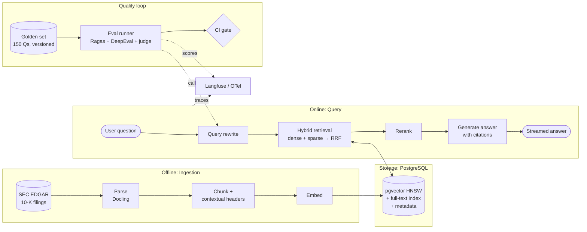

# Project 1: RAG Eval Lab

> A production-style RAG service over public SEC filings. Every retrieval technique is **measured**,
> and quality regressions are **blocked in CI**.

**Target role:** GenAI / Applied AI Engineer
**Gaps it closes:** evals (Ragas/DeepEval, LLM-as-judge, CI gates), observability (Langfuse/OTel),
reranking, and measured retrieval quality
**Status:** 🟡 Design phase (no code yet)

## Design documents

| # | Document | What it answers |
|---|---|---|
| 1 | [Requirements](docs/01-requirements.md) | What we're building, for whom, scope, success metrics, capacity estimates |
| 2 | [High-Level Architecture](docs/02-architecture.md) | Components, data flows, sequence diagrams, deployment |
| 3 | [Low-Level Design](docs/03-low-level-design.md) | Data model, API contracts, pipeline internals, configuration |
| 4 | [Evaluation Design](docs/04-evaluation-design.md) | Golden dataset, metrics, judge calibration, ablation plan, CI gate |
| 5 | [Non-Functional Design](docs/05-non-functional.md) | Latency, cost, observability, security, failure modes, scaling |
| 6 | [Architecture Decision Records](docs/06-decisions.md) | Why each major choice was made, and the alternatives considered |
| 7 | [Tech Stack](docs/07-tech-stack.md) | Every technology used, why it was chosen, alternatives rejected, what it adds to your profile |

## The system at a glance

## Planned deliverables
1. A FastAPI service with SSE streaming, answering questions about 10-K filings with citations
2. A config-driven retrieval pipeline, so each technique can be switched on or off for ablations
3. A 150-question golden dataset, versioned in git
4. An eval harness plus a GitHub Actions gate that fails PRs on quality regressions
5. An ablation results table and a Langfuse latency/cost dashboard
6. A blog/LinkedIn post about the findings
