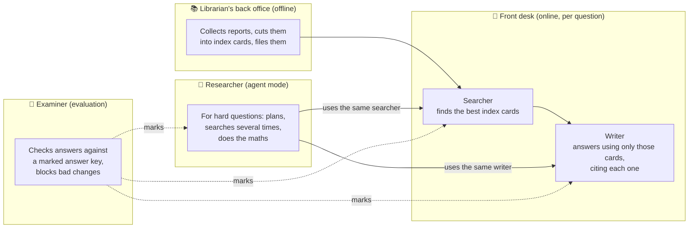
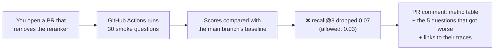
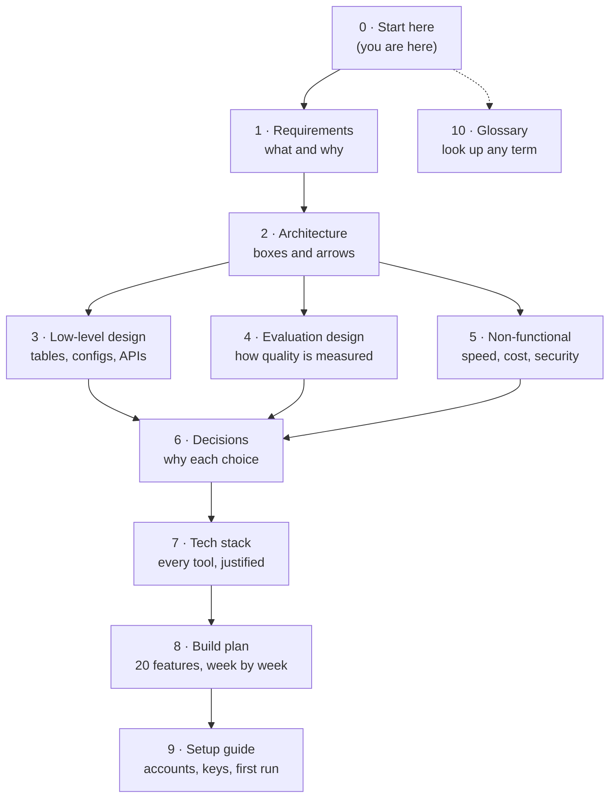

# 0. Start Here: the project in plain English

New to these docs, or preparing for an interview? Read this page first. It explains what the project
does, follows one question all the way through the system, and tells you which document to open next.
Unfamiliar terms are explained in the [glossary](10-glossary.md).

## 0.1 The project in three sentences

1. It's a **question-answering service over company annual reports** (SEC 10-K filings of 20 consumer
   companies): you ask *"How did PepsiCo's gross margin change last year?"* and get a streamed answer where
   every sentence links to the exact passage it came from.
2. Every technique used to find the right passages is **measured** against a hand-checked set of 150+
   questions, so each design choice is backed by a number, not a guess.
3. A **CI gate** blocks any code change that makes answers worse, and an optional **agent mode** handles
   complex questions and is only used where it measurably beats the simpler pipeline.

## 0.2 Which path should you read?

| You want to… | Read, in this order | Time |
|---|---|---|
| Explain the project in an interview | This page → [Glossary](10-glossary.md) → [Decisions](06-decisions.md) → interview talking points at the bottom of each [feature page](08-build-plan/README.md#84-feature-index) | 30 min |
| Start building | This page → [Setup guide](09-setup-guide.md) → [Build plan](08-build-plan/README.md) → the feature page you're working on | 45 min |
| Understand a design choice | [Decisions](06-decisions.md) (short) → [Tech stack](07-tech-stack.md) (detailed) | 15 min |
| Review the whole design | [Requirements](01-requirements.md) → [Architecture](02-architecture.md) → [Low-level design](03-low-level-design.md) → [Evaluation](04-evaluation-design.md) → [Non-functional](05-non-functional.md) | 2 h |

## 0.3 The mental model: a research library

The easiest way to picture the system is a library with five roles:

| Library role | Real component | Feature pages |
|---|---|---|
| Back office | Ingestion: download filings, parse, chunk, embed, index in Postgres | F1–F4 |
| Searcher | Retrieval: query rewrite, hybrid search, reranking | F5–F7 |
| Writer | Answer generation with citations and "not found" answers | F8, F9 |
| Researcher | Agentic mode (LangGraph) | F18 |
| Examiner | Golden dataset, eval runner, CI gate, ablation report, trajectory evals | F11–F14, F19 |

## 0.4 A question's journey (pipeline mode)

Follow one question from the moment it's asked. *(All numbers and passages below are illustrative, not
real figures from the filings.)*

> **Question:** "How did PepsiCo's gross margin change from FY2023 to FY2024, and what drove it?"

**Before any question is asked (offline, done once):** PepsiCo's 10-K filings were downloaded from SEC
EDGAR, parsed into sections (Item 1, Item 7…) and tables, split into ~512-token **chunks**, and each
chunk was turned into a vector (a list of 1,024 numbers that captures its meaning). All of it sits in one
Postgres database. *(F1–F4)*

| Step | What happens | What comes out | Feature |
|---|---|---|---|
| 1. Receive | The API checks the API key and starts a trace in Langfuse | `trace_id` | F9, F10 |
| 2. Understand | A small, fast LLM rewrites the question into search queries and extracts filters | `queries: ["PepsiCo gross margin fiscal 2024", "PepsiCo gross margin fiscal 2023"]`, `filters: {ticker: PEP, fiscal_year: [2023, 2024]}`, `type: comparison_years` | F7 |
| 3. Search two ways | **Dense** search finds chunks with similar *meaning*; **sparse** (keyword) search finds chunks with the exact words "gross margin". Both run in parallel | Two lists of 50 chunks | F5 |
| 4. Merge | **RRF** merges the two lists by rank, so a chunk ranked high in both wins | 40 candidates | F5 |
| 5. Rerank | A **cross-encoder** reads the question and each candidate together and scores how well it answers | Top 8 chunks, best first | F6 |
| 6. Decide | If even the best chunk scores below the threshold, the system says "not found in the filings" instead of guessing | Continue or abstain | F8 |
| 7. Write | The strong LLM gets the 8 numbered sources and strict rules: use only these, cite every sentence | Streamed text: *"Gross margin rose from 54.2% to 54.6% [1][2], mainly due to pricing actions [1]."* | F8 |
| 8. Check citations | Every `[n]` is mapped to its chunk; invalid numbers are removed and counted | Citation list with company, year, section, exact character range | F8 |
| 9. Record | Every step's latency, tokens and cost are saved as spans in the trace | A Langfuse trace you can click through | F10 |

Target speed: the first words appear within **3 s** (p95), and the full answer within **8 s**.

## 0.5 The same idea for a hard question (agent mode)

> **Question:** "Compare Coca-Cola's and PepsiCo's FY2024 effective tax rates, and give the difference in
> percentage points."

The fixed pipeline does **one** search round, and both companies compete for the same 8 slots. In agent
mode, the researcher works like a person would:

1. **Plan:** "I need KO's FY2024 tax rate, PEP's FY2024 tax rate, then the difference."
2. **Act:** it calls `search_filings` for KO and for PEP **at the same time**.
3. **Calculate:** it calls `calculate("20.9 - 19.1")` (illustrative numbers) instead of doing arithmetic
   in its head.
4. **Reflect:** both numbers are found, so it calls `finish()`.
5. **Answer:** the **same writer** from step 7 above writes the cited answer from everything the agent
   collected.

The user sees each step appear live (`step` events). A **guard** caps every run (6 steps, 12 tool calls,
40k tokens, 45 s), so the agent can't loop forever or burn money. In `auto` mode, simple questions skip
the agent completely. *(F18)*

## 0.6 How a bad change gets caught

This is the part interviewers usually find most interesting.

1. The **golden set** holds questions with known answers, and for each answer the **exact character span
   in the filing** that proves it. *(F11)*
2. The **eval runner** answers every golden question and scores it: did we retrieve the proving passage?
   Is the number right? Is every sentence supported? *(F12)*
3. Scores come with **confidence intervals**, so a tiny random wobble isn't mistaken for a real change.
4. The **gate** compares the PR's scores with `main` and fails the check if any metric drops more than
   its tolerance in `gate.yaml`. *(F13)*
5. For the agent, the gate also watches **trajectory** metrics, e.g. "did it search both companies?" and
   "did the number of steps suddenly double?" *(F19)*

## 0.7 How the documents fit together

## 0.8 FAQ

**Why not just use LangChain or LlamaIndex?**
The project is about *measuring* each retrieval step, and those frameworks hide the steps. Writing them
by hand also shows you understand what the frameworks do. LangGraph is used only for the agent loop,
where it adds real value. ([ADR-013](06-decisions.md), [ADR-015](06-decisions.md))

**Why Postgres instead of Pinecone or another vector database?**
At ~50k vectors, one Postgres with pgvector handles vectors, keyword search and metadata in one place.
The scaling path to a dedicated vector store is documented in [05 §5.6](05-non-functional.md). ([ADR-002](06-decisions.md))

**Why label evidence spans instead of "the right chunk IDs"?**
Chunk IDs change every time the chunking strategy changes. A character span in the original document
doesn't, so one golden set can score every chunking strategy fairly. ([ADR-007](06-decisions.md))

**Why is an LLM judging another LLM trustworthy?**
Only after it's checked: you hand-label 50 answers and the judge must agree with you (Cohen's κ ≥ 0.6).
The tightest gate rules also use deterministic metrics that need no LLM at all. ([04 §4.5](04-evaluation-design.md))

**What if the agent isn't better than the pipeline?**
Then the report says so, the router keeps sending everything to the pipeline, and you have an honest,
data-backed answer to "when should you use an agent?", which is a strong interview story on its own.
([ADR-017](06-decisions.md))

**How much will building it cost?**
Mostly LLM API calls during evals. The response cache makes re-running unchanged configs almost free, the
smoke split keeps CI small, and a budget guard aborts runs that would exceed a token limit. Set a spending
limit on every provider account before you start (see the [setup guide](09-setup-guide.md#94-keeping-costs-safe)).

**Is this the code for the project?**
Not yet. These are the design documents, written before any code. The build follows the
[build plan](08-build-plan/README.md), feature by feature.
