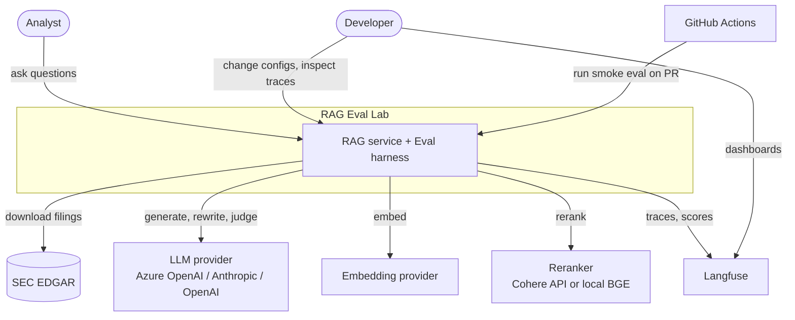
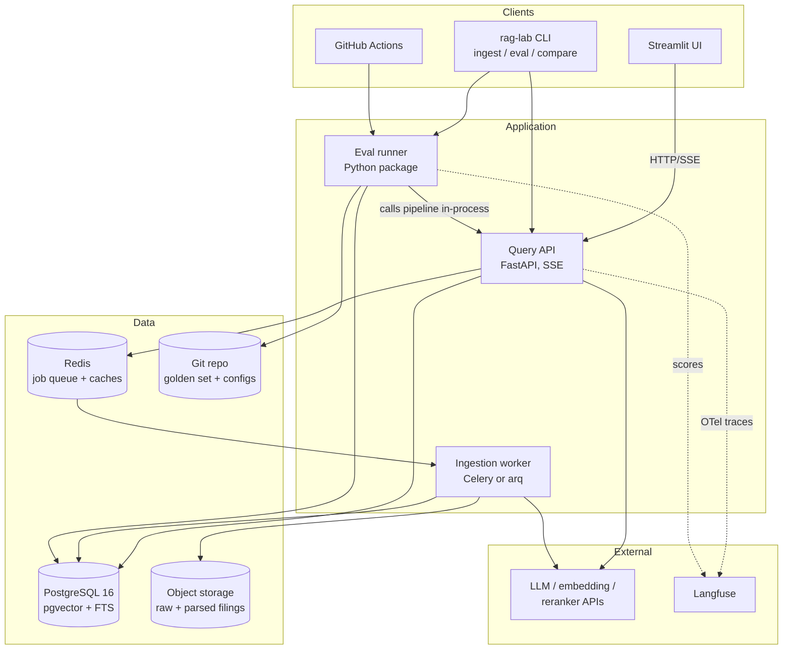
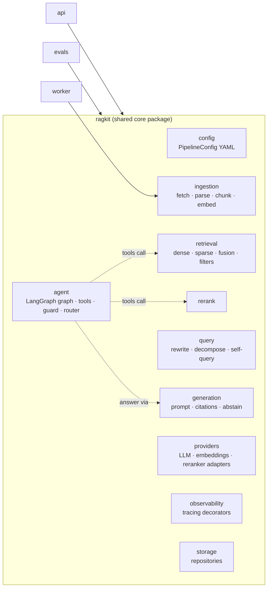
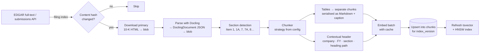
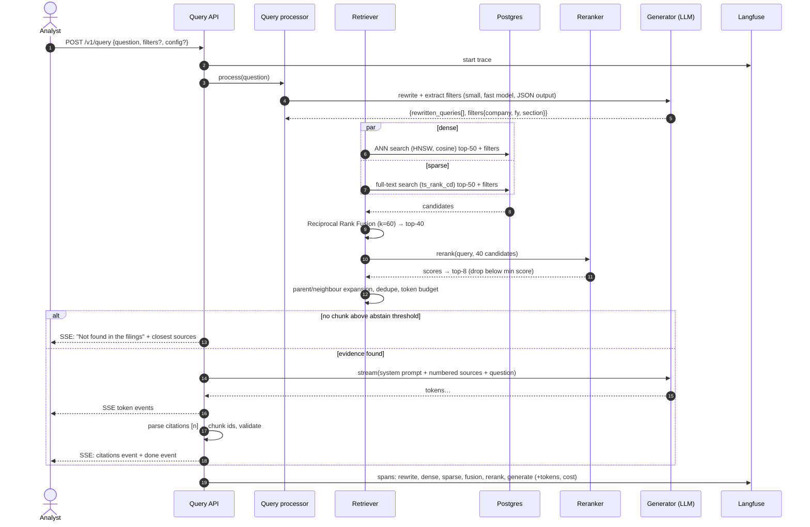
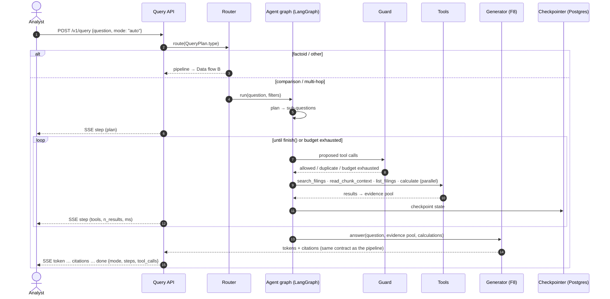
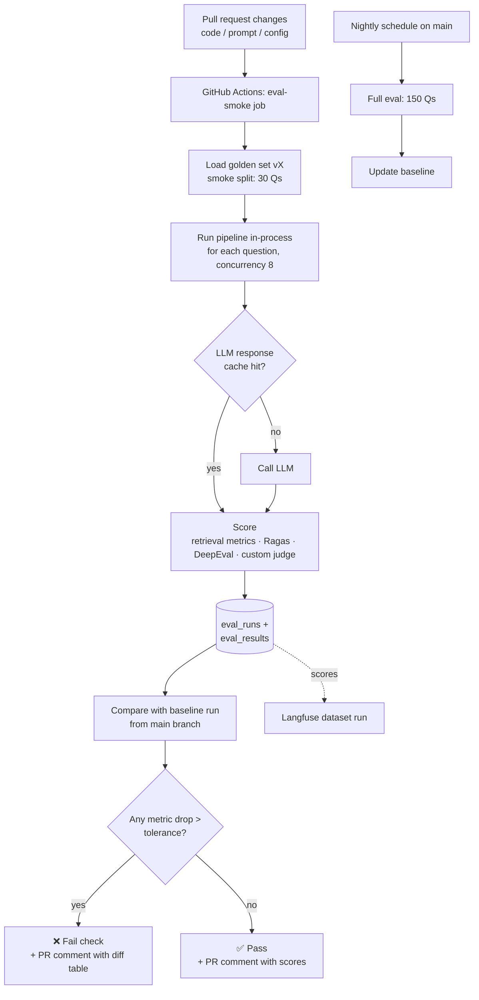
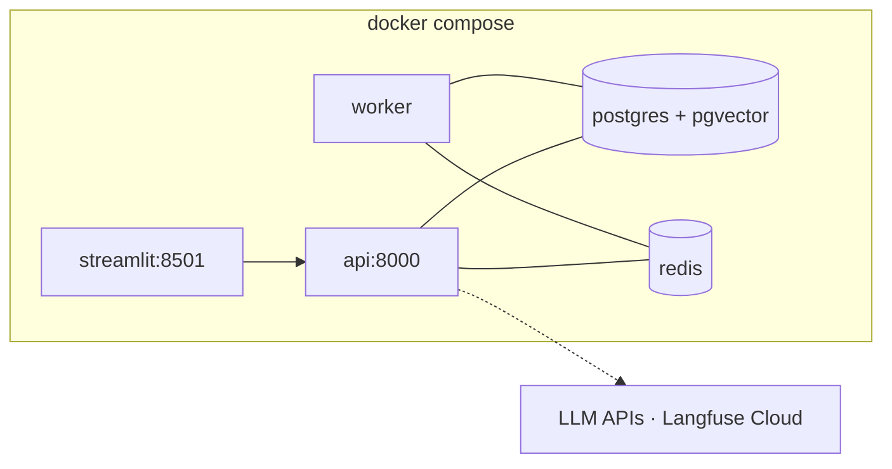
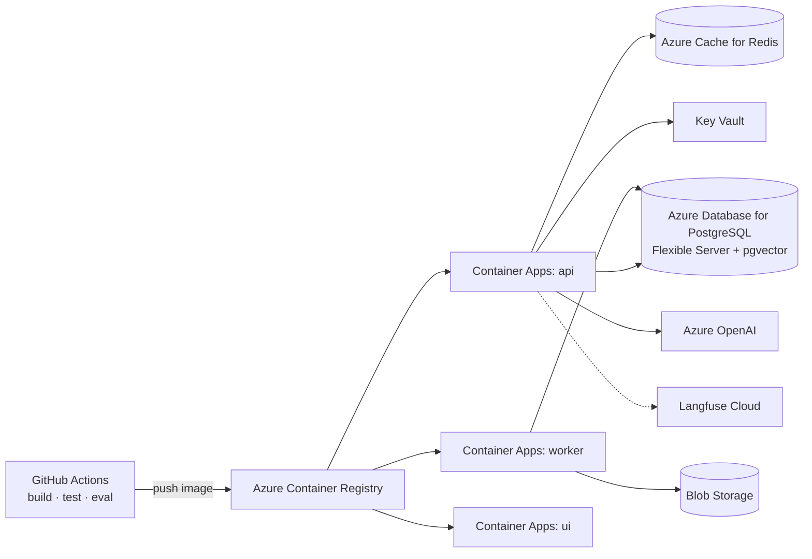

# 2. High-Level Architecture

## 2.1 Design principles

1. **Everything is measurable.** Every stage emits a trace span with inputs, outputs, latency and tokens.
2. **Pipelines are configuration, not code branches.** A retrieval pipeline is a YAML file. An ablation
   is a diff between two YAML files.
3. **Evaluate chunk-independently.** Ground truth is labelled as *evidence spans in the source document*,
   not chunk IDs, so the same golden set can score any chunking strategy (see [04](04-evaluation-design.md)).
4. **Retrieved text is untrusted input.** It is delimited, never executed, and never allowed to override
   system instructions.
5. **Agents must earn their cost.** The agentic mode shares retrieval and answer generation with the
   fixed pipeline and is compared with it on the same golden set. It's used only where it measurably wins.
6. **Boring infrastructure.** Postgres does vector, full-text and metadata storage. There is no extra database
   until the numbers justify one.

## 2.2 System context (C4 level 1)



## 2.3 Containers (C4 level 2)



| Container | Responsibility | Tech |
|---|---|---|
| **Query API** | Online query pipeline **and agentic mode**, SSE streaming, document/eval-run read APIs | FastAPI, Pydantic v2, asyncio, LangGraph (agent mode only) |
| **Ingestion worker** | Download → parse → chunk → embed → index, incremental and idempotent | arq (async Redis queue) or Celery |
| **Eval runner** | Runs a pipeline config over a golden-set version, scores it, stores results, enforces the gate | Python, Ragas, DeepEval, custom metrics |
| **PostgreSQL** | Documents, chunks, vectors (pgvector HNSW), full-text (tsvector GIN), eval runs | Postgres 16 + pgvector ≥ 0.7 |
| **Redis** | Job queue; embedding cache; LLM response cache (evals only) | Redis 7 |
| **Object storage** | Raw EDGAR HTML and parsed Docling JSON (for re-chunking without re-parsing) | Local volume / Azure Blob |
| **Langfuse** | Traces, prompt versions, eval scores, cost dashboards | Langfuse Cloud (free tier) or self-hosted |

> The eval runner imports the **same pipeline package** the API uses (in-process), rather than calling it
> over HTTP. This keeps CI fast and deterministic, and guarantees we evaluate the exact code that ships.

## 2.4 Internal module structure



## 2.5 Data flow A: ingestion (offline)



**Key points**
- **Parse once, chunk many times.** The parsed Docling JSON is stored, so a new chunking strategy doesn't
  re-download or re-parse anything.
- **Index versions.** `(chunking_strategy, embedding_model)` → `index_version`. Several versions live
  side by side, and a pipeline config picks one.
- **Idempotent.** Filing identity = accession number; content identity = SHA-256 of the HTML. Chunk
  identity = hash(index_version, document_id, char_start, char_end).
- **SEC fair-access rules:** a descriptive `User-Agent` header with contact email, and ≤ 10 requests/second.

## 2.6 Data flow B: online query



## 2.6b Data flow B2: agentic query (`mode: agent`, or `auto` for complex questions)



**Key points**
- The agent **reuses** the pipeline's retrieval (as the `search_filings` tool) and its answer generator, so
  any retrieval improvement from the ablations helps both modes.
- The guard is plain Python and runs **before** every tool call: step, tool-call, token and time budgets,
  plus duplicate-call detection.
- Tools are read-only. The worst an injected instruction in a filing can do is waste the agent's budget,
  which the guard caps.

## 2.7 Data flow C: evaluation & CI gate



## 2.8 Deployment view

**Local (primary for development and CI)**



**Cloud (Azure, to match your Azure experience)**



Infrastructure is defined in **Terraform** (`infra/`), and the API scales from 0–3 replicas on HTTP
concurrency. An AWS equivalent is ECS Fargate + RDS Postgres (pgvector) + ElastiCache + Bedrock.

## 2.9 Proposed repository layout

```
01-rag-eval-lab/
├── docs/                      # these design docs
├── configs/
│   ├── pipelines/             # A0-naive.yaml … A7-full.yaml (ablations), AG1-agent.yaml, AG2-auto.yaml
│   └── prompts/               # versioned prompt templates
├── data/golden/               # golden set JSONL (v1, v2 …) + human labels
├── src/ragkit/                # core package (see 2.4), incl. ragkit/agent/ (LangGraph)
├── src/api/                   # FastAPI app
├── src/worker/                # ingestion jobs
├── src/evals/                 # runner, metrics, gate, report
├── ui/                        # Streamlit
├── infra/                     # Terraform (Azure)
├── .github/workflows/         # ci.yml, eval-smoke.yml, eval-nightly.yml
├── docker-compose.yml
└── pyproject.toml             # uv-managed
```
