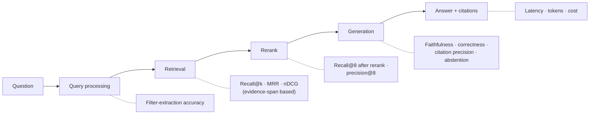
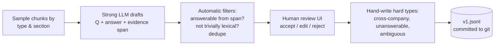
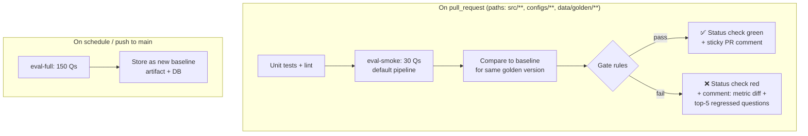

# 4. Evaluation Design

> This is the core of the project. The RAG service is the thing being measured; **the evaluation
> system is the product.**

## 4.1 What we evaluate, and at which layer



Measuring each layer separately tells us **where** quality is lost. For example, low answer correctness
together with high recall points to a generation problem, not a retrieval problem.

## 4.2 Golden dataset

### Size & composition (v1: 150 questions)

| Type | Count | Example | What it tests |
|---|---|---|---|
| Factoid (single chunk) | 40 | "What was Colgate's FY2024 net sales?" | Basic retrieval + exact numbers |
| Table / numeric | 30 | "What were Hershey's North America Confectionery segment operating profits in FY2023?" | Table parsing & serialisation |
| Multi-hop, same filing | 20 | "Which risk factor does Clorox link to its 2023 cyberattack, and what was the sales impact?" | Several chunks from one document |
| Cross-year comparison | 20 | "How did PepsiCo's gross margin change FY2023 → FY2024 and why?" | Filters + multiple documents |
| Cross-company comparison | 15 | "Compare Coca-Cola's and PepsiCo's FY2024 effective tax rates." | Multi-query + fusion |
| Unanswerable | 15 | "What is P&G's FY2024 revenue in Brazil?" (not disclosed) | Abstention |
| Ambiguous / underspecified | 10 | "What was revenue growth?" | Clarification or scoped answer |

**Splits:** `smoke` = 30 stratified questions (used in PR CI). `full` = all 150 (nightly). `holdout` =
20 extra questions **never** used while tuning, and run once at the end to check for overfitting to the
golden set.

### Record schema (`data/golden/v1.jsonl`)

```json
{
  "id": "q-0042",
  "type": "cross_year",
  "question": "How did PepsiCo's gross margin change from FY2023 to FY2024, and what drove it?",
  "reference_answer": "Gross margin rose from 54.2% to 54.6%, driven by …",
  "key_facts": ["FY2023 gross margin 54.2%", "FY2024 gross margin 54.6%", "driver: pricing actions"],
  "evidence": [
    { "accession_no": "0000077476-25-000007", "char_start": 184220, "char_end": 184910 },
    { "accession_no": "0000077476-24-000009", "char_start": 176004, "char_end": 176590 }
  ],
  "expected_filters": { "ticker": ["PEP"], "fiscal_year": [2023, 2024] },
  "answerable": true,
  "numeric_answers": [{ "value": 54.6, "unit": "%", "tolerance": 0.05 }],
  "split": "smoke",
  "created_by": "synthetic+human",
  "reviewed": true
}
```
*(The numbers above are illustrative placeholders, not real figures.)*

### How the golden set is built



- Target: at least 40% of questions **hand-written or heavily edited**. Purely synthetic questions tend to
  copy the source wording, which inflates sparse-retrieval scores.
- The golden set is **versioned** (`v1`, `v2` …). Editing a question creates a new version, and runs are
  only compared within the same version.

## 4.3 Chunk-independent retrieval scoring

**Problem:** If ground truth were labelled as chunk IDs, changing the chunking strategy would make the
golden set invalid.

**Solution:** Ground truth is stored as **evidence character spans** in the parsed document. A retrieved
chunk counts as **relevant** to an evidence span if

$$\frac{|\text{chunk} \cap \text{span}|}{|\text{span}|} \ge 0.5 \quad \text{(or the chunk fully contains the span)}$$

A question's evidence is **covered** at k when every evidence span is matched by at least one of the top-k
chunks.

| Metric | Definition |
|---|---|
| **Evidence recall@k** | Fraction of evidence spans covered by the top-k (k = 5, 8, 20, 40) |
| **Full-coverage@k** | Fraction of questions whose evidence spans are *all* covered (this matters for multi-hop) |
| **MRR** | Mean of 1 / (rank of first relevant chunk) |
| **nDCG@8** | Binary relevance, discounted by rank |
| **Precision@8** | Relevant chunks / 8, which measures context noise |

These metrics are deterministic and need **no LLM**, so they are cheap and stable enough to gate on.

## 4.4 Generation metrics

| Metric | Tool | Method | Notes |
|---|---|---|---|
| **Faithfulness** | Ragas | Claims in the answer are checked for support by the retrieved context | Main hallucination metric |
| **Answer correctness** | Custom judge (DeepEval `GEval`) | Rubric: are all `key_facts` present and correct, with no contradictions? Score 1–5, then normalised | Uses the reference answer and key facts |
| **Numeric accuracy** | Custom, deterministic | Extract numbers from the answer; compare to `numeric_answers` within tolerance | No LLM, so fully reliable |
| **Citation precision** | Custom | Share of cited chunks that actually support their sentence (judge per sentence–citation pair) | |
| **Citation validity** | Custom, deterministic | No citation numbers that point to nothing; every factual sentence has a citation | |
| **Abstention accuracy** | Custom, deterministic | Unanswerable → `NOT_FOUND`; answerable → not `NOT_FOUND`. Report the confusion matrix | Both false abstentions and hallucinated answers count |
| **Answer relevancy** | Ragas | Does the answer address the question? | Secondary |
| **Filter accuracy** | Custom, deterministic | Extracted filters vs. `expected_filters` | Only when self-query is enabled |
| **Latency / tokens / cost** | Langfuse | Recorded per item; report p50/p95 | |

## 4.5 LLM-as-judge design & calibration

- **Judge ≠ generator family.** If the generator is GPT-class, the judge is Claude-class, or the reverse.
  This reduces self-preference bias.
- `temperature = 0` and a structured output `{reasoning, score}`. The reasoning comes first so the score
  follows from it.
- **Rubric with anchored examples** for scores 1, 3 and 5, kept in `configs/prompts/judge_correctness@vN`.
- **Calibration:** 50 answers are labelled by hand (you) on the same 1–5 scale. Report **Cohen's weighted
  κ** and Spearman ρ between judge and human. The judge is only trusted for gating if **κ ≥ 0.6**. If it's
  lower, iterate on the rubric, then re-calibrate.
- **Judge drift:** The judge model and prompt version are part of the run metadata. Changing either one
  invalidates baseline comparisons, so a new baseline must be recorded.

## 4.6 Statistical rigour

With 30–150 questions, small score differences are mostly noise.

- Report every aggregate as **mean ± 95% bootstrap CI** (1,000 resamples over questions).
- To compare two pipelines on the **same questions**, use a **paired bootstrap** of the per-question
  difference. A technique counts as an improvement only if the CI of the difference excludes 0.
- For LLM-judged metrics, optionally run the judge 3 times and average, which reduces the judge's own
  variance.

## 4.7 Ablation plan

Each row adds **one** change to the previous row, and all rows use golden set v1 `full`.

| ID | Config | Hypothesis |
|---|---|---|
| **A0** | `fixed-512`, dense only, top-5, no rerank | Baseline |
| **A1** | → `structural-512` + table chunks | Table/numeric questions improve significantly |
| **A2** | → hybrid (dense + sparse, RRF) | Better on exact terms (tickers, line-item names) |
| **A3** | → reranker (40 → 8) | Largest precision@8 and faithfulness gain |
| **A4** | → query rewrite / multi-query | Cross-year and cross-company recall improves |
| **A5** | → contextual headers | Fewer wrong-company / wrong-year retrievals |
| **A6** | → self-query filters | Same gains as A5 for less cost? (compare) |
| **A7** | → parent-child expansion | Multi-hop improves; token cost goes up (trade-off) |
| A-emb | A5 with a different embedding model / dim (1024 vs 3072, bge-m3) | Cost vs. quality of embeddings |
| A-llmctx | A5 with LLM-generated contextual summaries | Is the ingestion cost worth it? |

**Results table format (goes in the README)**

| ID | Recall@8 | Full-cov@8 | P@8 | Faithful | Correct | Numeric | Abstain | p95 ms | In-tok/q |
|---|---|---|---|---|---|---|---|---|---|
| A0 | 0.xx ± .xx | … | … | … | … | … | … | … | … |

Also report results **by question type**. That breakdown is where the real insights are, e.g. "A1 did
nothing for factoid questions but +0.3 recall on table questions".

## 4.8 CI gate



**Gate rules** (`configs/gate.yaml`)
```yaml
baseline: main@latest
metrics:
  evidence_recall@8:   { max_drop: 0.03 }     # deterministic, so a tight tolerance is OK
  numeric_accuracy:    { max_drop: 0.05 }
  abstention_accuracy: { max_drop: 0.05 }
  faithfulness:        { max_drop: 0.05, min_abs: 0.85 }   # judged, so a looser tolerance
  answer_correctness:  { max_drop: 0.05 }
  p95_latency_ms:      { max_increase_pct: 25 }
  tokens_per_query:    { max_increase_pct: 30 }
hard_fail_on:
  - any_citation_invalid_rate > 0.02
```

**Keeping CI cheap and deterministic**
- The LLM response cache (§3.8) means an unchanged prompt and config costs almost nothing to re-run.
- Smoke split only on PRs, with a budget guard that aborts if estimated tokens exceed a limit.
- Secrets: provider keys live in GitHub Actions secrets. PRs from forks run only the deterministic
  retrieval metrics.

**Proof it works (README evidence):** Open a deliberate "bad" PR, e.g. switching to `fixed-512` or
removing the reranker, and screenshot the gate blocking it.

## 4.9 Online evaluation (lightweight)

- 👍/👎 feedback is attached to the Langfuse trace.
- A nightly job samples 5% of production traces (or demo traffic) and runs faithfulness plus
  citation-validity judges on them, then plots the trend in Langfuse.
- Failed or low-scored traces are reviewed and turned into **new golden questions** in the next golden-set
  version. This closes the loop.

## 4.10 Tooling map

| Need | Tool |
|---|---|
| Deterministic retrieval metrics | Custom (`src/evals/metrics/retrieval.py`), because span overlap isn't built into other tools |
| Faithfulness, answer relevancy | **Ragas** |
| Rubric judges (correctness, citation support) | **DeepEval** `GEval` / custom judge prompts |
| Runs, datasets, score storage & UI | **Langfuse** datasets + scores (also stored in Postgres for the gate) |
| CI | **GitHub Actions** + a sticky PR comment action |
| Stats | numpy bootstrap (custom, ~30 lines) |
