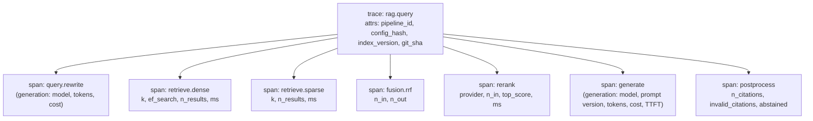

# 5. Non-Functional Design

## 5.1 Latency budget (online query, target p95)

```mermaid
gantt
    title Query latency budget (ms, p95 target, full answer ≤ 8 s)
    dateFormat X
    axisFormat %L
    section Pre-retrieval
    Query rewrite + filters (fast LLM)   :a1, 0, 700
    section Retrieval
    Dense + sparse (parallel)            :a2, after a1, 120
    RRF fusion                           :a3, after a2, 10
    Rerank 40 → 8                        :a4, after a3, 400
    section Generation
    Time to first token                  :a5, after a4, 1200
    Stream remaining tokens              :a6, after a5, 5000
```

| Stage | p95 budget | Main levers if over budget |
|---|---|---|
| Rewrite + filters | 700 ms | Smallest capable model; skip for short, specific questions; run in parallel with a first dense search |
| Dense + sparse | 120 ms | HNSW `ef_search`, partial indexes, `iterative_scan` |
| Rerank | 400 ms | Fewer candidates (40 → 25); local cross-encoder on GPU; provider region |
| **TTFT total** | **≤ 3 s** | Provider prompt caching of the static system prompt; smaller context |
| Full answer | ≤ 8 s | Output cap of 600 tokens; concise-answer instructions |

**Agent mode (NFR-10).** The agent has no fixed stage budget, because the number of steps varies. It is
bounded instead: the first `step` event within 2 s (the plan), each `search_filings` call costs the same
as one retrieval + rerank (≈ 520 ms), parallel tool calls keep comparison questions at ~2 rounds, and the
guard stops the run at 45 s. Target: full answer p95 ≤ 20 s.

## 5.2 Cost model

Per query:

$$\text{cost} = \underbrace{T_{rw}^{in} p^{in}_{fast} + T_{rw}^{out} p^{out}_{fast}}_{\text{rewrite}} + \underbrace{N_{rr}\, p_{rr}}_{\text{rerank}} + \underbrace{T_{gen}^{in} p^{in}_{strong} + T_{gen}^{out} p^{out}_{strong}}_{\text{generation}} + \epsilon_{embed}$$

Typical token counts: rewrite ≈ 400 in / 80 out; generation ≈ 6,000 in / 300 out. **Generation input
tokens dominate**, so the biggest cost levers are `rerank.top_n`, `context.max_tokens`, parent expansion,
and prompt caching. The actual prices come from `configs/models.yaml` and are logged by Langfuse per trace.
Every ablation row reports **input tokens per query** next to quality.

**Agent mode** adds, per question, the plan call plus one tool-calling LLM turn per step (each turn re-reads
the growing message history), so a typical 2–3-step run costs roughly **3–5× the pipeline's tokens**.
That's why `auto` mode exists and why every agent row in the results reports tokens per query next to
quality.

Eval run cost: ≈ 150 × (generation + rewrite + ~4 judge calls). On a cache hit (unchanged
prompt/config) the cost is close to zero. An agent eval run (AG1) costs roughly **2× a pipeline run**
because of the extra agent turns, so it runs on demand, not nightly; AG2 (`auto`) costs less because only
complex questions reach the agent.

## 5.3 Observability

**Traces (Langfuse via OpenTelemetry)**

In agent mode the trace is nested: `rag.query` → `agent.plan` → `agent.act` (one per step) →
`tool.search_filings` → the usual `retrieve.dense`, `retrieve.sparse`, `fusion.rrf` and `rerank` spans,
then `generate`. The trace attributes add `mode`, `steps`, `tool_calls` and `budget_exceeded`.

- Prompts are stored as **Langfuse prompt versions**, and traces link to the exact version used.
- Eval runs are Langfuse **dataset runs**, so each eval item links to its full trace. You can click from a
  failing golden question straight into what was retrieved.

**Metrics (Prometheus-style, via OTel)**
- `rag_request_duration_seconds{stage}` (histogram)
- `rag_ttft_seconds` (histogram)
- `rag_tokens_total{model, direction}`, `rag_cost_usd_total{model}`
- `rag_abstentions_total`, `rag_citation_invalid_total`
- `rag_upstream_errors_total{provider, code}`

**Logs:** JSON structured logs with `trace_id`. Question text is logged. The corpus is public data, but the
field is kept redactable because Project 6 will reuse this code for private data.

## 5.4 Security

| Threat | Mitigation |
|---|---|
| Prompt injection inside retrieved documents (indirect injection) | Sources wrapped in `<source>` tags with a "data, not instructions" rule; no tools or side effects in this pipeline, so the blast radius is limited to answer text; a red-team set of 10 injected passages is included as an eval category |
| Prompt injection in the user's question | Output limited to answer + citations; system prompt is not reflected back; injection attempts added to the golden set |
| API abuse / cost blow-up | API-key auth, per-key rate limit (token bucket in Redis), `max_output_tokens`, request size limits |
| Secret leakage | Keys only in env / Azure Key Vault; never logged; GitHub secrets are not exposed to fork PRs |
| SSRF via ingestion | Ingestion only fetches from an allow-list (`sec.gov`) |
| Agent misuse through injected text (e.g. a filing says "search for X 50 times") | Tools are read-only with no side effects; the guard enforces step, tool-call, token and time budgets and blocks duplicate calls; injection probes are part of the golden set, and trajectory metrics show budget abuse |
| Supply chain | Pinned dependencies (`uv.lock`), Dependabot, container image scanning in CI |
| Data licensing | SEC filings are public; EDGAR fair-access rules respected (User-Agent header, ≤ 10 req/s) |

## 5.5 Failure modes & degradation

| Failure | Detection | Behaviour |
|---|---|---|
| Rewrite LLM down or slow | Timeout 3 s | Use the original question and no filters; flag `degraded=rewrite` in the trace |
| Reranker down | Timeout 2 s / 5xx | Use RRF order top-8; flag `degraded=rerank` |
| Generation provider down | 5xx / timeout before first token | Retry once, then fall back to the secondary provider (config); otherwise `502` |
| Postgres down | `/readyz` fails | Load balancer stops routing; API returns `503` |
| Empty or poor retrieval | Top rerank score < threshold | Abstain, show the closest sources |
| Model returns uncited claims | Post-processing validator | Strip invalid markers; log `citation_invalid`; counted by the eval |
| Agent hits a budget | Guard | Stop the loop, answer from the evidence collected so far (or abstain); `budget_exceeded=true` in `done` and in the trace |
| Agent tool error (bad args, timeout) | Tool wrapper | Return the error to the LLM as a message so it can retry differently; counted by tool-call validity |
| Ingestion parse failure | Job error | Retry ×3 with backoff, then dead-letter; the document is marked `failed` and skipped by queries |

## 5.6 Scaling path (beyond the portfolio scale)

| Growth | Change |
|---|---|
| 10× corpus (~500k chunks) | Still fine in Postgres: tune HNSW `m`/`ef`, add partitions per `index_version` |
| 100× corpus (5M+ chunks) or high QPS | Read replicas for search; consider Qdrant / Azure AI Search for vectors; move BM25 to `pg_search` or OpenSearch |
| High QPS | Stateless API scale-out; reranker becomes the bottleneck → self-host a cross-encoder on GPU with batching |
| Many teams / tenants | Row-level security + tenant ID on chunks (→ Project 6); gateway + semantic cache (→ Project 7) |
| Frequent document updates | CDC-style incremental re-chunking per changed section; soft-delete old chunks by `document_version` |

## 5.7 Testing strategy

| Level | What | Tooling |
|---|---|---|
| Unit | Chunkers (boundaries, offsets), RRF, span-overlap metric, citation parser, config hashing | pytest, hypothesis (property tests on offsets) |
| Integration | Postgres queries (dense, sparse, filters) against a seeded mini-corpus | pytest + testcontainers |
| Contract | API schemas, SSE event order (incl. `step` events in agent mode) | pytest + httpx |
| Agent graph | Node transitions and budgets with a **scripted fake LLM** (fixed tool-call sequence) | pytest |
| Eval (quality) | Smoke and full golden-set runs | Eval runner + CI gate |
| Load | 20 concurrent users, p95 latency | Locust or k6 (once, documented in the README) |
