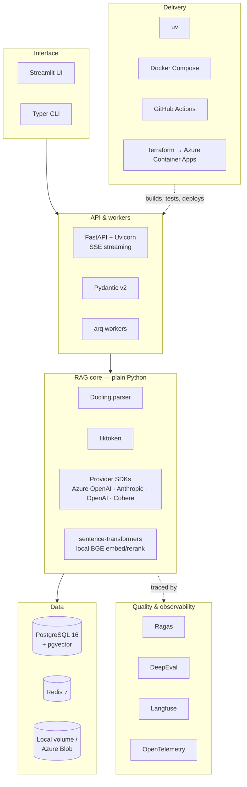

# 7. Tech Stack: What We Use and Why

For every technology in this project, this document answers five questions:
1. **What does it do in this system?**
2. **Why was it chosen?**
3. **What alternatives were considered, and why weren't they chosen?**
4. **What does it add to your profile?** (Which gap in the market/JD analysis does it close?)
5. **When would we replace it?**

Choosing a tool and being able to explain the trade-off is itself a senior-level skill. Expect these
questions in interviews, e.g. "Why pgvector and not Pinecone?"

Selection criteria used throughout:

| # | Criterion | Meaning |
|---|---|---|
| C1 | **Fit for scale** | Right-sized for ~50k vectors and < 1 QPS, with a documented path to 100× |
| C2 | **Transparency** | Lets us see and measure every stage (the project is about evaluation) |
| C3 | **Market value** | Shows up in 2026 GenAI Engineer JDs (see [01-market-analysis](../../../01-market-analysis.md)) |
| C4 | **Gap-filling** | Covers something your résumé doesn't show yet (see [00-profile-gap-analysis](../../../00-profile-gap-analysis.md)) |
| C5 | **Low ops & cost** | Runs with `docker compose up`; demo cost of a few dollars |
| C6 | **Portability** | No hard lock-in; providers can be swapped by config |

---

## 7.1 The stack at a glance

## 7.2 Summary table

| Layer | Choice | One-line reason | Main alternative (not chosen) |
|---|---|---|---|
| Language | **Python 3.12** | The GenAI ecosystem is built on it; ~71% of JDs | TypeScript (used in Projects 5–6) |
| Package mgmt | **uv** | Fast, lockfile, current standard | Poetry, pip-tools |
| API | **FastAPI** | Async, native SSE, Pydantic, your existing strength | Flask, Django, LitServe |
| Validation/config | **Pydantic v2** | Typed configs + structured LLM output in one library | dataclasses + jsonschema |
| Background jobs | **arq** | Async-native, Redis-based, tiny | Celery, Dramatiq |
| Parsing | **Docling** | Structure- and table-aware, gives stable offsets, open source | Unstructured, LlamaParse, BeautifulSoup only |
| Tokenisation | **tiktoken** | Exact token budgets for chunking and context | Character heuristics |
| Vector + keyword + metadata | **PostgreSQL 16 + pgvector** | One datastore does everything at this scale | Pinecone, Qdrant, Azure AI Search, Elasticsearch |
| Cache / queue | **Redis 7** | Job queue + embedding/LLM caches | In-memory, disk cache |
| Generation LLM | **Azure OpenAI** (default), **Anthropic** (alt) | Your Azure experience + a different family for judging | Open-weight via vLLM (optional) |
| Embeddings | **OpenAI `text-embedding-3-large` @1024d** (+ **BGE-M3** local) | Strong quality, Matryoshka dimensions, cheap | Cohere Embed, Voyage |
| Reranker | **Cohere Rerank** (+ **BGE-reranker** local) | Best quality-per-effort gain in RAG | No reranker, LLM-as-reranker |
| RAG framework | **None (plain Python)** | Every stage visible and measurable | LangChain, LlamaIndex, Haystack |
| Eval: RAG metrics | **Ragas** | Standard faithfulness / relevancy metrics | TruLens |
| Eval: rubric judges | **DeepEval** | GEval rubrics, pytest-style, CI-friendly | promptfoo, OpenAI Evals |
| Eval: retrieval metrics | **Custom (numpy)** | Span-overlap scoring isn't available in any library | — |
| Tracing / prompts / eval runs | **Langfuse** | Open source, OTel-native, datasets + scores + prompt versions | LangSmith, Arize Phoenix, W&B Weave |
| Telemetry standard | **OpenTelemetry** | Vendor-neutral traces and metrics | Vendor SDK only |
| UI | **Streamlit** | Internal tool in hours, not days | Next.js (saved for Project 6), Gradio |
| Testing | **pytest, testcontainers, hypothesis** | Real Postgres in tests, property tests for offsets | Mocks only |
| Containers | **Docker Compose** | One-command local stack | Kubernetes (overkill here) |
| CI/CD | **GitHub Actions** | Hosts the eval gate; free for public repos | GitLab CI, Azure DevOps |
| IaC + cloud | **Terraform → Azure Container Apps + Postgres Flexible** | Matches your résumé and Azure-heavy JDs; scale to zero | AWS ECS + RDS, Fly.io |

---

## 7.3 Detailed rationale

### Application layer

#### Python 3.12
- **Role:** All services, the RAG core and evals.
- **Why:** Every eval, RAG and LLM SDK is Python-first; it's in about 71% of AI-engineering JDs.
- **Not chosen:** TypeScript. It's great for full-stack AI, but the eval ecosystem (Ragas, DeepEval,
  numpy statistics) is Python. TypeScript is used in Projects 5–6.

#### uv
- **Role:** Dependency and virtual-environment management, lockfile, Python version pinning.
- **Why:** Resolves and installs 10–100× faster than pip or Poetry, which makes CI fast; one tool
  replaces pip, venv, pip-tools and pyenv; now the default in most new Python AI repos.
- **Not chosen:** Poetry (slower, extra plugins for some workflows); plain pip (no lockfile).

#### FastAPI (+ Uvicorn)
- **Role:** Query API with **SSE streaming**, ingestion/eval endpoints, health checks.
- **Why:** Async-native, so rewrite, dense, sparse and rerank calls run concurrently; first-class
  `StreamingResponse` for token streaming; Pydantic-typed request/response and automatic OpenAPI docs;
  the most-requested Python backend in AI JDs, and you already know it well, so time goes into the new
  skills (evals), not framework learning.
- **Not chosen:** Flask (sync by default, weaker streaming story); Django (too heavy); LitServe/BentoML
  (built for model serving, not orchestration APIs).

#### Pydantic v2
- **Role:** `PipelineConfig` (the YAML ablation configs), API schemas, and **JSON-schema structured
  outputs** from the LLM (query rewrite, judge scores).
- **Why:** One library for config validation, API contracts and LLM output validation; canonical JSON
  serialisation lets us **hash configs** for reproducibility (ADR-008).
- **Not chosen:** dataclasses + jsonschema (more code, no coercion or error messages).

#### arq (async Redis job queue)
- **Role:** Ingestion jobs (download → parse → chunk → embed).
- **Why:** Async like the rest of the codebase, uses Redis (already in the stack), very small API.
  The ingestion workload is modest.
- **Not chosen:** Celery (you already know it; heavier and sync-first; nothing new to learn);
  Temporal (durable execution is covered in Project 3).
- **Replace when:** Ingestion needs complex DAGs or retries across days → Temporal or Prefect.

### Ingestion layer

#### Docling
- **Role:** Parse EDGAR 10-K HTML into a structured document: headings, paragraphs, **tables** with
  cells, and reading order.
- **Why:** Structure-aware, which structural chunking (A1) needs; strong table extraction, which
  numeric questions need; exports a canonical text with **stable character offsets**, which the
  span-based evaluation (ADR-007) depends on; open source (IBM, LF AI & Data) and runs locally.
- **Not chosen:** Unstructured (good, but its element offsets are less convenient for canonical text);
  LlamaParse (a paid API, less control); BeautifulSoup alone (10-K HTML is messy, so you'd rebuild table
  and heading logic yourself); Azure Document Intelligence (you've already used it, it costs money, and
  it's built for PDFs and scans, not HTML).
- **Replace when:** The corpus moves to scanned PDFs → Azure Document Intelligence or a VLM-based parser.

#### tiktoken
- **Role:** Exact token counts for chunk sizes and for the context-window budget.
- **Why:** Chunk size and context budget are ablation variables, so they must be measured in real
  tokens, not characters.
- **Note:** Anthropic models tokenise differently. We use tiktoken as a consistent *ruler* for chunking,
  and read provider-reported usage for cost.

### Data layer

#### PostgreSQL 16 + pgvector (HNSW, `halfvec`)
- **Role:** One store for documents, chunks, **dense vectors**, **full-text (tsvector)**, metadata
  filters and eval results.
- **Why:**
  - **Right-sized (C1):** ~50k vectors ≈ 200 MB, far below where a dedicated vector DB pays off.
  - **Hybrid + filters in one SQL query:** vector search, keyword search and `WHERE ticker = … AND fiscal_year = …`
    with joins. No syncing between two systems.
  - **Transactional ingestion:** a document and its chunks are committed atomically.
  - **Market value (C3/C4):** pgvector is one of the most-listed vector stores in 2026 JDs, and it's the
    default for full-stack AI apps (Project 6 reuses it). Your résumé shows Pinecone, not pgvector.
  - **Cloud-managed everywhere:** Azure Postgres Flexible, AWS RDS/Aurora and GCP Cloud SQL all support pgvector.
- **Not chosen:** **Pinecone** (you already have it on your résumé, it's a second system, and it has no
  native keyword search at the same quality); **Qdrant** (excellent, with built-in hybrid search, but an
  extra service to run; kept as an optional comparison adapter); **Azure AI Search** (strong hybrid +
  semantic ranker, but paid tiers, vendor lock-in, and it hides the mechanics we want to measure);
  **Elasticsearch/OpenSearch** (real BM25 + vectors, but a heavy JVM cluster for 12k chunks).
- **Replace when:** Over ~5M vectors, high QPS, or when sparse recall needs real BM25 → `pg_search`
  first (ADR-004), then Qdrant or OpenSearch (see [05 §5.6](05-non-functional.md)).

#### Redis 7
- **Role:** arq job queue; embedding cache; **LLM response cache for evals** (which makes CI cheap and
  deterministic); rate-limit token buckets.
- **Why:** Already needed for the queue, so one more container gives three features. You know it well.
- **Not chosen:** In-process LRU (lost between CI runs); disk cache (not shared across workers).
- **Note:** In CI, the eval cache is persisted with `actions/cache` or a small Redis service container.

#### Object storage (local volume → Azure Blob)
- **Role:** Raw HTML and parsed Docling JSON.
- **Why:** *Parse once, chunk many times.* New chunking strategies don't re-download or re-parse.

### Model layer

#### LLMs: Azure OpenAI (default generator), Anthropic Claude (judge / alternative)
- **Role:** Query rewrite and filter extraction (`fast` alias), answer generation (`strong`), evaluation
  judge (`judge`).
- **Why:**
  - **Azure OpenAI** matches your experience and appears most often in Indian GCC and Middle-East
    enterprise JDs.
  - **A different model family for the judge** (ADR-011) reduces self-preference bias, so if the
    generator is GPT-class, the judge is Claude-class, and the reverse.
  - Accessed through **thin adapters over the official SDKs** (see [03 §3.7](03-low-level-design.md)),
    so the provider is a config value (C6).
- **Not chosen:** LiteLLM as the abstraction layer (it's the right tool for Project 7's gateway; here we
  want explicit, typed adapters); open-weight models via vLLM (optional, and not needed for the target roles).
- **Model IDs** are aliases in `configs/models.yaml`. We don't hard-code a model version; you pick the
  current best "fast" and "strong" models when you build.

#### Embeddings: OpenAI `text-embedding-3-large` at 1024 dims (primary) + BGE-M3 (local comparison)
- **Role:** Dense representations of chunks and queries.
- **Why:** Strong retrieval quality; **Matryoshka** support lets us request 1024 dims, which fit
  pgvector's HNSW limits as `halfvec` (ADR-003); low cost for ~5M tokens per index version.
  BGE-M3 (open source, runs locally) gives a **cost vs. quality data point** for ablation A-emb.
- **Not chosen:** Cohere Embed and Voyage (both strong; could be added as extra ablation rows).

#### Reranker: Cohere Rerank (primary) + BGE-reranker (local cross-encoder)
- **Role:** Re-order the 40 fused candidates and keep the top 8.
- **Why:** A cross-encoder reranker is usually the **largest single quality gain** in RAG for the effort;
  it's named explicitly in senior JDs ("re-ranking strategy selection") and **missing from your résumé** (C4).
  The local BGE reranker gives a self-hosting comparison (latency, cost).
- **Not chosen:** LLM-as-reranker (slower and more expensive per query); no reranker (that's ablation
  row A2, the baseline to beat).

### RAG orchestration: no framework (plain Python)
- **Why:** This project's purpose is to **measure and explain each stage** (C2). You've already shown
  LangChain and LangGraph on your résumé, so building the pipeline by hand shows you understand what the
  frameworks do internally, which comes up in interviews ("How does hybrid retrieval actually work?").
- **Not chosen:** LangChain / LlamaIndex / Haystack. They're fast to prototype with, but they hide the
  retrieval internals, add abstraction to trace through, and version churn makes results harder to
  reproduce.
- **Revisit:** An optional LlamaIndex re-implementation scored by the same eval harness makes a good
  comparison section.

### Quality & observability layer

#### Ragas
- **Role:** Faithfulness and answer-relevancy metrics.
- **Why:** The most widely recognised RAG-eval library, named directly in JDs. Standard metric
  definitions make your numbers comparable to others'.
- **Not chosen:** TruLens (smaller JD footprint).
- **Caveat:** We don't use Ragas' *context* metrics for gating. We use our deterministic span-based
  retrieval metrics instead (ADR-007), which are cheaper and more stable.

#### DeepEval
- **Role:** `GEval` rubric judges (answer correctness, citation support), with a pytest-style API for CI.
- **Why:** Custom rubric judges with minimal code; integrates with pytest; the second most-cited eval
  framework in JDs. With Ragas, it covers both big names.
- **Not chosen:** promptfoo (excellent for prompt and red-team testing; saved for Project 3's injection
  suite); OpenAI Evals (less flexible for custom rubrics).

#### Custom retrieval metrics + bootstrap statistics (numpy)
- **Why:** Span-overlap relevance (ADR-007) and paired bootstrap confidence intervals aren't provided by
  any library. This is roughly 100 lines, and it's the most *senior-looking* part of the repo.

#### Langfuse
- **Role:** Traces (a span per pipeline stage), **prompt version management**, **datasets and eval runs**,
  cost and latency dashboards, user feedback scores.
- **Why:** Open source and self-hostable, so no lock-in; ingests **OpenTelemetry**; datasets and scores
  let every eval item link to its full trace; **fills an explicit gap on your résumé** (C4); appears
  in 2026 JDs next to LangSmith.
- **Not chosen:** **LangSmith** (strong, but closer to the LangChain ecosystem and hosted-first; we don't
  use LangChain here); **Arize Phoenix** (strong and OTel-native; good alternative); **W&B Weave**
  (better suited to ML-experiment workflows).
- **Deployment:** Langfuse Cloud's free tier for development. Self-hosting needs ClickHouse, Redis and
  object storage, which is documented but not run by default.

#### OpenTelemetry
- **Role:** Standard instrumentation for traces and metrics (`rag_request_duration_seconds`, tokens, cost).
- **Why:** Vendor-neutral, so traces could be sent to Grafana, Datadog or Azure Monitor without code
  changes. Named in staff-level JDs.

### Interface layer

#### Streamlit
- **Role:** Internal UI: ask questions, view citations and the "why this answer" retrieval panel,
  browse and compare eval runs.
- **Why:** The users here are the developer and reviewers, so an internal tool in hours is enough. It
  keeps the time budget for evals.
- **Not chosen:** Next.js (the right tool for a customer-facing product; it's the focus of Project 6,
  which reuses this backend); Gradio (better for model demos than multi-page tools).

#### Typer (CLI)
- **Role:** `rag-lab ingest`, `rag-lab eval run`, `rag-lab eval compare`, `rag-lab golden review`.
- **Why:** Type-hinted CLI with almost no code; the same commands run locally and in CI.

### Delivery layer

#### pytest + testcontainers + hypothesis
- **Why:** testcontainers starts a **real Postgres with pgvector** for integration tests (SQL, filters,
  HNSW behaviour can't be mocked meaningfully); hypothesis property-tests chunk offsets (every character
  covered, no gaps or overlaps beyond the configured overlap).

#### Docker Compose
- **Why:** `docker compose up` brings up the API, worker, UI, Postgres and Redis, which is what a
  reviewer will actually run. Kubernetes would add operational complexity without any learning value for
  this project's goals.

#### GitHub Actions
- **Role:** Lint, test, **eval-smoke gate on PRs**, nightly full eval, image build, deploy.
- **Why:** The CI gate is a headline feature, and it must run where reviewers can see it (public PR
  checks and comments). Free for public repos. You've used GitLab CI; GitHub Actions is the more common
  JD keyword.

#### Terraform → Azure Container Apps + Azure Database for PostgreSQL Flexible Server
- **Why:** Scale-to-zero containers keep demo cost low; managed Postgres with pgvector; Key Vault for
  secrets. Matches your résumé (Azure, Terraform) and Azure-heavy enterprise JDs.
- **Not chosen:** AWS ECS + RDS (documented equivalent in [02 §2.8](02-architecture.md)); AKS (overkill
  for three containers); Fly.io or Render (cheaper, but less résumé value).

---

## 7.4 What this stack adds to your profile

| New on your profile after this project | Evidence produced |
|---|---|
| Ragas, DeepEval, LLM-as-judge with calibration | Eval reports, κ agreement score |
| CI eval gates (GitHub Actions) | A PR blocked by the gate (screenshot) |
| Langfuse, OpenTelemetry | Dashboard screenshots, trace links |
| Rerankers (Cohere, BGE), hybrid search with RRF, measured | Ablation table |
| pgvector (HNSW, halfvec, filtered search) | Schema + latency numbers |
| Docling, structure-aware chunking | Chunking ablation by question type |
| uv, testcontainers, Terraform on Azure Container Apps | Repo + deployed demo |

**Deliberately not in this project** (covered elsewhere): LangGraph and agents (Project 3), LiteLLM and
semantic caching (Project 7), Next.js and the Vercel AI SDK (Project 6), Kubernetes, fine-tuning.

## 7.5 Version baseline

Pin exact versions in `uv.lock` when you start building. These minimums matter for the features used in
the design:

| Component | Minimum | Needed for |
|---|---|---|
| Python | 3.12 | Performance, typing features |
| PostgreSQL | 16 | Current managed-service default |
| pgvector | 0.8 | `halfvec` (0.7+), `hnsw.iterative_scan` for filtered search (0.8+) |
| Pydantic | 2.x | Model JSON schema for structured outputs |
| Redis | 7.x | — |
| Langfuse | v3 (SDK with OTel support) | OTel-based tracing, datasets |
