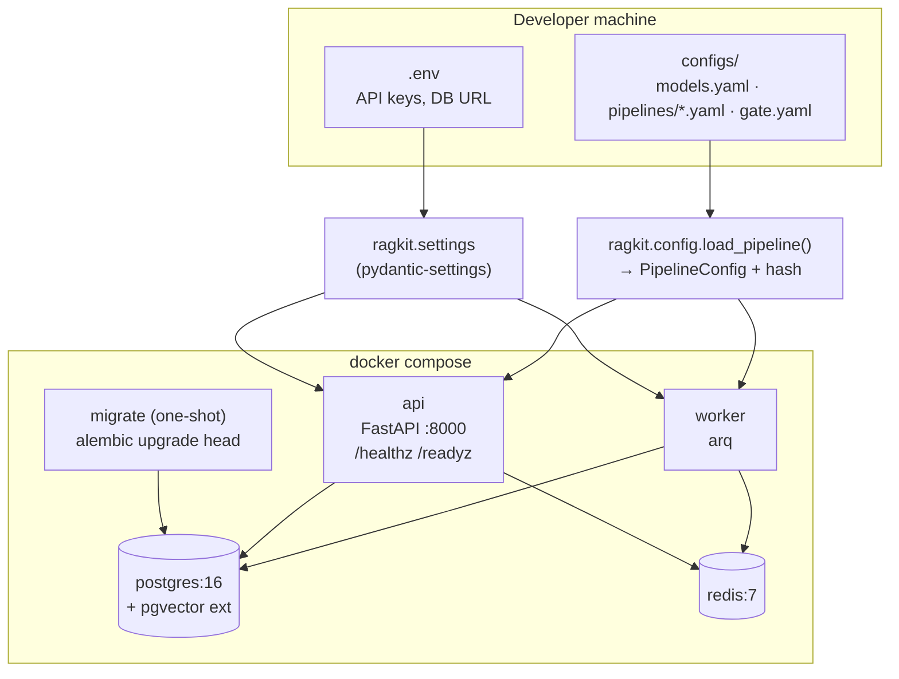
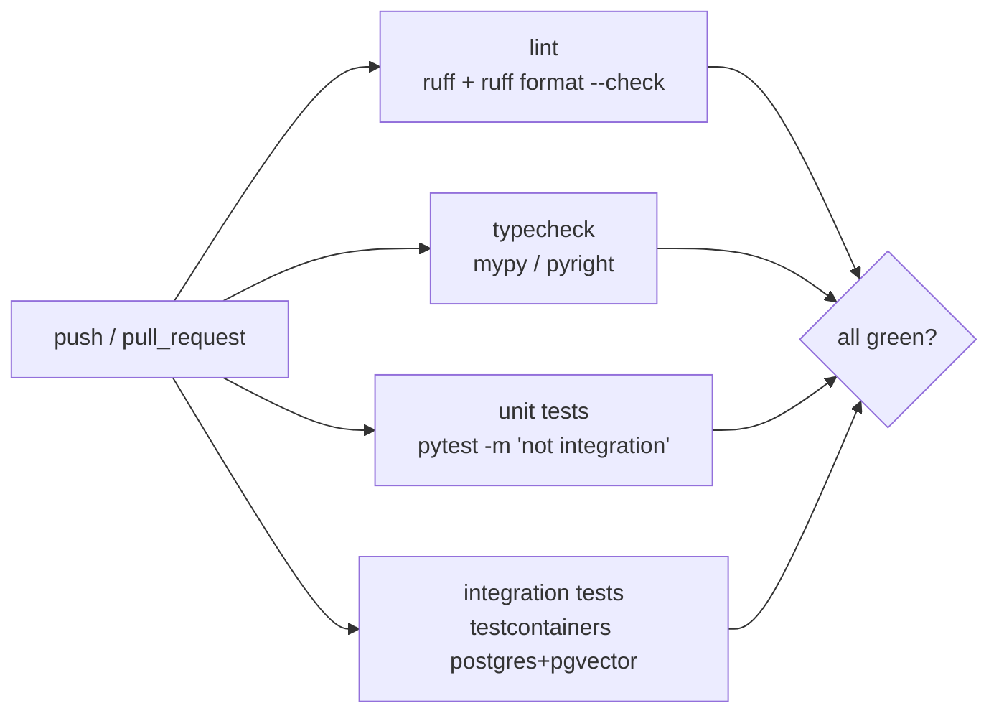

# F0: Project Foundation

| Milestone | Depends on | Effort | Unblocks |
|---|---|---|---|
| M1 | — | 4 h | Everything |

**Goal:** A repo where `uv sync && docker compose up` gives a running (empty) API, worker, Postgres with
pgvector, and Redis. Config loading, logging and CI are in place before any feature code is written.

## Diagram: local stack and config loading



## Diagram: CI skeleton



## Deliverables / files
```
pyproject.toml, uv.lock          # python 3.12, deps grouped: core, api, worker, evals, dev
docker-compose.yml               # api, worker, postgres(pgvector/pgvector:pg16), redis, migrate
Dockerfile                       # multi-stage, uv-based, non-root user
src/ragkit/settings.py           # pydantic-settings: env → typed Settings
src/ragkit/config.py             # PipelineConfig model, YAML loader, canonical hash
src/ragkit/logging.py            # structlog JSON logs
src/api/main.py                  # FastAPI app factory, /healthz, /readyz
src/worker/main.py               # arq WorkerSettings
migrations/                      # alembic, 0001_init (extension + tables from 03-low-level-design)
configs/models.yaml              # aliases: fast, strong, judge, embed, rerank
.github/workflows/ci.yml
Makefile                         # make up, make test, make lint, make migrate
```

## Tasks
- [ ] Init the repo with `uv init`; add ruff, mypy, pytest, pre-commit
- [ ] Write `docker-compose.yml`; Postgres image `pgvector/pgvector:pg16`
- [ ] Alembic migration `0001`: `CREATE EXTENSION vector`, tables `companies, documents, sections, index_versions, chunks, eval_runs, eval_results`
- [ ] `PipelineConfig` Pydantic model + `config_hash()` = sha256 of canonical JSON (sorted keys)
- [ ] `models.yaml` alias resolution (`fast` → concrete provider + model ID)
- [ ] `/healthz` (process alive) and `/readyz` (DB `SELECT 1` + Redis `PING`)
- [ ] GitHub Actions `ci.yml` with the 4 jobs above
- [ ] README "Quickstart" section

## Acceptance criteria
- `make up` → `curl localhost:8000/readyz` returns `200 {"db":"ok","redis":"ok"}`
- `select extversion from pg_extension where extname='vector'` returns ≥ 0.8
- The same YAML loaded twice gives the same hash; changing any field changes the hash
- CI is green on the first PR

## Tests
- Unit: config hashing is stable and order-independent; alias resolution; bad YAML raises a readable error
- Integration: the migration applies on a clean testcontainer DB

**Interview talking point:** *"Pipelines are config with a content hash, so every trace and eval result
can be reproduced exactly."*
