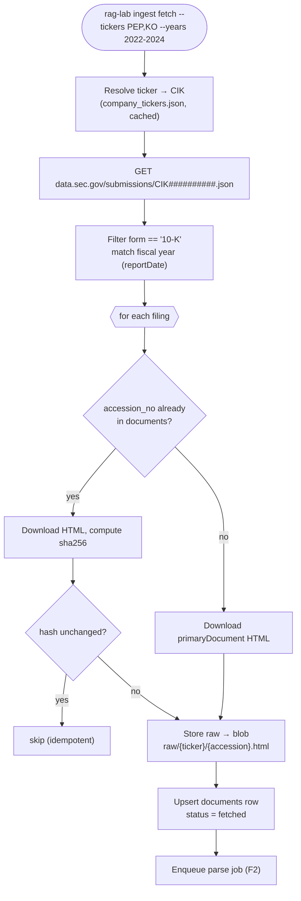
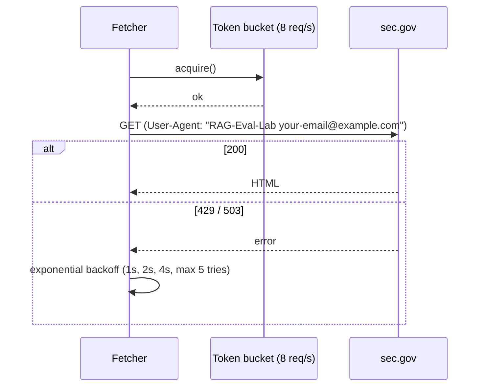

# F1: Corpus Acquisition (SEC EDGAR)

| Milestone | Depends on | Effort | Unblocks |
|---|---|---|---|
| M1 (2 companies) → M3 (20 companies) | F0 | 3 h | F2 |

**Goal:** Download the primary 10-K HTML document for each (company, fiscal year) **idempotently**, in
line with SEC fair-access rules, and record filing metadata.

## Diagram: fetch flow



## Diagram: rate limiting & politeness



## Deliverables / files
```
src/ragkit/ingestion/edgar.py        # EdgarClient: cik lookup, submissions, download
src/ragkit/ingestion/ratelimit.py    # async token bucket
src/ragkit/storage/blob.py           # BlobStore protocol: LocalBlobStore, AzureBlobStore (later)
src/worker/jobs/fetch.py             # arq job
configs/corpus.yaml                  # the 20 tickers + fiscal years
```

## Tasks
- [ ] `configs/corpus.yaml` with 20 tickers; **check each has 3 consecutive 10-Ks** (see requirements)
- [ ] `EdgarClient` with httpx AsyncClient, `User-Agent` from settings, token bucket ≤ 8 req/s
- [ ] Map fiscal year using `reportDate` (fiscal years don't equal calendar years for many CPG companies)
- [ ] Only allow `*.sec.gov` hosts (SSRF guard)
- [ ] Blob layout `raw/{ticker}/{accession}.html`; sha256 stored on `documents`
- [ ] CLI `rag-lab ingest fetch`; arq job wrapper
- [ ] Phase A: PEP + KO, 3 years. Phase B: all 20.

## Acceptance criteria
- Running fetch twice makes **0 downloads and 0 DB writes** on the second run
- 60 `documents` rows with `status=fetched` (Phase B); any missing (ticker, year) combination is listed in a report
- No request exceeds the rate limit (checked with a log counter)

## Tests
- Unit: fiscal-year mapping on fixture JSON; allow-list rejects non-SEC hosts
- Integration: `respx` mocked EDGAR → idempotency test

**Interview talking point:** *"Ingestion is idempotent on accession number plus content hash, so re-runs
are free and safe."*
