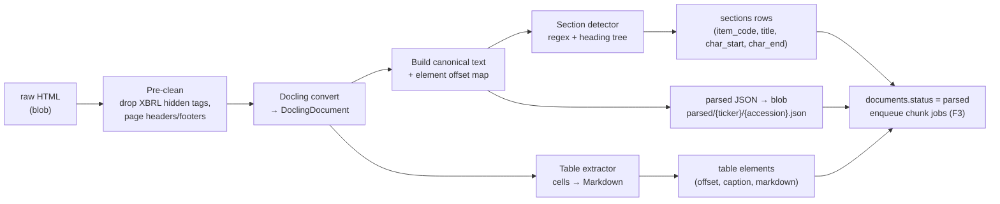
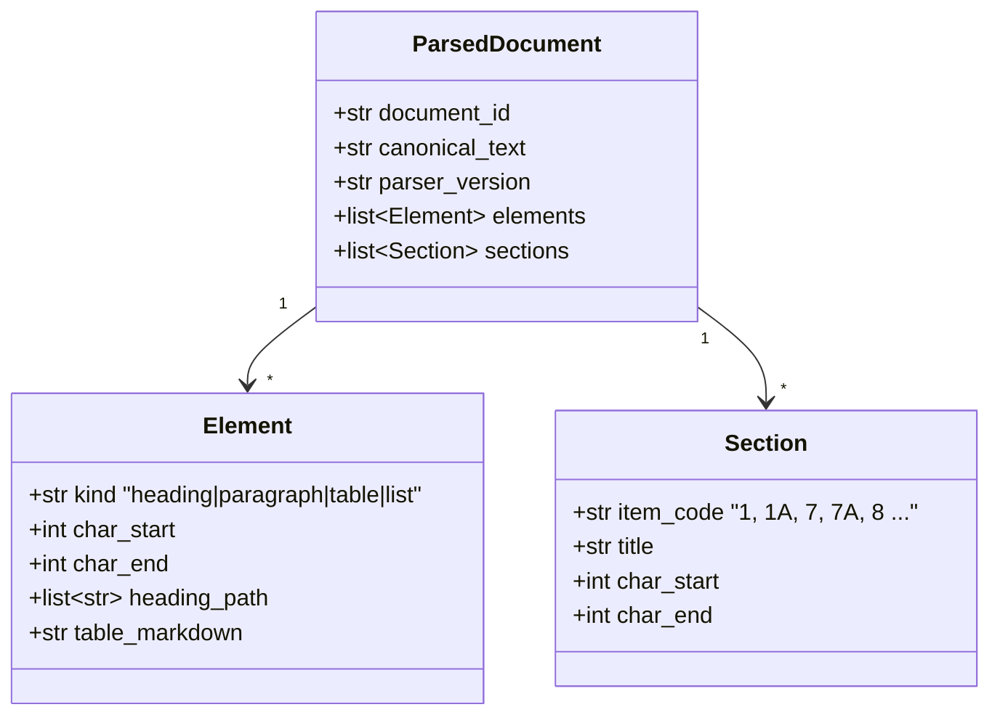
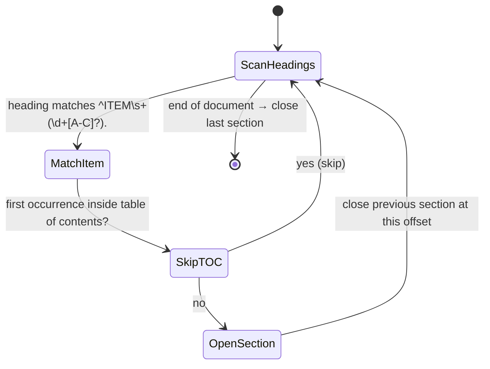

# F2: Parsing & Section Detection

| Milestone | Depends on | Effort | Unblocks |
|---|---|---|---|
| M1 | F1 | 5 h | F3, F11 |

**Goal:** Convert raw 10-K HTML into a **canonical text with stable character offsets**, a heading tree,
tables, and **10-K Item sections** (1, 1A, 7, 7A, 8 …). These offsets are the coordinate system for both
chunks and golden-set evidence spans (ADR-007).

## Diagram: parse pipeline



## Diagram: canonical text & offset model



## Diagram: section detection logic



## Deliverables / files
```
src/ragkit/ingestion/parse.py        # docling wrapper → ParsedDocument
src/ragkit/ingestion/sections.py     # 10-K item detector (TOC-aware)
src/ragkit/ingestion/tables.py       # table → markdown with caption + header row
src/worker/jobs/parse.py
notebooks/spike_docling.ipynb        # the spike (step 1)
```

## Tasks
- [ ] **Spike first (1 h):** run Docling on 3 filings (PEP, CL, HSY); inspect table quality. Decide go/fallback.
- [ ] Canonical text builder: concatenate elements with `\n\n`; record `(char_start, char_end)` per element
- [ ] Section detector: must skip the table-of-contents duplicates, and handle "Item 7." vs "ITEM 7 —" variants
- [ ] Table serialiser: Markdown with header row, caption and the preceding sentence as context
- [ ] Store `parser_version` (Docling version + our code version) on the document
- [ ] Pin the Docling version in `pyproject.toml`

## Acceptance criteria
- For ≥ 95% of filings, Items 1, 1A, 7, 7A and 8 are detected with plausible lengths (a report lists outliers)
- `canonical_text[el.char_start:el.char_end]` equals the element text for 100% of elements (invariant test)
- Parsing the same file twice gives byte-identical canonical text (determinism)
- 5 manually checked tables per company group render correctly as Markdown

## Tests
- Unit: section regex on 15 heading variants; TOC skipping; offset invariant (hypothesis)
- Golden-file test: 1 small committed 10-K excerpt → expected sections JSON

**Interview talking point:** *"All ground truth is anchored to a deterministic canonical text, so a
chunking change never invalidates the eval set."*
