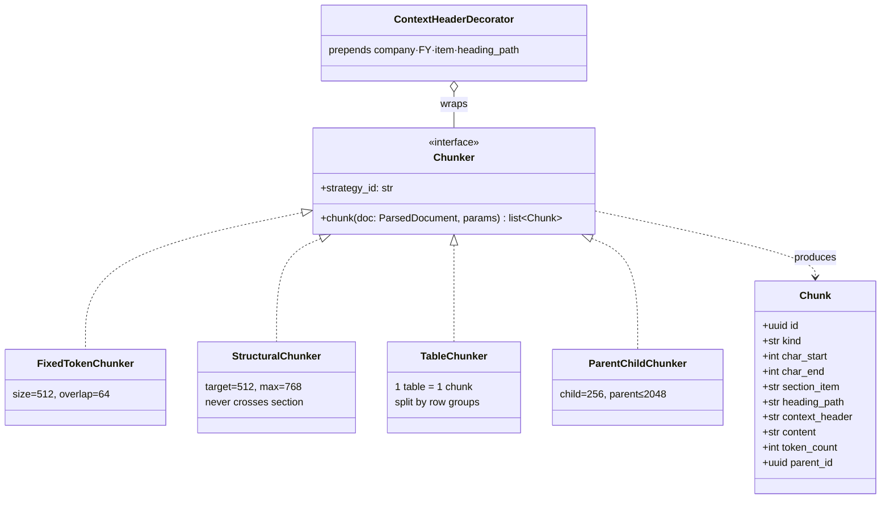
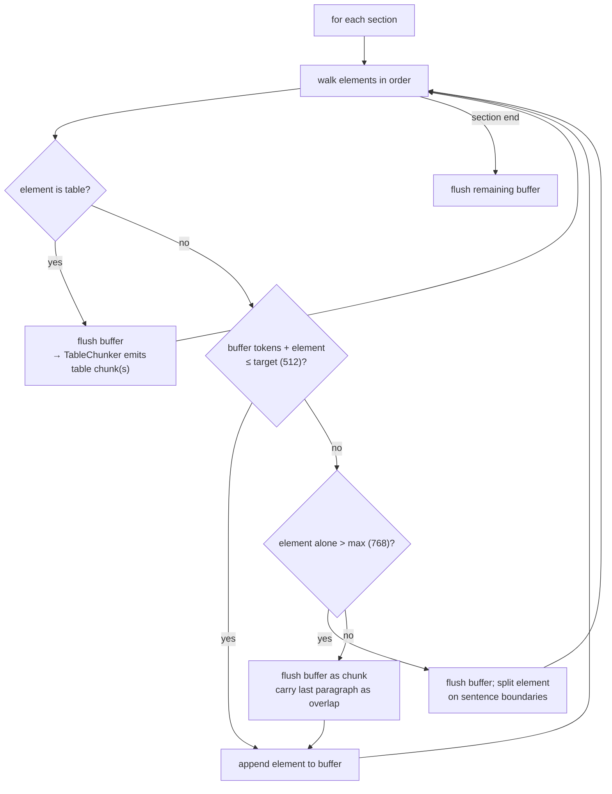
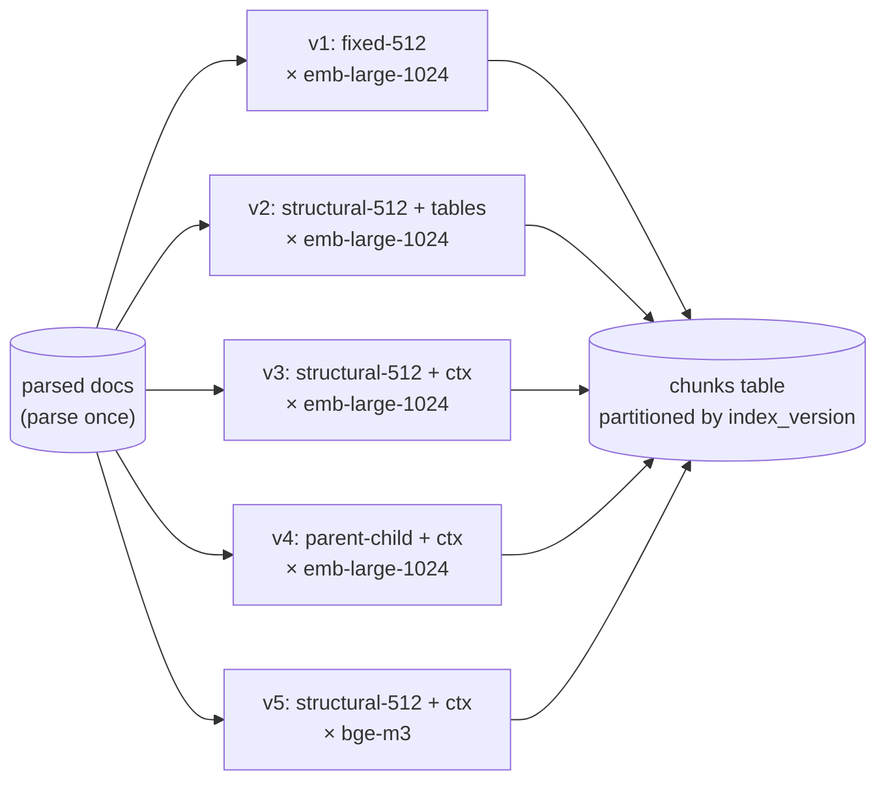

# F3: Chunking & Index Versions

| Milestone | Depends on | Effort | Unblocks |
|---|---|---|---|
| Phase A (M1): `fixed-512` · Phase B (M3): structural, tables, contextual headers, parent-child | F2 | 5 h | F4, F14 |

**Goal:** Pluggable chunking strategies that turn a `ParsedDocument` into chunks with **exact character
offsets**, stored under an **index version** so several strategies can be compared side by side.

## Diagram: strategy plug-in architecture



## Diagram: structural chunking algorithm



## Diagram: index versions (side-by-side ablations)



## Deliverables / files
```
src/ragkit/chunking/base.py          # Chunker protocol, Chunk model, registry
src/ragkit/chunking/fixed.py
src/ragkit/chunking/structural.py
src/ragkit/chunking/tables.py
src/ragkit/chunking/parent_child.py
src/ragkit/chunking/context_header.py
src/worker/jobs/chunk.py             # (document_id, index_version) → chunks
configs/index_versions.yaml
```

## Tasks
- Phase A
  - [ ] Chunker protocol, registry, `FixedTokenChunker` (tiktoken)
  - [ ] `index_versions` row creation from YAML; chunk ID = hash(index_version, doc, start, end)
- Phase B
  - [ ] `StructuralChunker` (algorithm above), `TableChunker`, `ContextHeaderDecorator`
  - [ ] `ParentChildChunker` (parents stored with `kind='parent'`, not embedded)
  - [ ] Chunk-statistics report per version: count, token histogram, % tables

## Acceptance criteria
- **Offset invariant:** `canonical_text[c.char_start:c.char_end] == c.content` (without the header) for every chunk
- **Coverage:** every non-whitespace character of every section is in ≥ 1 chunk (excluding the TOC)
- No chunk crosses a section boundary (structural strategies)
- Re-chunking the same version is idempotent (same chunk IDs)

## Tests
- Property tests (hypothesis): coverage, offset invariant, max-token bound
- Unit: table split repeats the header row; header template renders correctly

**Interview talking point:** *"Chunking is a measured variable: five index versions live side by side and
the ablation table shows the effect of each, by question type."*
