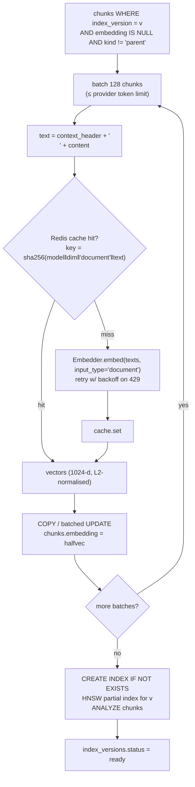
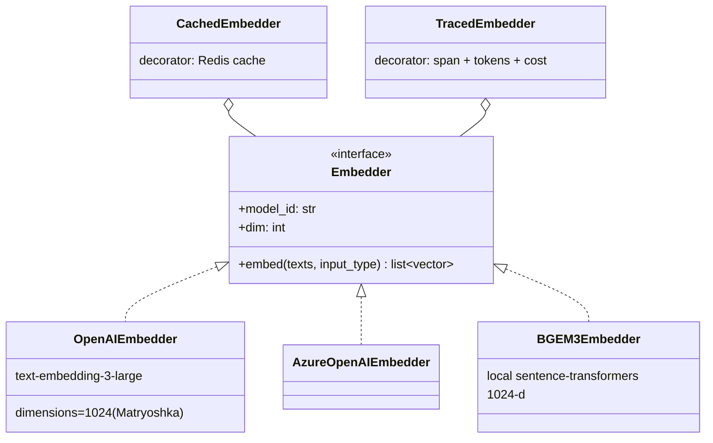

# F4: Embedding & Indexing

| Milestone | Depends on | Effort | Unblocks |
|---|---|---|---|
| M1 | F3 | 4 h | F5 |

**Goal:** Embed chunks in batches with caching, write vectors as `halfvec(1024)`, and build the HNSW and
GIN indexes for each index version.

## Diagram: embedding job



## Diagram: embedder adapters



## Deliverables / files
```
src/ragkit/providers/embeddings.py   # protocol + adapters + decorators
src/ragkit/storage/chunks_repo.py    # bulk write, index management
src/worker/jobs/embed.py
migrations/0002_hnsw_indexes.py      # helper to create partial HNSW per version
```

## Tasks
- [ ] `Embedder` protocol; OpenAI/Azure adapter with `dimensions=1024`; BGE-M3 local adapter
- [ ] Cache + tracing decorators (tracing is a no-op until F10)
- [ ] Batch writer using `psycopg` COPY or `executemany`; `halfvec` conversion
- [ ] Per-version partial HNSW index (`m=16, ef_construction=64`) + GIN on `tsv`
- [ ] Embedding cost report: total tokens per version

## Acceptance criteria
- Second run of the embed job: 100% cache hits, 0 provider calls
- `EXPLAIN` of a dense query uses the HNSW index for that version
- Embedding a full index version (~12k chunks) finishes in < 15 min

## Tests
- Unit: batching respects the token limit; cache key includes the model and dimension
- Integration: testcontainers Postgres, fake embedder → cosine query returns the expected nearest chunk

**Interview talking point:** *"1024-dimensional Matryoshka embeddings stored as halfvec: half the memory,
within pgvector's HNSW limits, and the recall cost is measured in ablation A-emb."*
