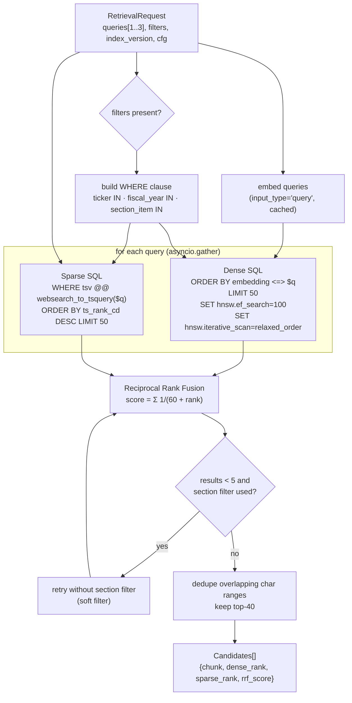
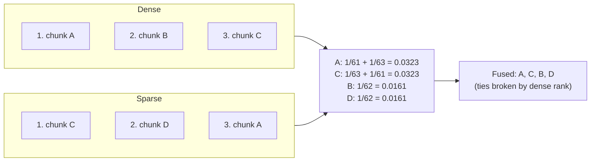

# F5: Hybrid Retrieval

| Milestone | Depends on | Effort | Unblocks |
|---|---|---|---|
| Phase A (M1): dense only · Phase B (M3): sparse, RRF, filters, multi-query | F4 (F7 for multi-query) | 5 h | F6, F8 |

**Goal:** Given one or more queries and optional filters, return a fused and deduplicated candidate list
from **dense (pgvector)** and **sparse (Postgres FTS)** retrieval, with every intermediate score kept for
debugging and evaluation.

## Diagram: retrieval flow



## Diagram: RRF worked example



## Deliverables / files
```
src/ragkit/retrieval/dense.py
src/ragkit/retrieval/sparse.py
src/ragkit/retrieval/fusion.py       # rrf(), pure function
src/ragkit/retrieval/filters.py      # Filters model → SQL fragments (parameterised)
src/ragkit/retrieval/retriever.py    # HybridRetriever orchestrates per cfg
```

## Tasks
- Phase A
  - [ ] Dense retrieval with a parameterised SQL filter, `ef_search` from config
  - [ ] `Candidate` model with every score field (null when a stage is disabled)
- Phase B
  - [ ] Sparse retrieval with `websearch_to_tsquery('english', q)`
  - [ ] `rrf()` pure function, multi-list, deterministic tie-break
  - [ ] Soft section filter fallback; overlap dedupe
  - [ ] Multi-query: fuse all per-query lists in one RRF
  - [ ] Config switches `dense.enabled`, `sparse.enabled`, `fusion.top_n`

## Acceptance criteria
- Retrieval p95 (dense + sparse, 1 query) < 150 ms on the full corpus, local Docker
- A filtered dense query returns `k` rows even with restrictive filters (iterative scan works)
- Disabling a stage in YAML changes results without code changes
- **All SQL is parameterised** (no string interpolation of user input)

## Tests
- Unit: `rrf()` against the worked example; tie-break; empty lists
- Integration: seeded mini-corpus. An exact-term query (e.g. a line-item name) is found by sparse and not by dense, proving the value of hybrid

**Interview talking point:** *"RRF uses ranks, not scores, so cosine similarity and ts_rank never need
normalising."*
