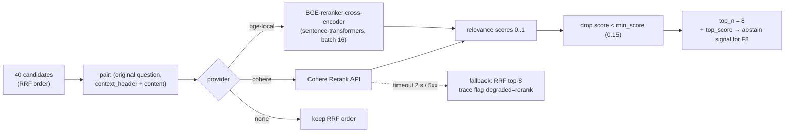
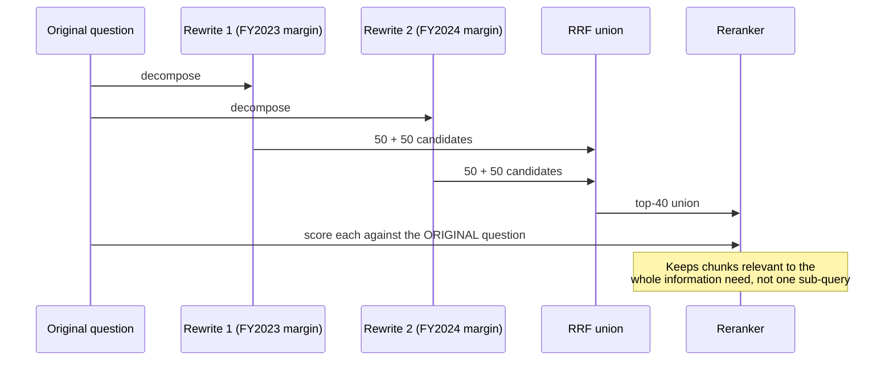

# F6: Reranking

| Milestone | Depends on | Effort | Unblocks |
|---|---|---|---|
| M3 | F5 | 2 h | F8, ablation A3 |

**Goal:** Re-order the fused candidates with a **cross-encoder** and keep the top-N above a minimum score,
with graceful fallback to the RRF order.

## Diagram: rerank stage



## Diagram: why rerank against the original question (multi-query case)



## Deliverables / files
```
src/ragkit/providers/rerankers.py    # Reranker protocol, CohereReranker, BGEReranker, NoopReranker
src/ragkit/retrieval/rerank.py       # stage logic: threshold, top_n, fallback
```

## Tasks
- [ ] `Reranker` protocol + 3 adapters; Redis cache for eval runs
- [ ] Threshold and top-N from config; expose `top_score` for abstention
- [ ] Timeout + fallback path, trace flag
- [ ] Micro-benchmark: Cohere vs BGE (CPU) latency for 40 docs

## Acceptance criteria
- Rerank p95 < 400 ms (Cohere) for 40 candidates
- A forced provider failure still returns an answer (fallback), flagged in the trace
- Ablation A3 row produced (in F14)

## Tests
- Unit: threshold and top-N logic; fallback on a simulated timeout
- Contract: Cohere adapter parses a recorded response fixture

**Interview talking point:** *"The cross-encoder sees the query and document together, which a bi-encoder
can't. It's usually the cheapest big gain in precision."*
