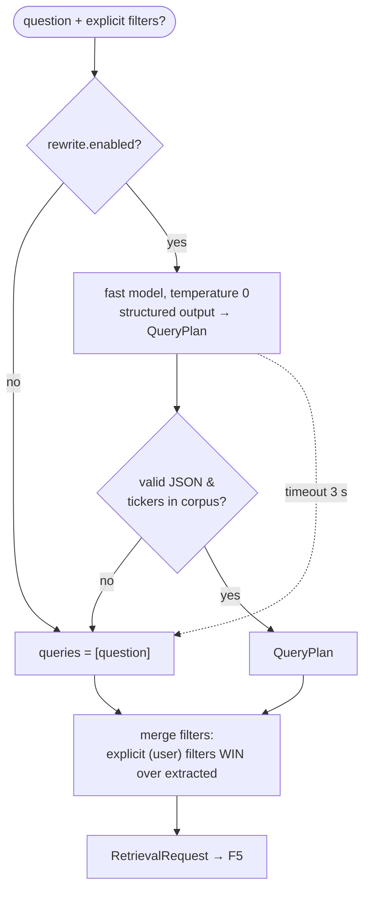
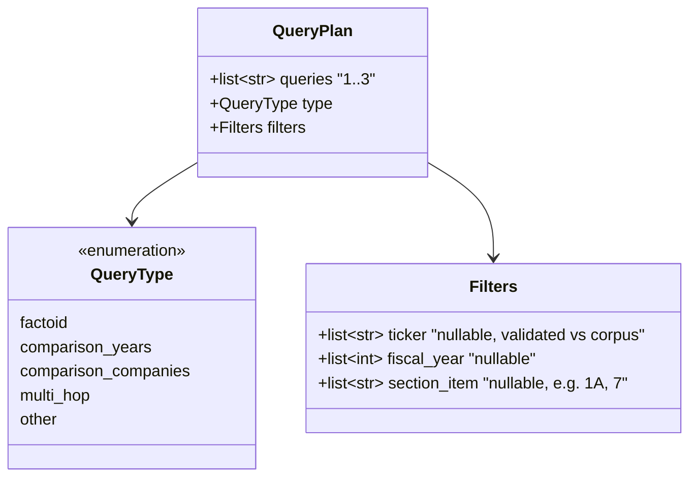

# F7: Query Understanding

| Milestone | Depends on | Effort | Unblocks |
|---|---|---|---|
| M3 | F0 (providers) | 4 h | F5 multi-query, ablations A4, A6 |

**Goal:** One cheap LLM call turns the user question into **(a) 1–3 retrieval queries** (rewrite and
decomposition) and **(b) structured filters** (company, fiscal year, section), using a JSON-schema
structured output.

## Diagram: query processor



## Diagram: QueryPlan schema



## Example
```
Q: "Compare Coca-Cola's and PepsiCo's effective tax rates in FY2024."
→ queries:  ["Coca-Cola effective tax rate fiscal 2024",
             "PepsiCo effective tax rate fiscal 2024"]
  type:     comparison_companies
  filters:  {ticker: ["KO","PEP"], fiscal_year: [2024], section_item: null}
```

## Deliverables / files
```
src/ragkit/query/plan.py             # QueryPlan pydantic model
src/ragkit/query/processor.py        # LLM call, validation, merge
configs/prompts/query_plan@v1.txt    # prompt with company-name → ticker list injected
```

## Tasks
- [ ] Prompt with few-shot examples per query type; include the list of corpus companies and tickers
- [ ] Structured output via the provider's JSON-schema mode; Pydantic validation
- [ ] Guardrails: max 3 queries; unknown tickers dropped; fiscal years clamped to the corpus range
- [ ] Separate switches: `rewrite.enabled` and `self_query_filters.enabled` (ablations A4 vs A6)
- [ ] Filter-accuracy metric hook for F12 (compare with `expected_filters`)

## Acceptance criteria
- Filter-extraction accuracy ≥ 90% on golden v0 (exact match on ticker + year)
- p95 latency < 700 ms; on timeout the pipeline still answers (fallback)
- Invalid LLM output never raises to the user

## Tests
- Unit: merge precedence; validation drops unknown tickers
- Recorded-response tests (fixtures) so CI doesn't call the LLM

**Interview talking point:** *"Self-query filters are applied softly, because wrong filter extraction is
worse than no filter."*
