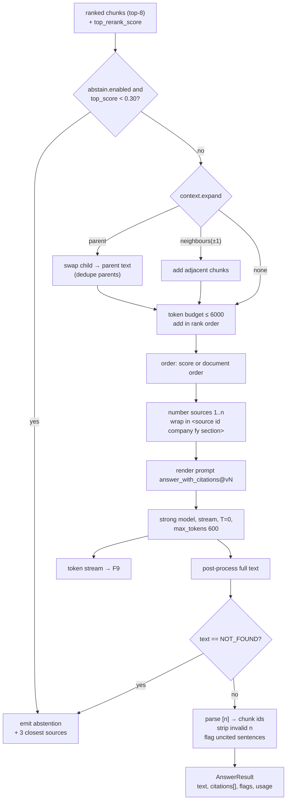
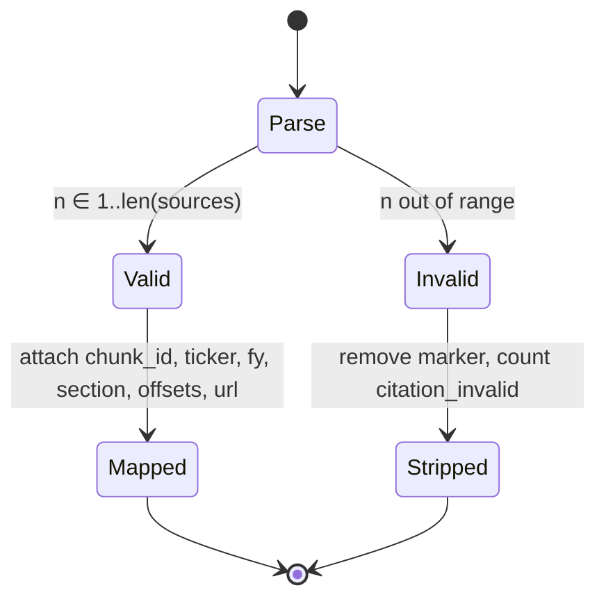

# F8: Answer Generation (Context, Citations, Abstention)

| Milestone | Depends on | Effort | Unblocks |
|---|---|---|---|
| Phase A (M1): basic prompt + sources · Phase B (M3): citations, validation, abstention, parent expansion | F5 (F6) | 5 h | F9, F12 |

**Goal:** Assemble a token-budgeted context from the ranked chunks, stream a grounded answer with `[n]`
citations, validate those citations, and **abstain** when the evidence is weak.

## Diagram: generation pipeline



## Diagram: citation validation state



## Deliverables / files
```
src/ragkit/generation/context.py     # expansion, budget, ordering, numbering
src/ragkit/generation/prompts.py     # template loading (versioned files; Langfuse later)
src/ragkit/generation/generator.py   # streaming call + post-processing
src/ragkit/generation/citations.py   # parser + validator (pure)
configs/prompts/answer_with_citations@v1.txt … @v3.txt
src/ragkit/pipeline.py               # RAGPipeline: F7 → F5 → F6 → F8 (used by API and evals)
```

## Tasks
- Phase A
  - [ ] Simple prompt with sources; streaming; `RAGPipeline.run()` and `.stream()`
- Phase B
  - [ ] Citation instructions + `<source>` delimiting + injection-resistance line
  - [ ] Citation parser/validator; uncited-sentence detection (sentence split + marker check)
  - [ ] Abstention via the rerank-score threshold **and** the `NOT_FOUND` sentinel
  - [ ] Parent and neighbour expansion; budget; ordering option (lost-in-the-middle ablation)
  - [ ] `AnswerResult` includes `usage` (input/output tokens) and flags

## Acceptance criteria
- 100% of emitted citations map to a real source (invalid ones stripped and counted)
- On golden v0 unanswerable questions, abstention ≥ 80% at Phase B (then tuned in M3)
- Context never exceeds `max_tokens` (asserted)

## Tests
- Unit: citation parser (`[1]`, `[1][3]`, `[1, 3]`, `[12]` out of range); budget packing; expansion dedupe
- Snapshot test: rendered prompt for a fixed input (catches accidental prompt changes)

**Interview talking point:** *"Abstention is a measured behaviour with its own confusion matrix. A system
that never says 'I don't know' is hallucinating somewhere."*
