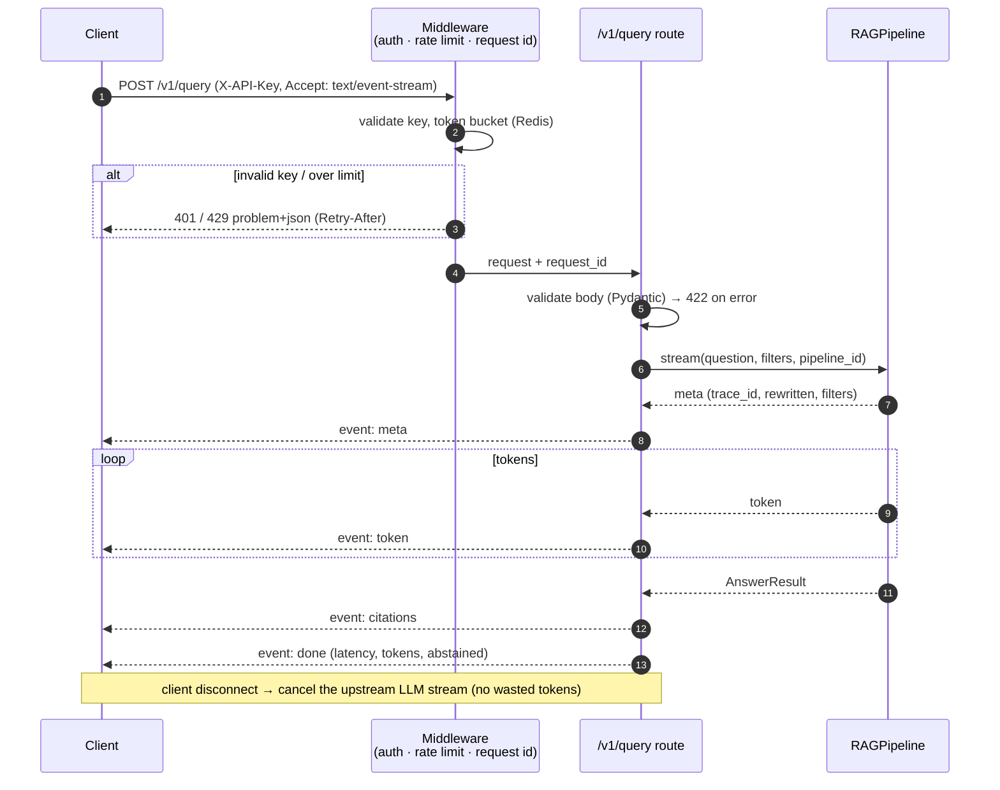
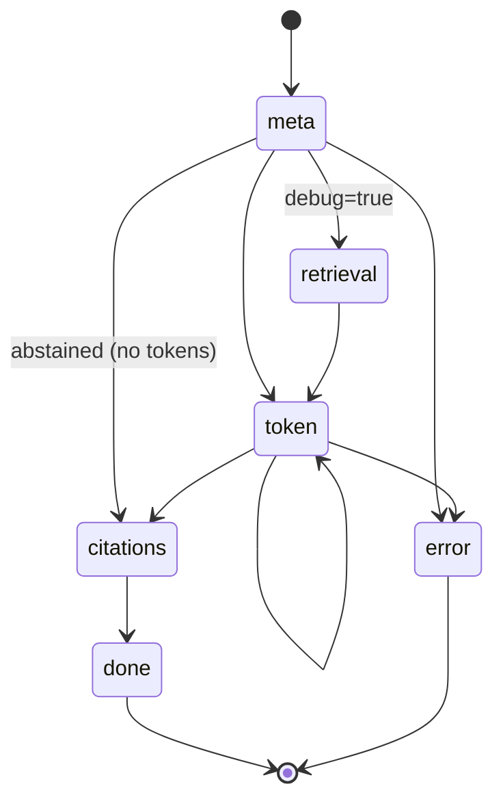

# F9: Query API & Streaming

| Milestone | Depends on | Effort | Unblocks |
|---|---|---|---|
| M1 (+ `mode` field and `step` events in M5, from F18) | F8 | 4 h | F15, F16, F17, F18 |

**Goal:** Expose the pipeline through FastAPI with **SSE streaming**, API-key auth, rate limiting and
problem+json errors, following the contract in [03 §3.6](../03-low-level-design.md).

## Diagram: request lifecycle



## Diagram: SSE event state machine (client contract)



## Deliverables / files
```
src/api/routes/query.py              # SSE + JSON modes
src/api/routes/documents.py, ingest.py, jobs.py, eval.py, feedback.py
src/api/middleware.py                # api key, rate limit, request id, timing
src/api/errors.py                    # RFC 9457 problem+json handlers
src/api/schemas.py                   # request/response/event models
```

## Tasks
- [ ] `POST /v1/query` streaming (`StreamingResponse`, `text/event-stream`) and non-streaming JSON mode
- [ ] Cancel the upstream stream on client disconnect (`request.is_disconnected()`)
- [ ] API-key auth (hashed keys in env/DB), Redis token-bucket rate limit
- [ ] `GET /v1/documents`, `POST /v1/ingest`, `GET /v1/jobs/{id}`
- [ ] Problem+json error mapping (422, 429, 502, 504)
- [ ] OpenAPI docs cleaned up with examples
- [ ] (M5) `mode: pipeline | agent | auto` request field and the `step` SSE event ([F18](F18-agentic-rag.md))

## Acceptance criteria
- `curl -N` shows events in the contract order; the first `token` arrives within the TTFT budget (local)
- Client disconnect mid-stream stops token usage (verified via the provider usage in the trace)
- 20 concurrent streams work without errors (quick load test)

## Tests
- Contract tests with httpx `AsyncClient` + fake pipeline: event order, error events, 401/422/429
- Integration: real pipeline with fake providers

**Interview talking point:** *"Streaming cancellation matters for cost: an abandoned request shouldn't keep
spending tokens."*
