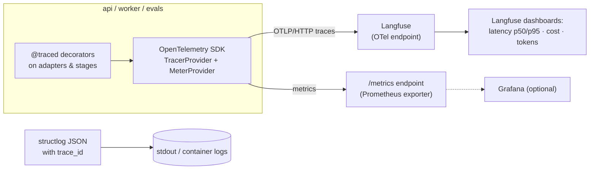
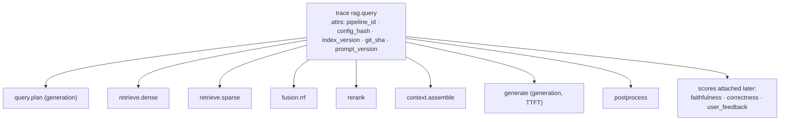

# F10: Observability (Langfuse + OpenTelemetry)

| Milestone | Depends on | Effort | Unblocks |
|---|---|---|---|
| M2 | F0 (adapters from F4–F8 get traced) | 4 h | F12, F17 |

**Goal:** Every query and every eval item produces a **trace** with one span per pipeline stage (inputs,
outputs, latency, tokens, cost), linked to the prompt version and config hash. Prometheus-style metrics
are available too.

## Diagram: instrumentation architecture



## Diagram: trace anatomy



## Deliverables / files
```
src/ragkit/observability/tracing.py  # OTel setup, @traced decorator, attribute helpers
src/ragkit/observability/metrics.py  # histograms/counters from 05-non-functional
src/ragkit/observability/cost.py     # price table from models.yaml → cost per call
src/api/routes/metrics.py
```

## Tasks
- [ ] OTel SDK setup; exporter to the Langfuse OTLP endpoint (keys from env)
- [ ] `@traced(span=..., kind="generation"|"span")` decorator; wrap all adapters and stages
- [ ] Record model, prompt version, token usage and cost on generation spans; TTFT on `generate`
- [ ] Trace-level attributes: pipeline ID, config hash, index version, git SHA
- [ ] Prompts registered as Langfuse prompt versions (sync script from `configs/prompts/`)
- [ ] Metrics: `rag_request_duration_seconds{stage}`, `rag_ttft_seconds`, tokens and cost counters
- [ ] Langfuse dashboard: p50/p95 per stage, cost per query, abstention rate

## Acceptance criteria
- A single query shows all 8 spans in Langfuse with correct nesting and durations
- The trace's summed stage latencies roughly equal the API-measured latency (±10%)
- Tracing can be disabled via env (no-op) with no code changes, which CI uses for forks

## Tests
- Unit: decorator records exceptions and sets span status; cost calculation from usage
- Integration: in-memory span exporter asserts the span tree for a fake pipeline run

**Interview talking point:** *"Instrumentation is OpenTelemetry-first, so Langfuse is a backend choice,
not lock-in."*
