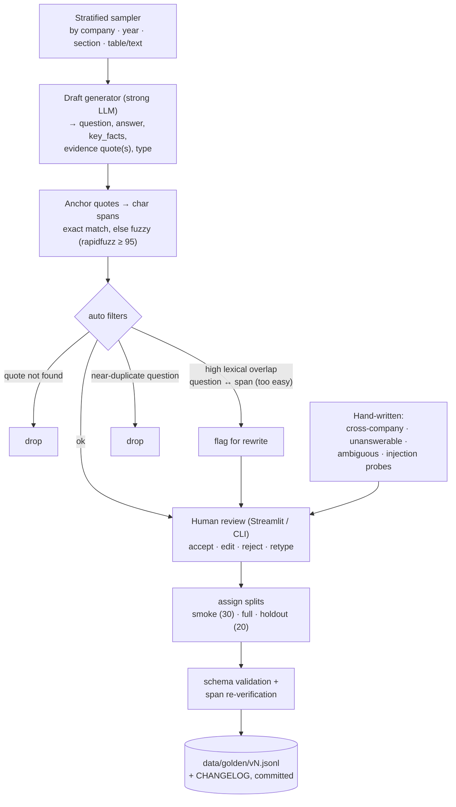
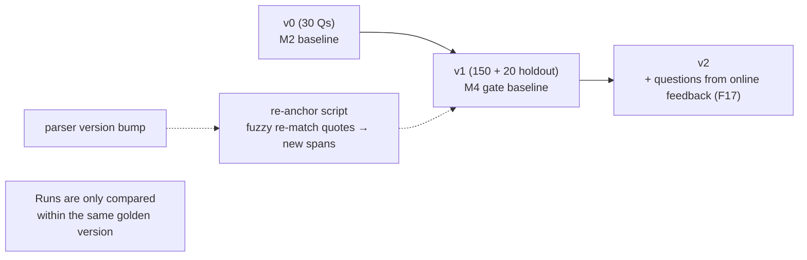
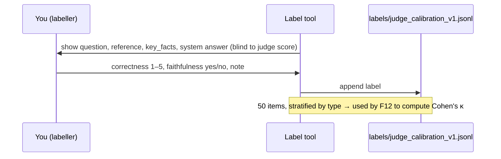

# F11: Golden Dataset Builder

| Milestone | Depends on | Effort | Unblocks |
|---|---|---|---|
| Phase A (M2): v0 = 30 Qs · Phase B (M4): v1 = 150 + 20 holdout, judge labels | F2 (canonical text) | 8 h | F12, F13, F14 |

**Goal:** Tools to create, review and version a golden dataset whose ground truth is **evidence spans in
the canonical text** (ADR-007), plus the human labels needed for judge calibration.

## Diagram: dataset creation workflow



## Diagram: versioning & re-anchoring



## Diagram: judge-calibration labelling



## Deliverables / files
```
src/evals/golden/schema.py           # GoldenItem pydantic model (matches 04 §4.2)
src/evals/golden/sampler.py
src/evals/golden/draft.py            # LLM drafting with structured output
src/evals/golden/anchor.py           # quote → span (exact / fuzzy), re-anchoring
src/evals/golden/review_app.py       # Streamlit review UI
src/evals/golden/label_app.py        # judge calibration labelling
data/golden/v0.jsonl, v1.jsonl, CHANGELOG.md
data/labels/judge_calibration_v1.jsonl
```

## Tasks
- Phase A (v0)
  - [ ] Schema + validator; anchoring; drafting for 40 candidates → review → keep 30
  - [ ] Include ≥ 5 unanswerable and ≥ 5 table/numeric questions in v0
- Phase B (v1)
  - [ ] Scale to 150 + 20 holdout with the type distribution in [04 §4.2](../04-evaluation-design.md)
  - [ ] ≥ 40% hand-written or heavily edited; 10 prompt-injection probe questions
  - [ ] Label 50 answers for judge calibration
  - [ ] Re-anchoring script + test
- Phase C (v1.1, done in [F19](F19-trajectory-evals.md))
  - [ ] Add `expected_trajectory` to the 55 multi-step items and 10 new calculation questions

## Acceptance criteria
- 100% of evidence spans verify against the canonical text (validator in CI)
- Type distribution within ±10% of the plan; smoke split is stratified
- Holdout questions are never loaded by the default eval commands (guarded by a flag)

## Tests
- Unit: anchoring (exact, whitespace-normalised, fuzzy); schema validation
- CI job: `rag-lab golden validate data/golden/*.jsonl`

**Interview talking point:** *"Synthetic questions copy the source wording, which flatters keyword search,
so at least 40% are hand-written, and a holdout split checks for overfitting."*
