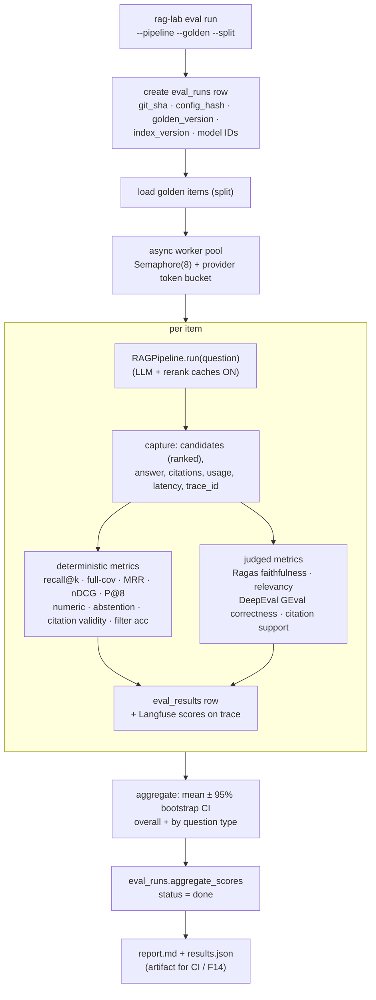
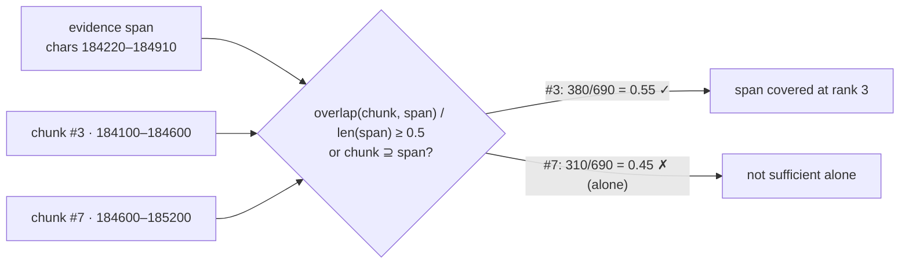
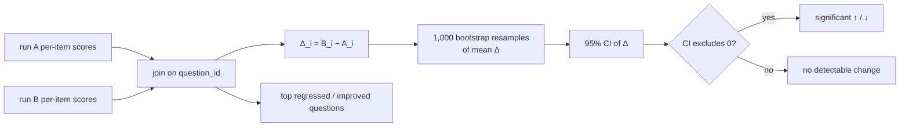

# F12: Eval Runner & Metrics

| Milestone | Depends on | Effort | Unblocks |
|---|---|---|---|
| M2 | F8, F10, F11 | 8 h | F13, F14, F15 |

**Goal:** `rag-lab eval run --pipeline A3 --golden v1 --split full` runs the pipeline **in-process**
over the golden set, computes all metrics in [04 §4.3–4.6](../04-evaluation-design.md) with bootstrap CIs,
stores results, and links every item to its trace.

## Diagram: runner architecture



## Diagram: span-overlap relevance (the core deterministic metric)



## Diagram: run comparison (paired bootstrap)



## Deliverables / files
```
src/evals/runner.py                  # orchestration, pool, persistence
src/evals/metrics/retrieval.py       # span overlap, recall@k, MRR, nDCG, P@k (pure)
src/evals/metrics/answer.py          # numeric extraction, abstention, citation validity (pure)
src/evals/metrics/judges.py          # Ragas + DeepEval wrappers, judge model from models.yaml
src/evals/stats.py                   # bootstrap, paired bootstrap, Cohen's weighted κ
src/evals/compare.py                 # run diff
src/evals/report.py                  # markdown + json report
src/ragkit/cache/llm_cache.py        # response cache (eval mode only)
```

## Tasks
- [ ] Pure deterministic metric functions with thorough unit tests
- [ ] Judge wrappers: judge model ≠ generator family (assert at startup)
- [ ] LLM, rerank and embedding caches enabled in eval mode; budget guard (estimated tokens > limit → abort)
- [ ] Runner persistence + Langfuse dataset run + scores per trace
- [ ] Bootstrap CIs, per-type breakdown, `compare` command, Markdown report
- [ ] Judge calibration command: `rag-lab eval calibrate --labels …` → κ, Spearman ρ
- [ ] **Record baseline A0 on golden v0** (M2 exit)

## Acceptance criteria
- Re-running the same run with a warm cache costs ≈ 0 tokens and gives identical deterministic metrics
- Smoke run (30 Qs) finishes in < 5 min; full run (150) in < 20 min
- Every `eval_results` row has a working Langfuse trace link
- A0 baseline report committed under `reports/`

## Tests
- Unit: metrics on hand-computed fixtures (the overlap example above); bootstrap with a fixed seed; κ against a known example
- Integration: runner on 3 fake items with fake providers → expected DB rows

**Interview talking point:** *"Retrieval is scored deterministically against evidence spans. The LLM judge
is only used where it has to be, and it's calibrated against my own labels."*
