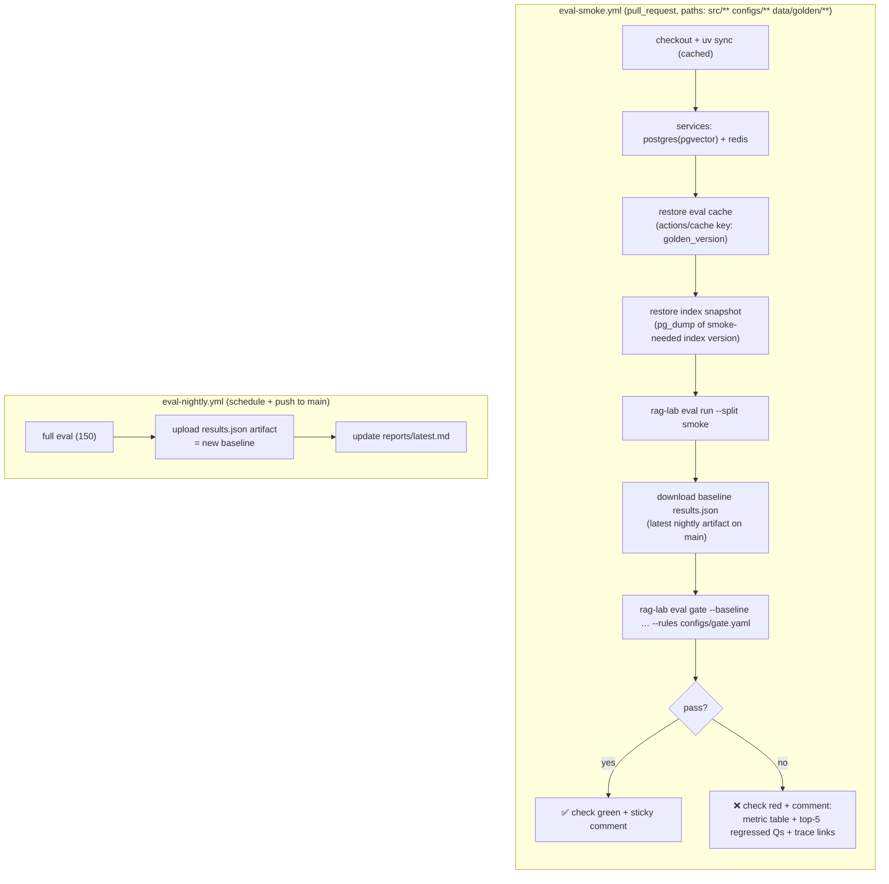
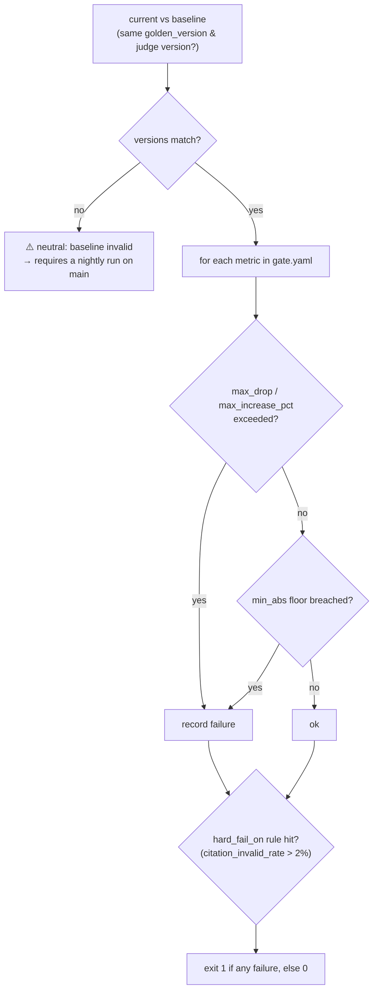
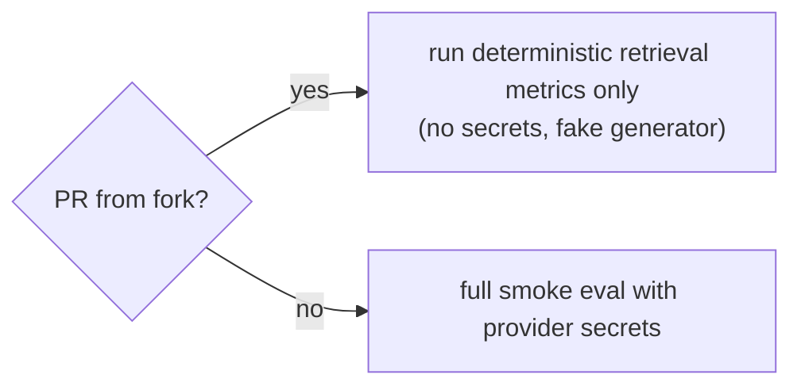

# F13: CI Eval Gate

| Milestone | Depends on | Effort | Unblocks |
|---|---|---|---|
| M4 | F12 (+ golden v1 from F11) | 4 h | F16 (deploy only when green) |

**Goal:** A GitHub Actions check that runs the smoke eval on every relevant PR, compares it with the
`main` baseline using [`gate.yaml`](../04-evaluation-design.md#48-ci-gate), **fails on regressions**, and
posts a sticky PR comment with the diff.

## Diagram: workflows



## Diagram: gate decision logic



## Diagram: security for fork PRs



## Deliverables / files
```
.github/workflows/eval-smoke.yml
.github/workflows/eval-nightly.yml
configs/gate.yaml
src/evals/gate.py                    # rules engine (pure) + CLI
scripts/index_snapshot.sh            # build/restore the pg_dump used by CI
```

## Tasks
- [ ] Rules engine (pure function: current, baseline, rules → decision + reasons)
- [ ] Index snapshot so CI doesn't re-embed the corpus (restore a dump for the smoke-relevant documents)
- [ ] Baseline fetch from the latest nightly artifact; version-mismatch handling
- [ ] Sticky PR comment (e.g. `marocchino/sticky-pull-request-comment`)
- [ ] Budget guard + cache restore; timeouts
- [ ] **Demo PR:** switch the default to `fixed-512` / remove the reranker and show the gate blocking it (screenshot for the README)
- [ ] Branch protection: `eval-smoke` required on `main`

## Acceptance criteria
- A PR with no pipeline changes passes with ~0 LLM cost (cache)
- The demo regression PR fails with a readable comment
- The job finishes in < 8 min end to end

## Tests
- Unit: gate rules (drop, increase %, floors, hard-fail, version mismatch)
- Workflow tested with `act`, or on a throwaway branch

**Interview talking point:** *"Prompts and retrieval changes go through CI like code changes. The gate
blocked a PR of mine that silently cut recall by __ points."* (Fill in with your real demo-PR number.)
