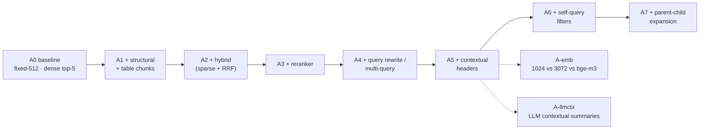
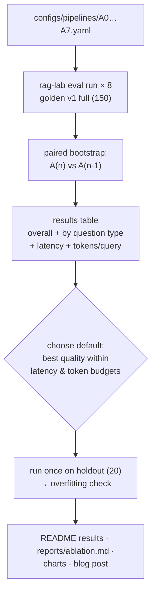

# F14: Ablation Study & Report

| Milestone | Depends on | Effort | Unblocks |
|---|---|---|---|
| Phase A (M3): run A0–A7 · Phase B (M6): final report (+ agent rows from F19), holdout, blog | F12 (+ F3 versions, F6, F7) | 5 h | README, blog post |

**Goal:** Run the ablation ladder from [04 §4.7](../04-evaluation-design.md), test significance, pick the
final default pipeline, check it once on the holdout, and publish the results.

## Diagram: ablation ladder (each step adds one change)



## Diagram: study procedure



## Report contents
1. Headline chart: key metrics per ablation step (bars with CI error bars)
2. Table: overall metrics ± CI, p95 latency, input tokens per query
3. Per-question-type heatmap (types × steps, recall@8 and correctness)
4. Cost/quality frontier: tokens per query vs. correctness
5. Three failure case studies with trace screenshots (what went wrong, which step fixed it)
6. Holdout vs. full comparison
7. Honest "what didn't help" section

## Deliverables / files
```
configs/pipelines/A0.yaml … A7.yaml, A-emb-*.yaml, A-llmctx.yaml
src/evals/ablation.py                # runs the ladder, paired comparisons
src/evals/charts.py                  # matplotlib/plotly charts for the report
reports/ablation.md, reports/figures/*.png
```

## Tasks
- [ ] Write the ablation YAMLs (each a one-change diff from the previous one)
- [ ] `rag-lab eval ablation --ladder A0..A7` → runs + comparisons + table
- [ ] Charts; per-type heatmap; cost/quality frontier
- [ ] Choose the default pipeline; set it in `configs/pipelines/default.yaml`
- [ ] Holdout run (once); record the result
- [ ] Blog/LinkedIn post: one finding, one chart, a link to the repo

## Acceptance criteria
- All 8 ladder rows have CIs and paired-difference significance
- The chosen default meets the NFR-3 targets, or the gap is explained
- The report is reproducible with one command from a clean clone (given API keys)

## Tests
- Unit: ladder ordering, comparison selection; charts render from fixture JSON

**Interview talking point:** *"The reranker was the biggest single gain, but contextual headers fixed a
whole class of wrong-company answers. That only showed up in the per-type breakdown."* (Update this with
your real findings.)
