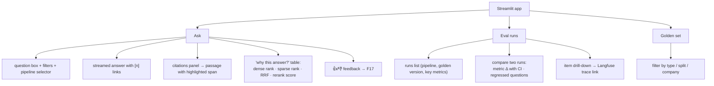
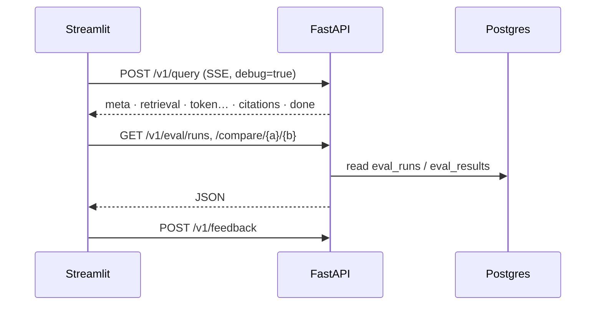

# F15: Streamlit UI

| Milestone | Depends on | Effort | Unblocks |
|---|---|---|---|
| M5 | F9, F12 | 4 h | Demo video, screenshots |

**Goal:** An internal tool with three pages: **Ask** (streamed answer, citations, "why this answer"),
**Eval runs** (browse and compare), **Golden set** (read-only browser).

## Diagram: page map



## Diagram: data access



## Deliverables / files
```
ui/app.py, ui/pages/1_Ask.py, 2_Eval_Runs.py, 3_Golden_Set.py
ui/client.py                         # SSE client (httpx-sse)
```

## Tasks
- [ ] SSE client; incremental rendering with `st.write_stream`
- [ ] Citation panel: fetch the passage by chunk ID; highlight the cited span
- [ ] "Why this answer" table from the `retrieval` debug event
- [ ] Runs list + comparison view + trace links
- [ ] Golden-set browser (read-only)

## Acceptance criteria
- The full demo flow works end to end locally and on the deployed URL
- The UI talks only to the API (no direct DB access)

## Tests
- Smoke test: the app imports and renders with a mocked API (Streamlit AppTest)

**Interview talking point:** *"The 'why this answer' panel exposes every ranking signal, which makes
debugging retrieval a UI task instead of a notebook task."*
