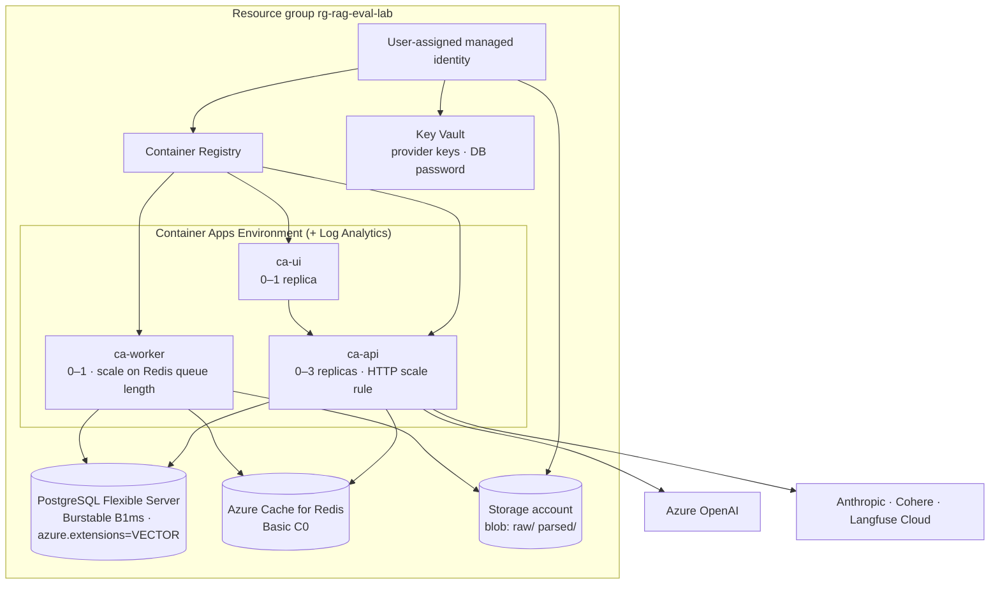
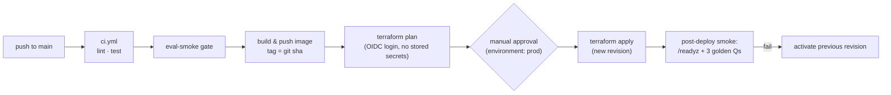

# F16: Azure Deployment (Terraform)

| Milestone | Depends on | Effort | Unblocks |
|---|---|---|---|
| M6 | F9, F13 | 5 h | Public demo URL |

**Goal:** A reproducible Azure deployment with Terraform: Container Apps (api, worker, ui), Postgres
Flexible Server with pgvector, Redis, Blob, Key Vault, and a GitHub Actions pipeline that deploys only
when CI and the eval gate are green.

## Diagram: Azure resources



## Diagram: delivery pipeline



## Deliverables / files
```
infra/main.tf, variables.tf, outputs.tf
infra/modules/{container_apps,postgres,redis,storage,keyvault}/
infra/envs/prod.tfvars
.github/workflows/deploy.yml
docs/runbook.md                      # deploy, rollback, rotate keys, cost notes
```

## Tasks
- [ ] Terraform modules; remote state in an Azure Storage backend
- [ ] Allow-list the `VECTOR` extension on Flexible Server; run migrations as a Container Apps job
- [ ] Managed identity + Key Vault references for secrets (no secrets in env files)
- [ ] GitHub OIDC federated credentials for `azure/login`
- [ ] Scale-to-zero for api/ui; queue-based scaling for the worker (KEDA Redis scaler)
- [ ] Post-deploy smoke test + revision rollback
- [ ] Cost note: monthly estimate at idle vs. demo usage; budget alert

## Acceptance criteria
- `terraform apply` from scratch creates a working environment; `terraform destroy` removes it cleanly
- Public demo URL answers questions; secrets never appear in logs or the repo
- Rollback to the previous revision in < 2 min

## Tests
- `terraform validate`, `tflint`, `checkov` in CI
- Post-deploy smoke job

**Interview talking point:** *"Deploys are gated by the eval check, use OIDC with no stored cloud
credentials, and scale to zero, so the demo costs almost nothing when idle."*
