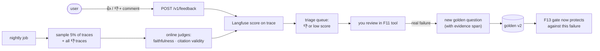
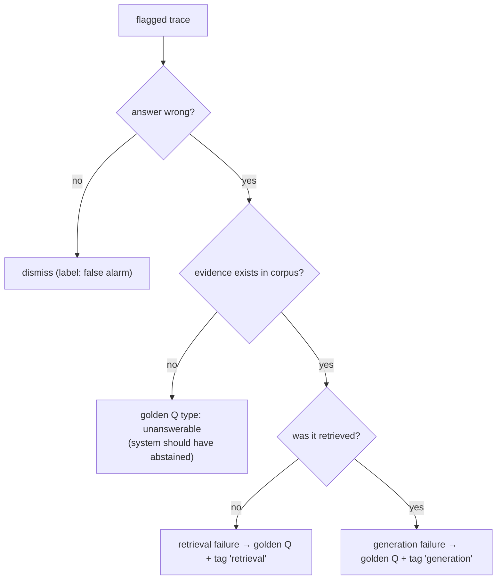

# F17: Online Feedback Loop (stretch)

| Milestone | Depends on | Effort | Unblocks |
|---|---|---|---|
| M5 (stretch) | F9, F10 | 2 h | Golden set v2 (F11) |

**Goal:** Close the loop from real usage back into the golden set: user feedback and sampled online judge
scores surface bad answers, which become new golden questions.

## Diagram: the loop



## Diagram: triage decision



## Deliverables / files
```
src/api/routes/feedback.py
src/evals/online.py                  # nightly sampler + judges
.github/workflows/online-eval.yml    # schedule
```

## Tasks
- [ ] Feedback endpoint → Langfuse score (trace ID from the `meta` event)
- [ ] Nightly sampler + online judges; trend chart in Langfuse
- [ ] Triage export → F11 review tool with pre-filled question, answer and trace

## Acceptance criteria
- Feedback appears on the trace within seconds
- At least 5 golden v2 questions come from real or demo usage (shows the loop working)

**Interview talking point:** *"Production failures become regression tests. The eval set grows from real
usage, not only from synthetic data."*
