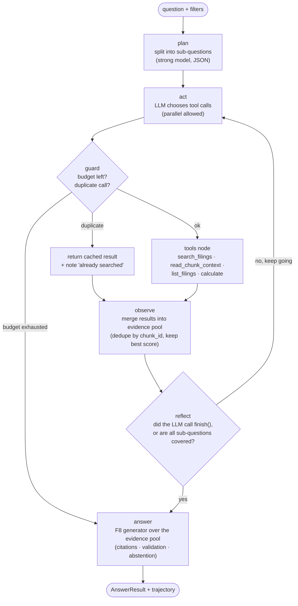
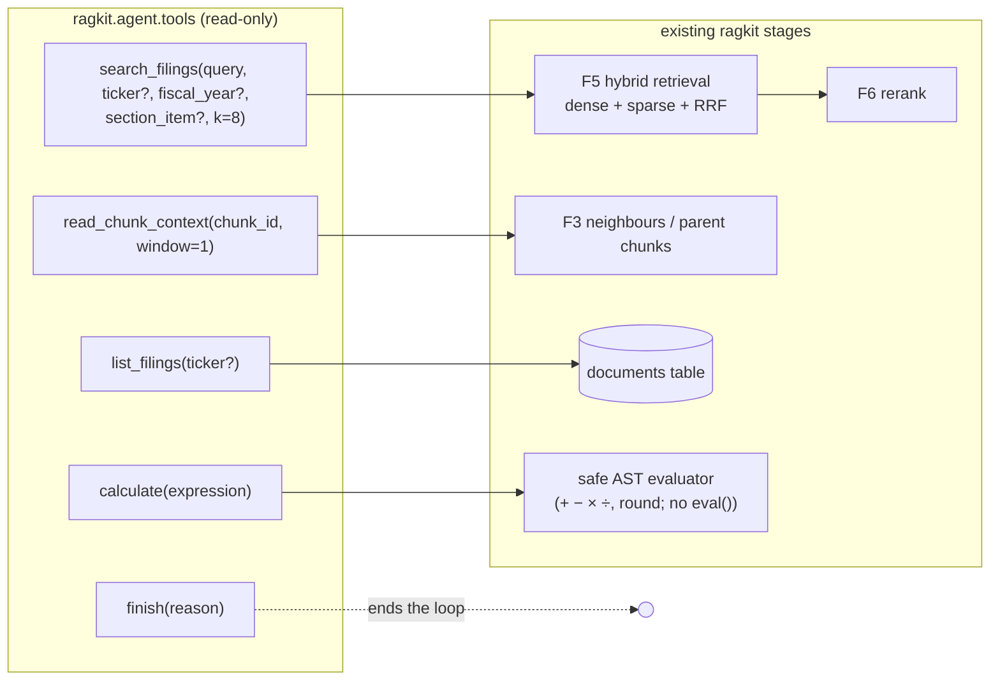
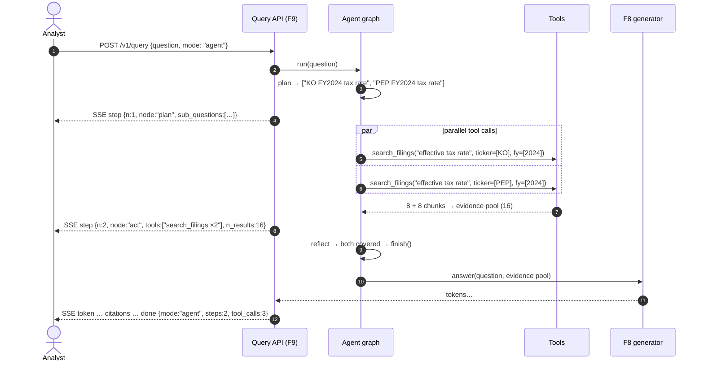
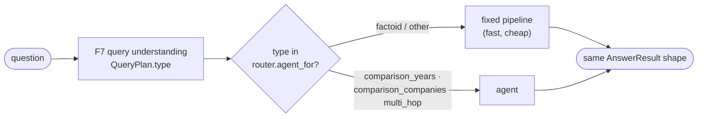

# F18: Agentic RAG Mode (LangGraph research agent)

| Milestone | Depends on | Effort | Unblocks |
|---|---|---|---|
| M5 Agentic | F5, F6, F8, F10 (F7 for routing) | 8 h | F19, agent panel in F15 |

**Goal:** Add a second way to answer questions: a **read-only research agent** that plans, calls
retrieval tools several times, checks whether it has enough evidence, and then answers with the **same
citation and abstention contract** as the fixed pipeline. The agent is not a replacement. It's a
**measured alternative**, and F19 decides with numbers when it's worth the extra cost.

## Why an agent here?

The fixed pipeline (F7 → F5 → F6 → F8) does **one** round of retrieval. Some questions need more than
that:

| Question | Why one retrieval round struggles | What the agent does |
|---|---|---|
| "Compare Coca-Cola's and PepsiCo's FY2024 effective tax rates." | Two companies compete for 8 context slots | Searches each company separately, in parallel |
| "By how many percentage points did Hershey's gross margin change FY2023 → FY2024?" | Needs two numbers **and** arithmetic | Finds both numbers, then calls `calculate` |
| "Which risk factor does Clorox link to its cyberattack, and what was the sales impact?" | The second half depends on the first half's answer | Searches, reads, then searches again with what it learned |
| "What was Colgate's FY2024 net sales?" | Nothing, one round is enough | **Shouldn't be used**: the router (below) sends this to the pipeline |

## Diagram: agent graph (LangGraph `StateGraph`)



- **plan** writes 1–4 sub-questions. It's cheap and gives the trajectory eval something to check.
- **act** is a tool-calling LLM turn. One turn counts as one **step** against the budget.
- **guard** is plain Python: it enforces the budgets and catches loops *before* any tool runs.
- **answer** reuses F8 unchanged. That's the key design choice: the agent can only change **which
  evidence is found**, not how answers are written, so pipeline and agent are directly comparable.

## Diagram: tools wrap the existing pipeline stages



| Tool | Returns to the LLM | Why it exists |
|---|---|---|
| `search_filings` | Up to 8 chunks: `chunk_id`, ticker, FY, section, heading path, text (≤ 1,200 chars), rerank score | The main tool. It's the same hybrid + rerank retrieval the pipeline uses, so any retrieval gain helps both modes |
| `read_chunk_context` | The chunk plus its neighbours or parent section | Tables and multi-paragraph explanations are often split across chunks |
| `list_filings` | Available `(ticker, fiscal_year)` pairs | Stops the agent searching for years that don't exist, which is a common source of hallucination |
| `calculate` | A number | LLMs are unreliable at arithmetic; the tool is deterministic and easy to test |
| `finish` | — | An explicit "I'm done" signal, which makes trajectories easy to score |

All tool outputs are wrapped in `<tool_result>` tags and treated as **untrusted data** (same rule as
`<source>` in F8). No tool writes anything or reaches the internet.

## Diagram: one agent run, as the client sees it



## Diagram: router for `mode: auto`



The router reuses the question type F7 already computes, so it adds no extra LLM call. Whether routing
is worth it is decided by the F19 comparison (pipeline vs agent vs auto), not assumed.

## State and configuration

```python
class AgentState(TypedDict):
    question: str
    filters: Filters | None                 # from F7 (optional hint, not a hard constraint)
    sub_questions: list[str]                # from plan
    messages: Annotated[list, add_messages] # LLM ↔ tool conversation
    evidence: dict[str, ScoredChunk]        # chunk_id → chunk with best score seen
    calculations: list[CalcRecord]          # expression, result
    trajectory: list[ToolCallRecord]        # tool, args, n_results, ms, duplicate: bool  (for F19)
    budget: BudgetUsage                     # steps, tool_calls, tokens, started_at
    status: Literal["running", "answered", "abstained", "budget_exceeded"]
```

```yaml
# configs/pipelines/AG1-agent.yaml
id: AG1
mode: agent                    # pipeline | agent | auto
base_pipeline: A6              # retrieval settings used inside search_filings
agent:
  model: strong
  prompt: agent_researcher@v1
  max_steps: 6                 # tool-calling LLM turns
  max_tool_calls: 12
  max_total_tokens: 40000
  timeout_s: 45
  parallel_tool_calls: true
  tools: [search_filings, read_chunk_context, list_filings, calculate, finish]
  evidence_max_tokens: 8000    # budget for the final answer context

# configs/pipelines/AG2-auto.yaml  (same agent block, plus:)
mode: auto
router:
  agent_for: [comparison_years, comparison_companies, multi_hop]
```

**Checkpointing:** In the API, the graph uses LangGraph's **Postgres checkpointer** (separate `agent`
schema in the same database), so a run can be inspected step by step, or replayed from any step while
debugging. Eval runs use the in-memory checkpointer for speed.

## Deliverables / files
```
src/ragkit/agent/state.py            # AgentState, ToolCallRecord, BudgetUsage
src/ragkit/agent/tools.py            # tool functions + JSON schemas (wrap F5/F6/F3)
src/ragkit/agent/guard.py            # budgets + duplicate-call detection (pure)
src/ragkit/agent/calculator.py       # safe arithmetic via ast (pure)
src/ragkit/agent/graph.py            # StateGraph: plan → act → guard → tools → observe → reflect → answer
src/ragkit/agent/router.py           # mode=auto routing on QueryPlan.type
configs/prompts/agent_plan@v1.txt, agent_researcher@v1.txt
configs/pipelines/AG1-agent.yaml, AG2-auto.yaml
```

## Tasks
- [ ] Tool functions with Pydantic arg schemas; validate args before running; tool errors returned as
      readable messages (so the LLM can recover), not exceptions
- [ ] `calculate`: parse with `ast`, allow only numbers, `+ - * / ( )`, unary minus and `round()`
- [ ] Guard: step, tool-call, token and time budgets; duplicate detection on `(tool, normalised args)`
- [ ] Graph with plan / act / guard / tools / observe / reflect / answer; answer reuses the F8 generator
- [ ] `mode` field in the pipeline config and in `POST /v1/query`; new SSE `step` event
- [ ] Router for `mode: auto` using F7's `QueryPlan.type`
- [ ] Langfuse spans: `agent.plan`, `agent.act`, `tool.<name>` (with nested `retrieve.*` spans), `generate`
- [ ] Postgres checkpointer in the API, in-memory checkpointer in evals

## Acceptance criteria
- The example cross-company question produces two parallel `search_filings` calls and a cited answer
  covering both companies
- A calculation question returns the right number, with a `calculate` call in the trajectory and citations
  on the source numbers
- A run that hits a budget still returns a valid response (a partial answer with citations, or an
  abstention), never a 500
- The same `AnswerResult` shape comes back in `pipeline`, `agent` and `auto` modes, so F12 can score all
  three without changes
- Every step is visible in Langfuse as a nested span, with tokens and cost

## Tests
- Unit: calculator (hypothesis: random safe expressions match Python's result; unsafe input like
  `__import__` is rejected); guard budgets; duplicate detection; router mapping
- Graph test with a **scripted fake LLM** that emits a fixed sequence of tool calls, so the expected
  state after each node can be asserted without calling a real model
- Integration: agent run against the 2-company test index (testcontainers Postgres)

**Interview talking point:** *"The agent can only change which evidence gets found. Answer writing,
citations and abstention are shared with the pipeline, so I could compare them on the same golden set and
route only the question types where the agent actually won."*
