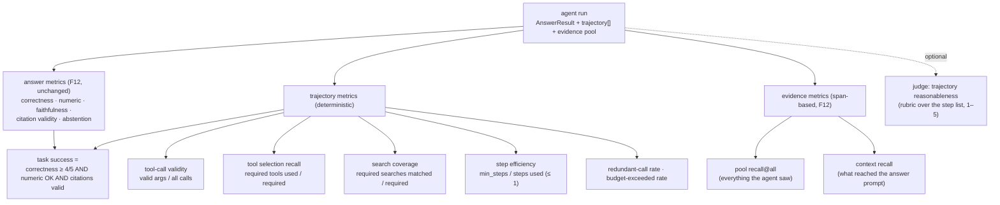
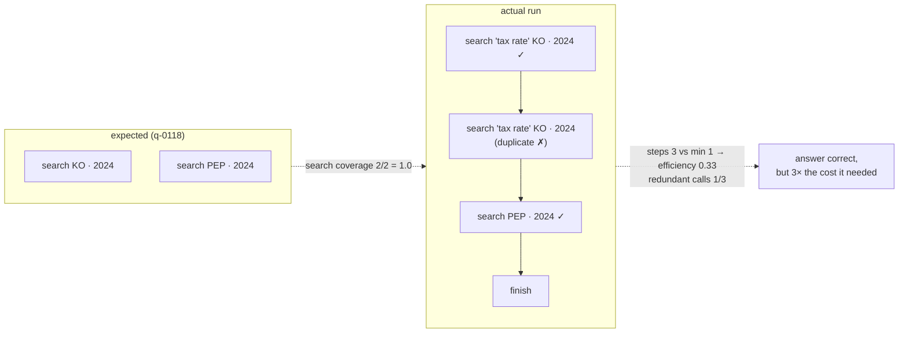
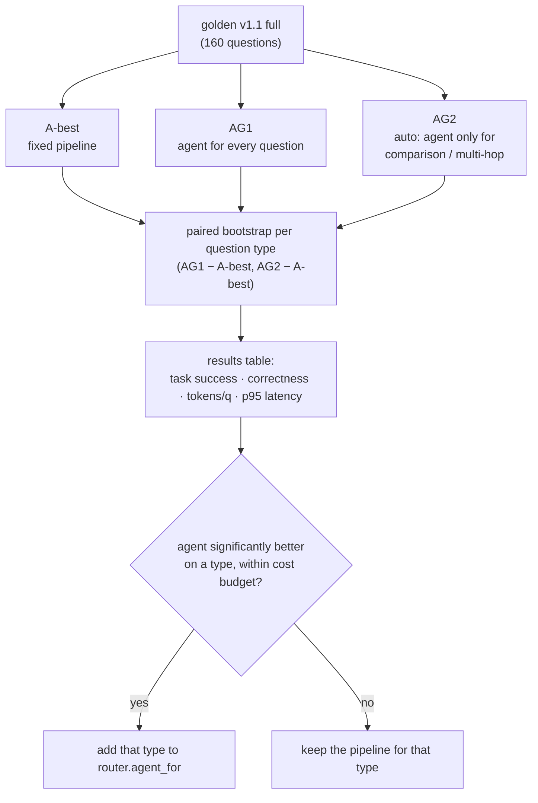

# F19: Trajectory Evals (agent vs pipeline)

| Milestone | Depends on | Effort | Unblocks |
|---|---|---|---|
| M5 Agentic | F11 (golden v1), F12, F18 | 6 h | Agent rows in F14, agent rules in F13 |

**Goal:** Score **how** the agent reached its answer (its trajectory), not only the answer itself, and
answer one question with numbers: **for which question types is the agent worth its extra cost?**

## What a trajectory eval adds

The F12 metrics tell you *whether* an answer is right. For an agent you also need to know *why* it went
wrong, because the same wrong answer can come from very different failures:

| Symptom | Possible cause | Metric that shows it |
|---|---|---|
| Wrong answer on a comparison | Searched only one company | Search coverage |
| Right answer, huge cost | Searched the same thing 4 times | Redundant-call rate, step efficiency |
| Wrong number | Found both numbers but did the arithmetic in its head | Tool selection (`calculate` missing) |
| Wrong answer, evidence was found | The chunk was in the evidence pool but not used | Pool recall vs. context recall |
| Crash-like behaviour | Invalid tool arguments | Tool-call validity |
| Slow tail latency | Ran out of budget | Budget-exceeded rate |

## Golden set extension: v1 → v1.1

Trajectory labels are added only where multiple steps are expected: the existing **multi-hop (20),
cross-year (20) and cross-company (15)** questions, plus **10 new `calculation` questions**. That makes
65 labelled items. The other questions keep no trajectory label; for them the agent is scored on answer
metrics only.

```json
{
  "id": "q-0118",
  "type": "cross_company",
  "question": "Compare Coca-Cola's and PepsiCo's FY2024 effective tax rates.",
  "expected_trajectory": {
    "required_tools": ["search_filings"],
    "required_searches": [
      { "ticker": ["KO"],  "fiscal_year": [2024] },
      { "ticker": ["PEP"], "fiscal_year": [2024] }
    ],
    "min_steps": 1,
    "max_reasonable_steps": 3
  }
}
```

- `required_searches` are matched on **filters actually used** (ticker and year), not on query wording,
  so the metric doesn't punish a different but valid phrasing.
- Adding items changes the golden version, so the baseline must be re-recorded (F13 already handles a
  version mismatch as "baseline invalid").

## Diagram: scoring one agent run



**Pool recall vs. context recall** is the most useful pair. If pool recall is high but context recall is
low, the agent **found** the evidence but lost it when building the answer context (a token-budget or
ranking problem, not a search problem).

## Diagram: example, expected vs. actual trajectory



## Diagram: the comparison experiment



**Hypothesis (to be confirmed or rejected by the data):** the agent wins on cross-company, multi-hop and
calculation questions, loses nothing on factoid questions except cost, and `auto` keeps most of the gain
for a fraction of the extra tokens.

**Results table format (goes in the README next to the ablation table)**

| Mode | Task success | Correct | Numeric | Faithful | Tokens/q | p95 s | Steps (avg) | Redundant % |
|---|---|---|---|---|---|---|---|---|
| A-best (pipeline) | 0.xx ± .xx | … | … | … | … | … | 1 | — |
| AG1 (agent) | … | … | … | … | … | … | … | … |
| AG2 (auto) | … | … | … | … | … | … | … | … |

…plus the same table **by question type**, which is where the routing decision comes from.

## CI gate: agent rules

When the default pipeline uses `mode: agent` or `auto`, the smoke eval also runs the **10 labelled
multi-step items in the smoke split**, and these rules are added to `configs/gate.yaml`:

```yaml
agent_metrics:
  task_success:          { max_drop: 0.05 }
  tool_call_validity:    { min_abs: 0.98 }     # deterministic, so a strict floor
  search_coverage:       { max_drop: 0.05 }
  avg_steps:             { max_increase_pct: 25 }
  budget_exceeded_rate:  { max_abs: 0.05 }
  tokens_per_query:      { max_increase_pct: 30 }
```

This catches the typical agent regression: a prompt change that keeps answers correct but doubles the
number of steps.

## Deliverables / files
```
src/evals/metrics/trajectory.py      # validity, selection, coverage, efficiency, redundancy (pure)
src/evals/metrics/judges.py          # + optional trajectory-reasonableness rubric
src/evals/runner.py                  # capture trajectory + evidence pool when mode != pipeline
data/golden/v1.1.jsonl               # + expected_trajectory, + 10 calculation questions
configs/gate.yaml                    # + agent_metrics block
reports/agent-vs-pipeline.md
```

## Tasks
- [ ] Label `expected_trajectory` for the 55 existing multi-step items; write 10 calculation questions
      (with evidence spans, as in F11)
- [ ] Pure trajectory metric functions + unit tests on hand-written trajectories
- [ ] Runner: store the trajectory per item in `eval_results.details` and as Langfuse scores
- [ ] Pool recall vs. context recall using the F12 span-overlap function
- [ ] Run A-best vs AG1 vs AG2 on v1.1 `full`; paired bootstrap per type; write the report
- [ ] Set `router.agent_for` from the results; add the agent gate rules

## Acceptance criteria
- Every agent eval item links to a Langfuse trace showing each step
- The comparison report has CIs for every row and a per-type table
- The router configuration is **justified by the report**, with the numbers quoted
- A deliberately bad agent prompt (e.g. one that removes "search each company separately") is caught by
  the gate through search coverage or task success

## Tests
- Unit: each trajectory metric on fixtures (perfect run, duplicate calls, missing company, invalid args,
  budget exceeded)
- Unit: matching of `required_searches` is order-independent and ignores query wording

**Interview talking point:** *"I scored the agent's trajectory, not only its answer: search coverage,
step efficiency and redundant calls. The agent beat the pipeline on cross-company questions by __ points
but cost __× the tokens, so I only route comparison and multi-hop questions to it."* (Fill in with your
real numbers.)
