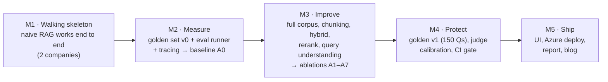
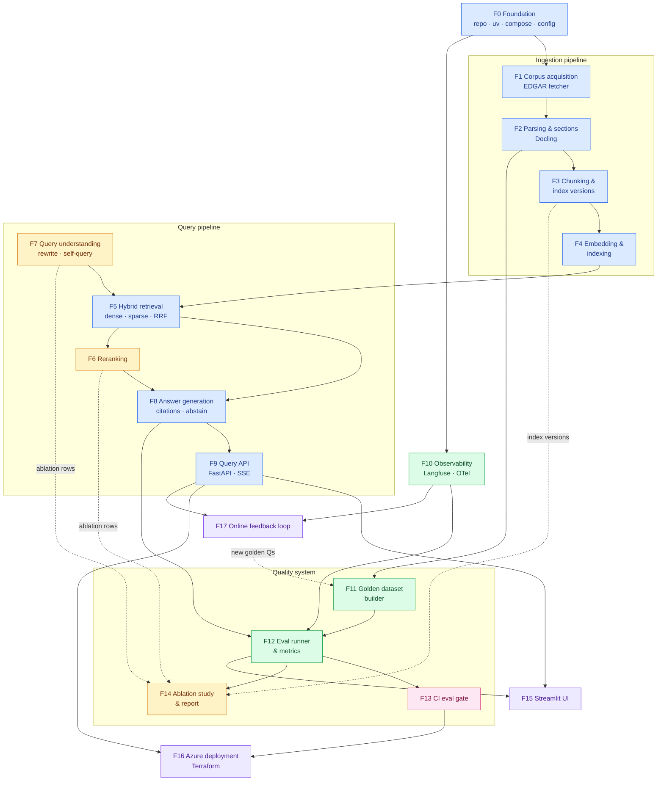
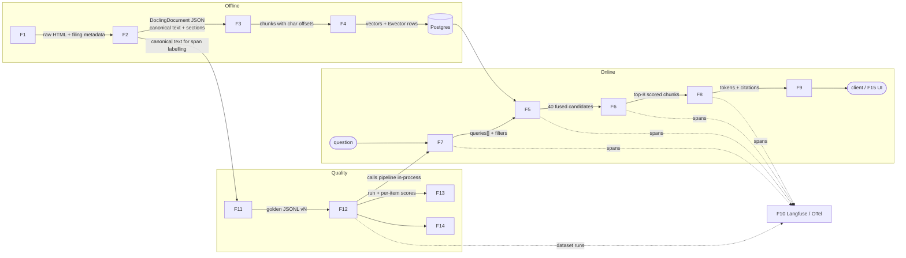
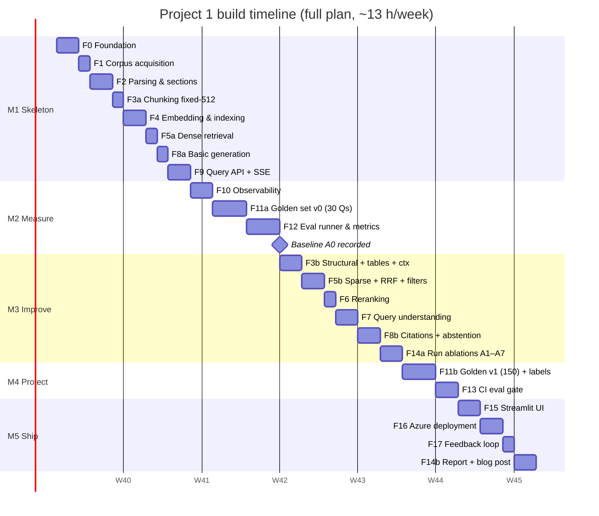

# 8. Build Plan: Feature by Feature

This plan splits Project 1 into **18 features** (F0–F17), grouped into **5 milestones**. Every feature
has its own page with a detailed diagram, tasks, acceptance criteria, tests and an estimate.

## 8.1 Build strategy: measure before you optimise

Three rules:
1. **Walking skeleton first.** A thin but complete path (ingest → retrieve → answer → API) on
   2 companies, before making any part of it good.
2. **Evaluation before improvement.** Retrieval isn't touched (M3) until a baseline score exists (M2).
   Every later change then produces a number.
3. **Each feature ends with a PR, green tests and a short note in `CHANGELOG.md`.** From M4 onwards, each
   PR also shows the eval-gate result.

## 8.2 Master diagram: how the features connect

Arrows mean **"is required by"** (build the source first). Colours show milestones.

**Legend:** blue = M1 Skeleton · green = M2 Measure · amber = M3 Improve · pink = M4 Protect · purple = M5 Ship.
In M1, features F1–F5 and F8 are built in their **simplest form** (e.g. F3 = `fixed-512` only,
F5 = dense only). M3 then extends them, which the per-feature pages mark as *Phase A* (skeleton) and
*Phase B* (full).

## 8.3 Runtime integration map: what flows between features

## 8.4 Feature index

| ID | Feature | Milestone | Depends on | Effort (h) | Page |
|---|---|---|---|---|---|
| F0 | Project foundation | M1 | — | 4 | [F00](F00-foundation.md) |
| F1 | Corpus acquisition (EDGAR) | M1 | F0 | 3 | [F01](F01-corpus-acquisition.md) |
| F2 | Parsing & section detection | M1 | F1 | 5 | [F02](F02-parsing-sections.md) |
| F3 | Chunking & index versions | M1 → M3 | F2 | 5 | [F03](F03-chunking.md) |
| F4 | Embedding & indexing | M1 | F3 | 4 | [F04](F04-embedding-indexing.md) |
| F5 | Hybrid retrieval | M1 → M3 | F4, (F7) | 5 | [F05](F05-hybrid-retrieval.md) |
| F6 | Reranking | M3 | F5 | 2 | [F06](F06-reranking.md) |
| F7 | Query understanding | M3 | F0 | 4 | [F07](F07-query-understanding.md) |
| F8 | Answer generation | M1 → M3 | F5 | 5 | [F08](F08-answer-generation.md) |
| F9 | Query API & streaming | M1 | F8 | 4 | [F09](F09-query-api.md) |
| F10 | Observability | M2 | F0 | 4 | [F10](F10-observability.md) |
| F11 | Golden dataset builder | M2 → M4 | F2 | 8 | [F11](F11-golden-dataset.md) |
| F12 | Eval runner & metrics | M2 | F8, F10, F11 | 8 | [F12](F12-eval-runner.md) |
| F13 | CI eval gate | M4 | F12 | 4 | [F13](F13-ci-gate.md) |
| F14 | Ablation study & report | M3 → M5 | F12 | 5 | [F14](F14-ablation-report.md) |
| F15 | Streamlit UI | M5 | F9, F12 | 4 | [F15](F15-streamlit-ui.md) |
| F16 | Azure deployment | M5 | F9, F13 | 5 | [F16](F16-azure-deployment.md) |
| F17 | Online feedback loop | M5 (stretch) | F9, F10 | 2 | [F17](F17-feedback-loop.md) |
| | **Total** | | | **~80 h** | |

## 8.5 Timeline

At **12–15 h/week**, 80 hours takes about **6 weeks**. That is longer than the 3 weeks in the
[roadmap](../../../../04-roadmap.md). There are two options:
- **Full plan: 6 weeks.** Everything below.
- **Core cut: ~3.5 weeks (~48 h).** Skip F15, F16, F17 and A-emb/A-llmctx; the CI gate and ablation table stay.
  Do the skipped items later during the capstone.

*(Dates are illustrative. One "d" is one working session of about 2–2.5 hours.)*

## 8.6 Milestone exit criteria

| Milestone | Done when |
|---|---|
| **M1 Skeleton** | `docker compose up` → ingest 2 companies → `curl` the SSE endpoint → streamed answer with sources. CI runs lint + unit tests. |
| **M2 Measure** | `rag-lab eval run --pipeline A0 --golden v0` prints recall@8, faithfulness, correctness, abstention with CIs; every item links to a Langfuse trace. |
| **M3 Improve** | Full 60-filing corpus indexed in ≥ 3 index versions; A0–A7 results table produced; at least one change significantly improves results (CI of the difference excludes 0). |
| **M4 Protect** | Golden v1 (150 + 20 holdout) committed; judge κ reported; a deliberately bad PR is **blocked** by the gate. |
| **M5 Ship** | Public demo URL, README with results, architecture, costs and screenshots, a blog/LinkedIn post, a 3-minute video. |

## 8.7 Definition of done (every feature)

- [ ] Code merged via PR with a descriptive title; CI green
- [ ] Unit tests for all pure logic; integration test if it touches Postgres, Redis or HTTP
- [ ] Every external call goes through a traced adapter (from M2 onwards)
- [ ] Config-driven: no hard-coded model IDs, k values or thresholds
- [ ] Feature page checklist ticked; `CHANGELOG.md` entry
- [ ] From M4: the eval gate passes, or the regression is justified in the PR description

## 8.8 Risk register

| Risk | Impact | Mitigation |
|---|---|---|
| 10-K HTML tables parse badly | Numeric questions fail | Spike Docling on 3 filings in F2 before committing; fallback: custom table extraction with `pandas.read_html` |
| Char offsets change when the parser is upgraded | Golden spans break | Pin the Docling version; store parsed text; re-anchoring script (F11) |
| Golden-set creation takes longer than planned | M2 slips | Start with v0 = 30 Qs; grow to 150 in M4 |
| LLM/API spend during evals | Cost | Response cache (F12), smoke split, budget guard |
| Judge disagrees with humans (κ < 0.6) | Gate unreliable | Gate on deterministic metrics first; iterate on the rubric |
| Scope creep (agents, UI polish) | Timeline | The out-of-scope list in [01 §1.8](../01-requirements.md) is binding |
