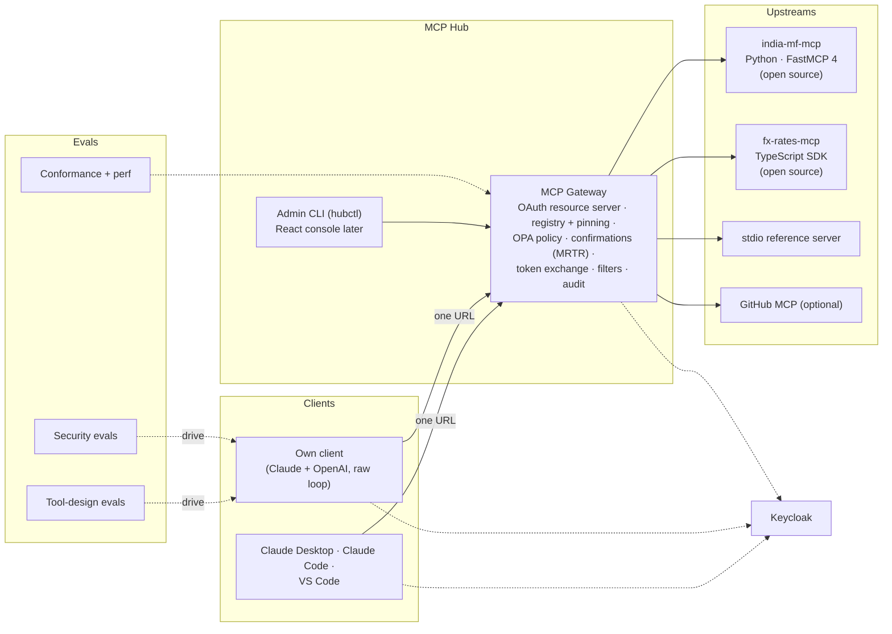

# Project 2: MCP Hub

> An open-source MCP server people can actually use, and a **secure MCP gateway** in front of it and other
> servers, built on the **MCP 2026-07-28 specification** and measured with tool-design and security evals.

**Target roles:** Agent Engineer (primary), AI Full-stack Engineer
**Gaps it closes:** remote MCP with OAuth 2.1, MCP clients, tool-design evals, MCP security (tool
poisoning, rug pulls, confused deputies), TypeScript MCP SDK, public open-source proof
**Status:** 🟡 Design, tech stack and build plan done (no code yet). **Core plan chosen: ~103 h, 8 weeks**
(roadmap weeks 8–15)

> **New here?** Start with [0 · Start here](docs/00-start-here.md): the project in plain English, one
> request's journey through the gateway, and which document to read next.

## Design documents

| # | Document | What it answers |
|---|---|---|
| 0 | [Start Here](docs/00-start-here.md) | The project in plain English, a request's journey, reading paths, FAQ |
| 1 | [Requirements](docs/01-requirements.md) | Components, use cases, functional and non-functional requirements, capacity, success criteria, scope |
| 2 | [High-Level Architecture](docs/02-architecture.md) | Context, containers, OAuth flow, tool-call flow, stateless confirmations, aggregation, deployment |
| 3 | [Low-Level Design](docs/03-low-level-design.md) | Data model, tool catalog, MRTR and signed state, gateway pipeline, OPA policy, tokens, APIs, client loop |
| 4 | [Evaluation Design](docs/04-evaluation-design.md) | Tool-design evals, security evals, protocol conformance, performance, CI gate |
| 5 | [Security & Threat Model](docs/05-security-threat-model.md) | Assets, trust boundaries, MCP-specific threats → controls → tests, STRIDE, audit integrity, residual risk |
| 6 | [Non-Functional Design](docs/06-non-functional.md) | Latency budget, cost, observability, failure modes, scaling, testing |
| 7 | [Architecture Decision Records](docs/07-decisions.md) | 18 decisions with alternatives and consequences |
| 8 | [Tech Stack](docs/08-tech-stack.md) | Every technology, why it was chosen, alternatives rejected, what it adds to your profile, versions, things to verify |
| 9 | [Build Plan](docs/09-build-plan/README.md) | 23 features in 6 milestones (20 in the chosen core plan): master dependency diagram, 8-week timeline, and a page per feature with diagrams, tasks and acceptance criteria |
| 10 | [Setup Guide](docs/10-setup-guide.md) | Accounts and keys (and when you need them), `.env`, first run, cost safety, troubleshooting |
| 11 | [Glossary](docs/11-glossary.md) | Plain-English definitions of MCP, OAuth, security, fund and eval terms |

## The system at a glance

## Planned deliverables
1. **india-mf-mcp** on PyPI and the official MCP Registry; **fx-rates-mcp** on npm
2. The MCP Gateway (Docker images + Terraform for Azure), with 2+ stateless replicas
3. Admin tooling: the `hubctl` CLI for tool approvals and the audit API (the React admin console is
   deferred in the core plan)
4. A minimal MCP client for Claude and OpenAI models with full OAuth (CIMD, PKCE, step-up)
5. A **tool-design report** (3 toolset variants in the core plan, 5 later × 2 model families, with
   confidence intervals)
6. A **security report** (attack success rate with and without defences, false-positive rate) and a
   threat model
7. A blog/LinkedIn post on MCP security or tool design, with the numbers
