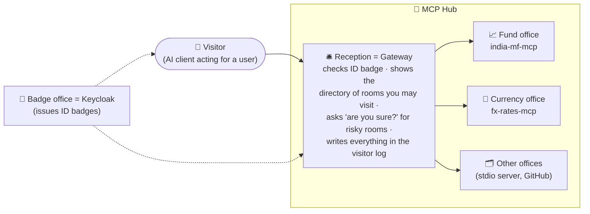

# 0. Start Here: the project in plain English

New to these docs, or preparing for an interview? Read this page first. Unfamiliar terms are explained in
the [glossary](11-glossary.md).

## 0.1 The project in three sentences

1. **india-mf-mcp** is an open-source MCP server that lets any AI assistant look up Indian mutual funds,
   calculate returns, back-test SIPs, and keep a personal watchlist and portfolio.
2. The **MCP Gateway** sits in front of several MCP servers and gives AI clients **one secure URL**: it
   checks who you are, shows you only the tools you're allowed to use, asks you to confirm risky actions,
   and records every call in a tamper-evident log.
3. **Evals** measure how tool design changes an agent's success and cost, and how much the gateway's
   defences reduce attacks, so every design choice is backed by numbers.

## 0.2 Which path should you read?

| You want to… | Read, in this order | Time |
|---|---|---|
| Explain the project in an interview | This page → [Security](05-security-threat-model.md) → [Decisions](07-decisions.md) → [Glossary](11-glossary.md) | 30 min |
| Understand the design | [Requirements](01-requirements.md) → [Architecture](02-architecture.md) → [Low-level design](03-low-level-design.md) | 1 h |
| Understand how it's measured | [Evaluation design](04-evaluation-design.md) | 20 min |
| Understand speed, failures and operations | [Non-functional design](06-non-functional.md) | 15 min |

## 0.3 The mental model: an office building with a reception desk

| Office role | Real component | Why it matters |
|---|---|---|
| Badge office | Keycloak (OAuth 2.1 authorization server) | Issues tokens; the hub never handles passwords |
| Reception | MCP Gateway | One place for identity checks, access rules, confirmations and logging |
| Directory | Tool registry with **pinned** definitions | If an office secretly changes its sign ("rug pull"), reception notices and closes that door until it's re-checked |
| "Are you sure?" | Confirmations (multi round-trip requests) | An AI can't delete your holdings because some text told it to |
| Visitor log | Hash-chained audit log | Every entry is linked to the previous one, so edits are detectable |
| Offices | MCP servers | Each one only trusts badges made **for that office** (no badge sharing) |

## 0.4 One request's journey

> **User (in Claude Desktop, connected to the hub):** "Remove my holding in the old ELSS fund."

| Step | What happens | Where |
|---|---|---|
| 1. First contact | The client has no token, so the gateway replies `401` and points to its metadata | Gateway |
| 2. Login | The client discovers Keycloak, the user logs in, and the client gets a token **valid only for the hub** (with `portfolio:read`) | Keycloak |
| 3. Tool list | The client asks for tools; the gateway returns only the approved tools this user's tenant may use (`mf__…`, `fx__…`) | Gateway registry + policy |
| 4. The model picks a tool | The model calls `mf__portfolio_summary`, finds the holding ID, then calls `mf__portfolio_remove_holding` | Client + LLM |
| 5. Step-up | The token lacks `portfolio:write`, so the gateway answers `403 insufficient_scope`; the client asks the user to approve the extra permission | Gateway + Keycloak |
| 6. Confirmation | The policy says "destructive tool → confirm". The gateway replies `input_required` with *"Remove 120.5 units of Fund X?"* and a signed state | Gateway (stateless) |
| 7. User confirms | The client re-sends the same call with the answer; any gateway replica can verify the signature | Gateway |
| 8. Right token, right user | The gateway exchanges the user's token for one meant only for the fund server, still carrying the user's ID | Keycloak token exchange |
| 9. Do it safely | The fund server deletes the row; row-level security means it could only ever touch *this user's* rows | india-mf-mcp + Postgres |
| 10. Record | Audit event written (arguments redacted, hash-chained); a trace links all hops | Gateway |

## 0.5 What makes this project stand out in interviews

- It uses the **newest MCP protocol** (stateless, 2026-07-28), not tutorials from a year ago.
- It treats MCP as a **security problem**: tool poisoning, rug pulls, confused deputies and prompt injection
  are each mapped to a control **and a test**.
- It shows **judgement with numbers**: which tool design works better for which model, and what the
  defences cost in normal use.
- It's **public and useful**: a real open-source server people can install.

## 0.6 FAQ

**Why a gateway? Can't each server do its own auth?**
It can, and ours do. But without a gateway every server needs its own policies, confirmations, rate limits
and audit, and nobody sees the whole picture. The gateway is the one enforcement point. ([02](02-architecture.md))

**Why not just forward the user's token to each server?**
That's called token passthrough and the spec forbids it: a server receiving someone else's token can't
tell who it's really acting for, and the audit trail breaks. The gateway gets a new token per server
instead. ([ADR-006](07-decisions.md))

**Why build a gateway when open-source ones exist?**
To understand and show every control, and then compare with an existing gateway (agentgateway) in the
reports. That comparison is also a strong "build vs. buy" interview answer. ([ADR-007](07-decisions.md))

**What does "stateless" change?**
There's no session to keep, so any replica can answer any request. Anything that must carry over (like a
pending confirmation) travels inside the request, signed so it can't be forged. ([ADR-011](07-decisions.md))

**Is this financial advice?**
No. The tools return data and calculations only, and say so in their descriptions.

**Is this the code?**
Not yet. These are the design documents and the [tech-stack rationale](08-tech-stack.md). The
feature-by-feature build plan comes next.
