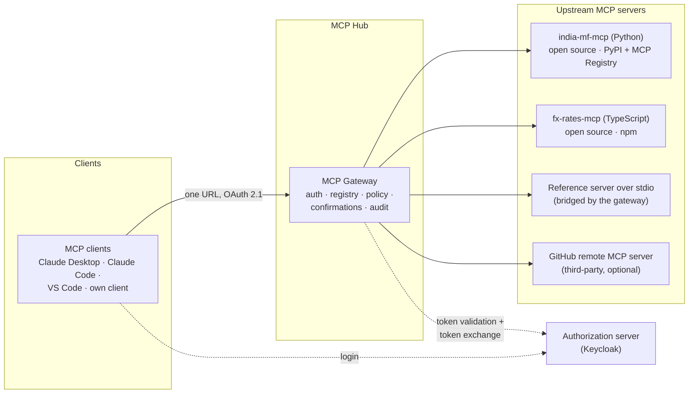

# 1. Requirements

## 1.1 Problem statement

Teams now connect AI agents to dozens of tools through MCP. Each MCP server brings its own auth, its own
tool descriptions and its own risks: a poisoned tool description, a tool result carrying hidden
instructions, or a server that quietly changes what a tool does after it was approved. Most companies
end up with **no central place** to decide which agent may call which tool, for whom, and with what
audit trail.

**Goal:** Build three things and measure them:
1. A useful **open-source MCP server** that people can install and use.
2. An **MCP gateway**: one endpoint in front of several MCP servers that handles authentication,
   per-tenant tool access, policy checks, human confirmation, rate limits and an audit log.
3. **Evidence**: evals that measure how tool design affects agent success and cost, and how much the
   gateway's defences reduce attack success.

The project targets the **MCP 2026-07-28 specification** (stateless core, multi round-trip requests,
tightened OAuth), so it shows current, not legacy, protocol knowledge.

## 1.2 What gets built

| # | Component | What it is |
|---|---|---|
| C1 | **india-mf-mcp** | Open-source MCP server over **Indian mutual-fund data** (AMFI daily NAVs + history): search schemes, NAV history, returns, SIP back-tests, plus per-user watchlists and holdings. Runs locally over stdio or remotely over Streamable HTTP. |
| C2 | **fx-rates-mcp** | Small open-source TypeScript server with official reference exchange rates (e.g. ECB data), used to show TypeScript SDK skills and cross-server tool use (e.g. "value my INR portfolio in USD"). |
| C3 | **MCP Gateway** | One endpoint that aggregates C1, C2 and others; OAuth resource server; tool registry with pinned definitions; per-tenant allow-lists; policy engine; confirmations; rate limits; hash-chained audit log. |
| C4 | **MCP client** | A minimal client in a raw tool-calling loop (no agent framework) for Claude and OpenAI models, with full OAuth (CIMD, PKCE, step-up) and multi round-trip handling. Also drives the evals. |
| C5 | **Admin console** | Small React + TypeScript app: approve tool definitions, view diffs, manage tenant allow-lists, browse the audit log. |
| C6 | **Eval harness** | Tool-design evals, security (attack) evals, protocol conformance checks and gateway performance tests. |

## 1.3 Users & use cases

| Actor | Use case |
|---|---|
| **Investor / analyst** (end user, via any MCP client) | "Compare the 5-year returns of these two flexi-cap funds", "Back-test a ₹10,000 monthly SIP since 2018", "Add this fund to my watchlist", "What's my portfolio worth in USD?" |
| **Open-source user** | `uvx india-mf-mcp` in Claude Desktop, or connect to the hosted remote endpoint |
| **Platform admin** | Register an upstream server, review and approve its tools, set which tenants may use which tools, read the audit log |
| **Security reviewer** | Check who called which tool with which arguments, verify the audit log hasn't been tampered with |
| **Developer (you)** | Change a tool's description or granularity and see the effect on agent success and token cost before merging |
| **CI pipeline** | Run protocol, contract and security regression tests on every PR |

## 1.4 Functional requirements

### Open-source server (C1, C2)

| ID | Requirement | Priority |
|---|---|---|
| FR-1 | Daily ingestion of AMFI NAVs and a history backfill into Postgres; tools never call the upstream website per request | Must |
| FR-2 | Read tools: `search_schemes`, `get_scheme`, `get_nav_history`, `compute_returns`, `compare_schemes`, `sip_backtest` with JSON input **and output schemas** (structured content) | Must |
| FR-3 | User tools: watchlists and holdings (`watchlist_*`, `portfolio_*`), scoped to the authenticated user | Must |
| FR-4 | **Interactive tools** through multi round-trip requests: disambiguate scheme names ("which of these 3 funds?") and **confirm** write/delete actions | Must |
| FR-5 | Transports: stdio (local) and Streamable HTTP (remote), both on the 2026-07-28 protocol, with version negotiation for older clients | Must |
| FR-6 | Published to **PyPI** (C1) and **npm** (C2), and listed in the **official MCP Registry** (`server.json`) | Must |
| FR-7 | A long-running tool (multi-scheme SIP back-test) using the **Tasks extension** | Should |
| FR-8 | Resources (`mf://scheme/{code}`) and one prompt template (`analyze_fund`) | Should |
| FR-9 | An **MCP Apps** UI resource (interactive NAV chart) for clients that support it | Could |

### Gateway (C3)

| ID | Requirement | Priority |
|---|---|---|
| FR-10 | **OAuth 2.1 resource server**: publishes Protected Resource Metadata (RFC 9728), validates audience-bound tokens (RFC 8707), returns `401` with `WWW-Authenticate` and `403 insufficient_scope` for step-up | Must |
| FR-11 | **Aggregation**: one `tools/list` combining all upstream tools under namespaced names (`mf__search_schemes`), filtered to what the caller is allowed to use, with cache hints | Must |
| FR-12 | **Routing** on the `Mcp-Method` / `Mcp-Name` headers, with a check that headers match the body | Must |
| FR-13 | **Tool registry with pinning**: every tool definition is hashed and approved; a changed definition is quarantined until re-approved | Must |
| FR-14 | **Policy engine**: allow / deny / require confirmation / require step-up, per tenant, user, scope, tool and argument | Must |
| FR-15 | **Confirmations** for risky tools through multi round-trip requests, without server-side session state | Must |
| FR-16 | **No token passthrough**: the gateway gets its own audience-restricted token for each upstream (token exchange), keeping the user's identity in the token | Must |
| FR-17 | **Rate limits and quotas** per user, tenant and tool | Must |
| FR-18 | **Audit log** of every call (who, what, arguments redacted, decision, result status, latency), hash-chained so tampering is detectable | Must |
| FR-19 | **Response filters**: size cap, output-schema validation, prompt-injection heuristics, PII redaction | Should |
| FR-20 | **stdio bridging**: expose a local stdio-only server as a remote tool source | Should |
| FR-21 | **Per-user upstream OAuth** for a third-party server (GitHub) using URL-mode elicitation, so the client never sees the upstream token | Could |

### Client, console and evals (C4–C6)

| ID | Requirement | Priority |
|---|---|---|
| FR-22 | Client: tool-calling loop for Claude and OpenAI models; OAuth discovery, CIMD, PKCE, step-up; handles `input_required` | Must |
| FR-23 | Admin console: tool approval with a definition diff, tenant allow-lists, audit viewer with chain verification | Should |
| FR-24 | Tool-design eval harness: several toolset variants × two model families × a task set, with statistics | Must |
| FR-25 | Security eval suite: attack cases run with gateway defences off vs. on | Must |
| FR-26 | Protocol conformance and interoperability checks (MCP Inspector + at least 2 third-party clients) | Must |

> **Build scope:** the chosen **core plan** ([build plan §9.5](09-build-plan/README.md#95-timeline-option-b-core-plan-chosen))
> builds all *Must* requirements. FR-7 (Tasks), FR-8 (resources/prompts), FR-9 (MCP Apps), FR-21 (GitHub
> upstream) and FR-23 (admin console) are deferred; admin approvals use the `hubctl` CLI.

## 1.5 Non-functional requirements

| ID | Category | Target |
|---|---|---|
| NFR-1 | Gateway overhead | Added latency (gateway minus upstream time) **p95 ≤ 25 ms**, p99 ≤ 60 ms |
| NFR-2 | Server latency | Read tools p95 ≤ 300 ms (DB-backed); `sip_backtest` single scheme ≤ 1 s |
| NFR-3 | Statelessness | Any request can hit any gateway replica; proven with 2+ replicas behind round-robin, no sticky sessions |
| NFR-4 | Security | Zero token passthrough; all tokens audience-bound; secrets only in env / Key Vault; tool definitions pinned; audit chain verifiable |
| NFR-5 | Availability | Portfolio scale: single region; gateway keeps serving other tools when one upstream is down |
| NFR-6 | Throughput | ≥ 200 tool calls/s per gateway replica on cached read tools (load test, documented) |
| NFR-7 | Compatibility | New protocol for new clients; older protocol versions negotiated for older clients (per connection) |
| NFR-8 | Portability | `docker compose up` runs everything locally, including Keycloak |
| NFR-9 | Eval cost | Tool-design eval smoke set runs in ≤ 10 min; security regression suite (no LLM) runs on every PR |
| NFR-10 | Data freshness | NAVs updated daily after AMFI publishes; staleness shown in every NAV response (`as_of`) |

## 1.6 Capacity estimates (back of the envelope)

| Quantity | Estimate |
|---|---|
| Mutual-fund schemes (AMFI) | ~15k scheme codes including closed ones; ~10k active (verify at ingestion) |
| NAV history kept | 10 years × ~250 NAV days × ~10k schemes ≈ **~25M rows** (≈ 1.5–2 GB with indexes); partitioned by year |
| Daily ingestion | One file of ~10k lines per day |
| Users | Portfolio/demo scale: tens of users, < 5 tool calls/s |
| Upstream servers behind the gateway | 3–5 |
| Tools exposed | ~25–35 in total |
| `tools/list` size | ~30 tools × ~250 tokens ≈ **7–8k tokens** per agent turn if unfiltered, which is why filtering and descriptions matter (measured in the evals) |
| Audit events | < 100k/month at demo scale; append-only table |
| Tool-design eval run | 60 tasks × 5 variants × 2 models × 3 repeats = **1,800 agent runs** (full); **1,080** with the core plan's 3 variants; smoke = 15 tasks |

**Conclusion:** One Postgres handles both the MF data and the gateway state. The engineering difficulty is
in **protocol correctness, security and measurement**, not in scale.

## 1.7 Success criteria

1. `india-mf-mcp` is installable with one command, listed in the MCP Registry, and works in at least two
   third-party clients (e.g. Claude Desktop and VS Code) both locally and remotely.
2. A client connects to **one gateway URL**, completes OAuth (CIMD + PKCE), and uses tools from 3+
   upstream servers, seeing only the tools its tenant is allowed.
3. A write tool triggers a confirmation, and a delete by another user's ID is **denied and audited**.
4. A changed upstream tool description is **quarantined** automatically and shown as a diff in the admin
   console.
5. The security report shows **attack success rate with and without** the gateway's defences, plus the
   false-positive rate on normal tasks.
6. The tool-design report shows, with confidence intervals, how tool granularity, description style and
   output schemas change task success and tokens per task for two model families.
7. The gateway's p95 overhead meets NFR-1 with 2 replicas behind a round-robin load balancer.

## 1.8 Out of scope

- Agent-to-agent protocol (A2A) (→ Project 4)
- Multi-tenant SaaS features such as billing and sign-up (→ Project 6); tenants here are configured by an
  admin
- Running user-supplied code in sandboxes (→ Project 5)
- Semantic caching and LLM routing (→ Project 7)
- Writing our own authorization server: we use Keycloak and act as a **resource server** only
- Financial advice: tools return data and calculations, never recommendations (stated in tool
  descriptions and the README)
- Deprecated protocol features: sampling, roots, logging, the legacy HTTP+SSE transport
