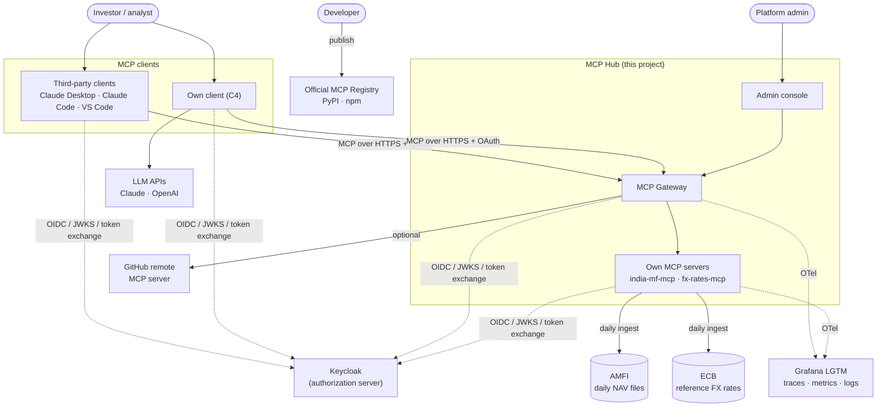
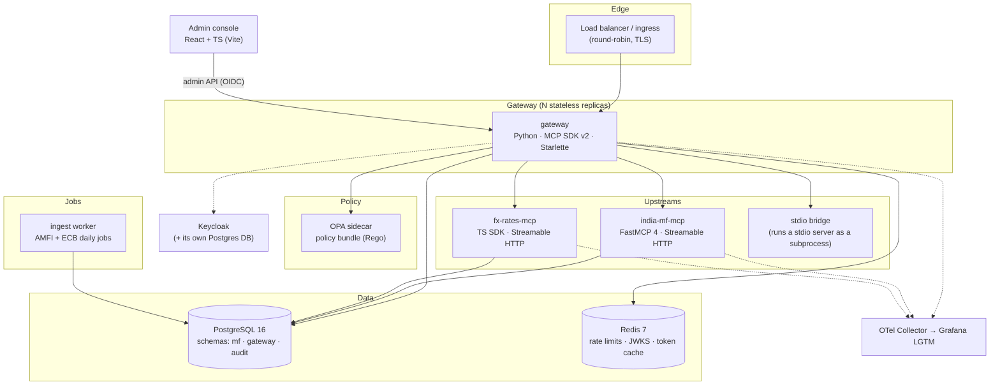
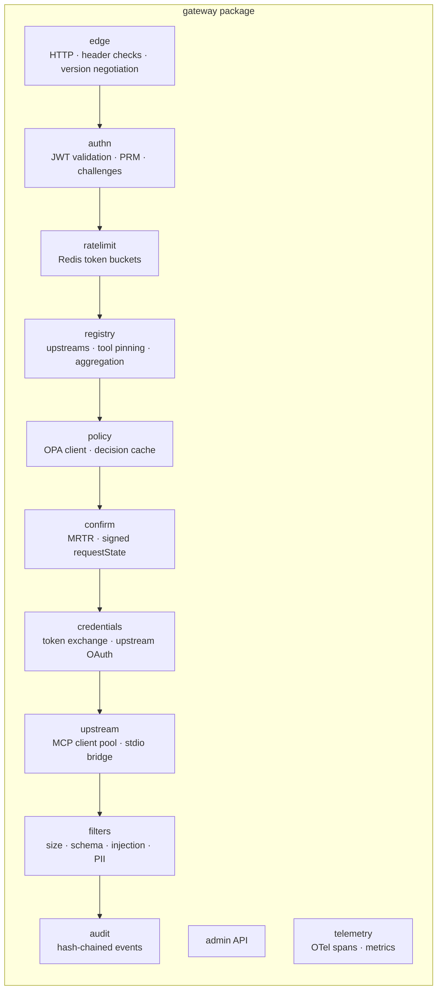
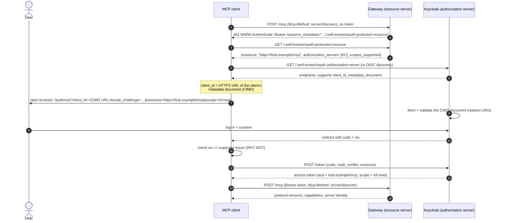
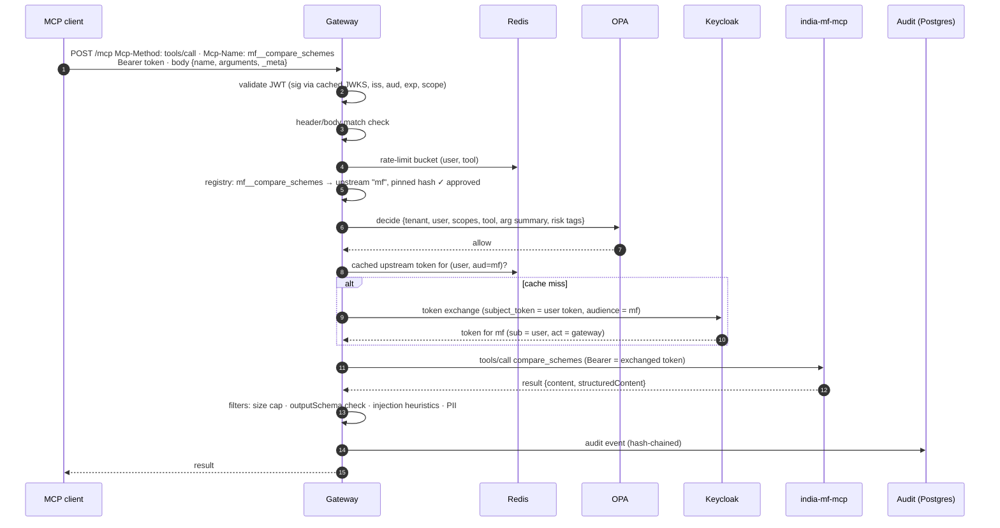
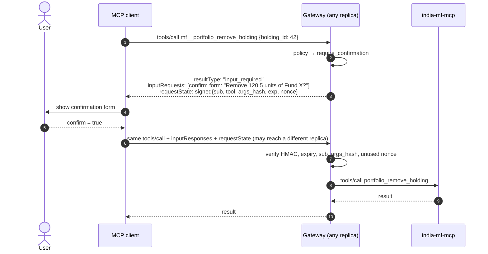
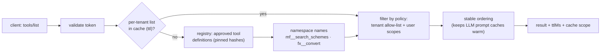
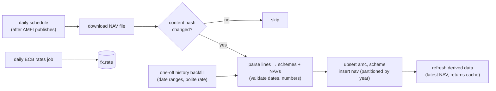
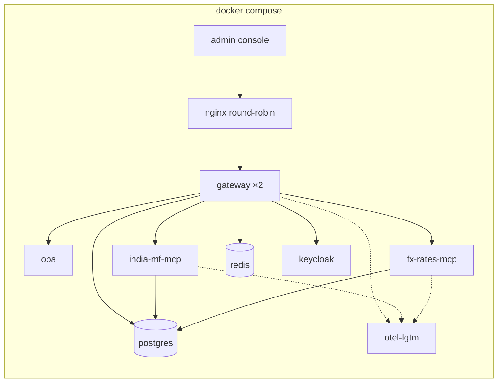
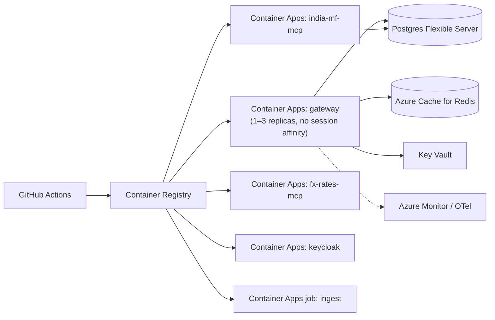

# 2. High-Level Architecture

## 2.1 Design principles

1. **Current protocol first.** Everything speaks MCP **2026-07-28**: stateless requests, `server/discover`,
   multi round-trip requests (MRTR) for user input, and `Mcp-Method` / `Mcp-Name` routing headers. Older
   clients are handled by version negotiation, not by designing around the old protocol.
2. **Stateless everywhere.** No gateway replica holds per-client state. Anything that must survive between
   two requests (a pending confirmation, for example) travels **signed** inside the request itself.
3. **The gateway is a resource server, never an identity provider.** Keycloak issues tokens; the gateway
   and servers only validate them. Tokens are never passed through to upstream servers.
4. **Default deny.** A tool is invisible and uncallable until its definition is approved *and* a policy
   allows it for the caller's tenant.
5. **Everything is audited and traced.** Every call produces an audit event and an OpenTelemetry trace that
   spans client → gateway → upstream server.
6. **Measure design choices.** Tool granularity, descriptions and defences are compared with evals, not
   chosen by taste.

## 2.2 System context (C4 level 1)



## 2.3 Containers (C4 level 2)



| Container | Responsibility | Tech |
|---|---|---|
| **Gateway** | MCP endpoint for clients; token validation; aggregation; routing; registry; policy calls; confirmations; token exchange; filters; audit; admin API | Python 3.12, MCP Python SDK v2, Starlette/Uvicorn, httpx |
| **OPA** | Evaluates policy decisions from a versioned Rego bundle | Open Policy Agent (sidecar) |
| **india-mf-mcp** | MF tools, resources, prompts; per-user watchlists and holdings | Python, FastMCP 4, SQLAlchemy, Postgres |
| **fx-rates-mcp** | FX tools (rates, conversion, history) | TypeScript, MCP TypeScript SDK v2, Node 22 |
| **stdio bridge** | Runs a stdio-only server as a subprocess and exposes it to the gateway | Part of the gateway package |
| **Ingest worker** | Daily AMFI NAV + ECB rates jobs, history backfill | Python, scheduled job (cron in compose / Container Apps job) |
| **PostgreSQL** | `mf` (funds, NAVs, user data), `gateway` (servers, tools, tenants, credentials), `audit` (events) | Postgres 16, partitioned NAV table |
| **Redis** | Rate-limit buckets, JWKS cache, upstream-token cache (short TTL) | Redis 7 |
| **Keycloak** | OAuth 2.1 / OIDC authorization server, token exchange | Keycloak (Docker) |
| **Admin console** | Tool approvals, tenant policies, audit viewer | React, TypeScript, Vite, TanStack Query |
| **Observability** | Traces, metrics, logs in one container for local dev | OTel Collector + `grafana/otel-lgtm` |

## 2.4 Module structure (gateway)



Each request passes through the modules **in this order**. Every module can end the request early (for
example `authn` with a `401`, `policy` with a deny), and every exit path still writes an audit event.

## 2.5 Data flow A: first connection (OAuth discovery, CIMD, PKCE)



**Key points**
- **CIMD** (Client ID Metadata Documents): the client's ID is a URL to a JSON document it hosts, so no
  registration step is needed. Dynamic Client Registration is deprecated in this spec version; it's kept
  only as a fallback if the authorization server doesn't support CIMD.
- The `resource` parameter (RFC 8707) makes the token **valid only for the gateway**. A token stolen from
  the gateway can't be replayed against another service.
- Step-up: if a later call needs a scope the token doesn't have (e.g. `portfolio:write`), the gateway
  answers `403` with `error="insufficient_scope"` and the required scope, and the client re-authorizes
  with the **union** of old and new scopes.

## 2.6 Data flow B: a tool call through the gateway



## 2.7 Data flow C: confirmation with multi round-trip requests (stateless)



- The pending confirmation isn't stored anywhere on the server. It's the **signed `requestState`**, bound
  to the user, the tool and a hash of the exact arguments, with a short expiry. Changing the arguments or
  replaying it for another user fails verification.
- The only shared state is a short-lived **nonce set** in Redis to stop the same confirmation being used
  twice.
- The upstream server can also return `input_required` itself (e.g. `india-mf-mcp` asking "which of these
  3 funds did you mean?"). The gateway passes such requests through, adding its own signature layer
  around the upstream's `requestState` so the upstream state can't be tampered with.

## 2.8 Data flow D: aggregated `tools/list`



The gateway **doesn't** fetch upstream `tools/list` on every client request. A background refresher polls
each upstream (respecting its cache hints), hashes every tool definition, and compares it with the
approved hash. A changed definition goes to **pending review** and disappears from client lists until an
admin approves it (see [05 Security](05-security-threat-model.md)).

## 2.9 Data flow E: ingestion (india-mf-mcp)



## 2.10 Deployment view

**Local (development and CI)**



Two gateway replicas behind nginx round-robin run **locally from day one**, so statelessness bugs show up
immediately rather than in production.

**Cloud (Azure, consistent with Project 1)**



The public `india-mf-mcp` endpoint for open-source users is the same container, reachable directly for
anonymous read-only use (strict rate limits), while signed-in features go through the gateway.

## 2.11 Proposed repository layout

```
02-mcp-hub/
├── docs/                         # these design docs
├── servers/
│   ├── india-mf-mcp/             # Python, FastMCP 4 (published to PyPI + MCP Registry)
│   └── fx-rates-mcp/             # TypeScript, MCP TS SDK (published to npm + MCP Registry)
├── gateway/                      # Python package: edge, authn, registry, policy, confirm, audit…
├── policies/                     # Rego policy bundle + tests (opa test)
├── client/                       # own MCP client (Claude + OpenAI adapters), CLI
├── console/                      # React + TS admin console
├── evals/
│   ├── tool_design/              # tasks, toolset variants, runner, report
│   ├── security/                 # attack cases, rogue test servers, report
│   └── perf/                     # k6 scripts
├── infra/                        # Terraform (Azure), Keycloak realm export
├── docker-compose.yml
└── .github/workflows/
```
