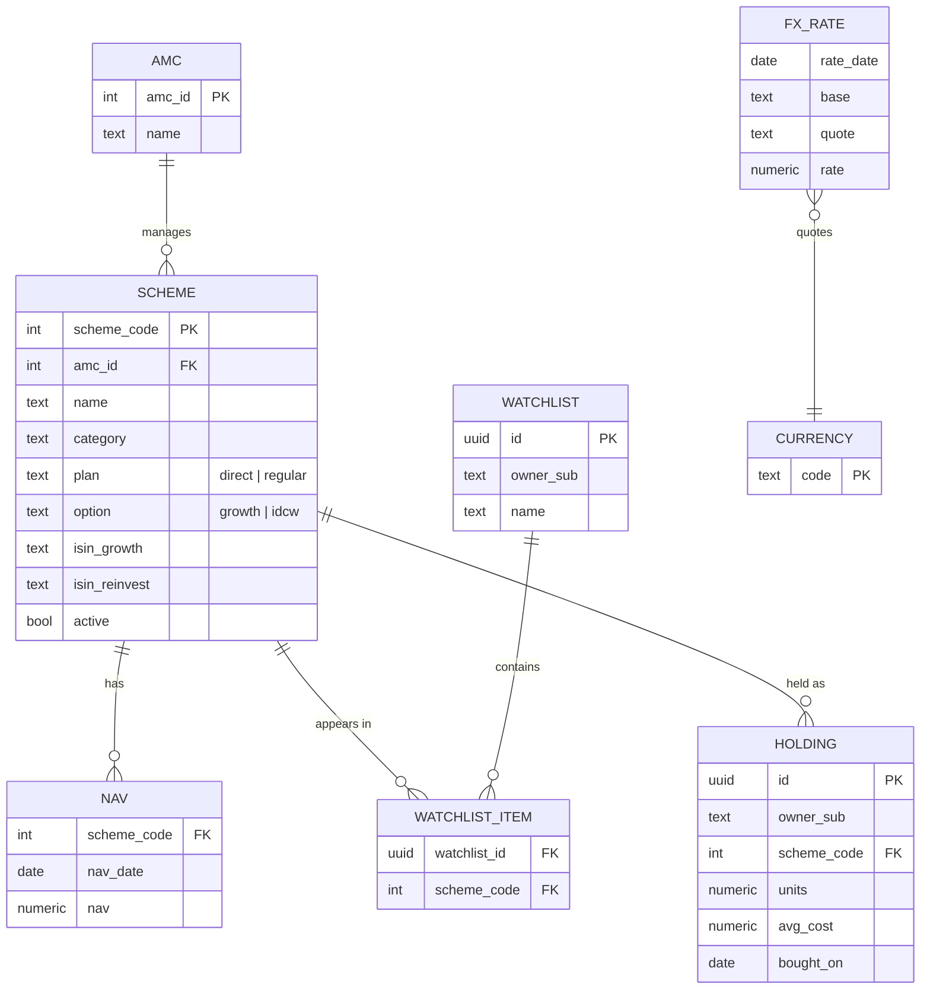
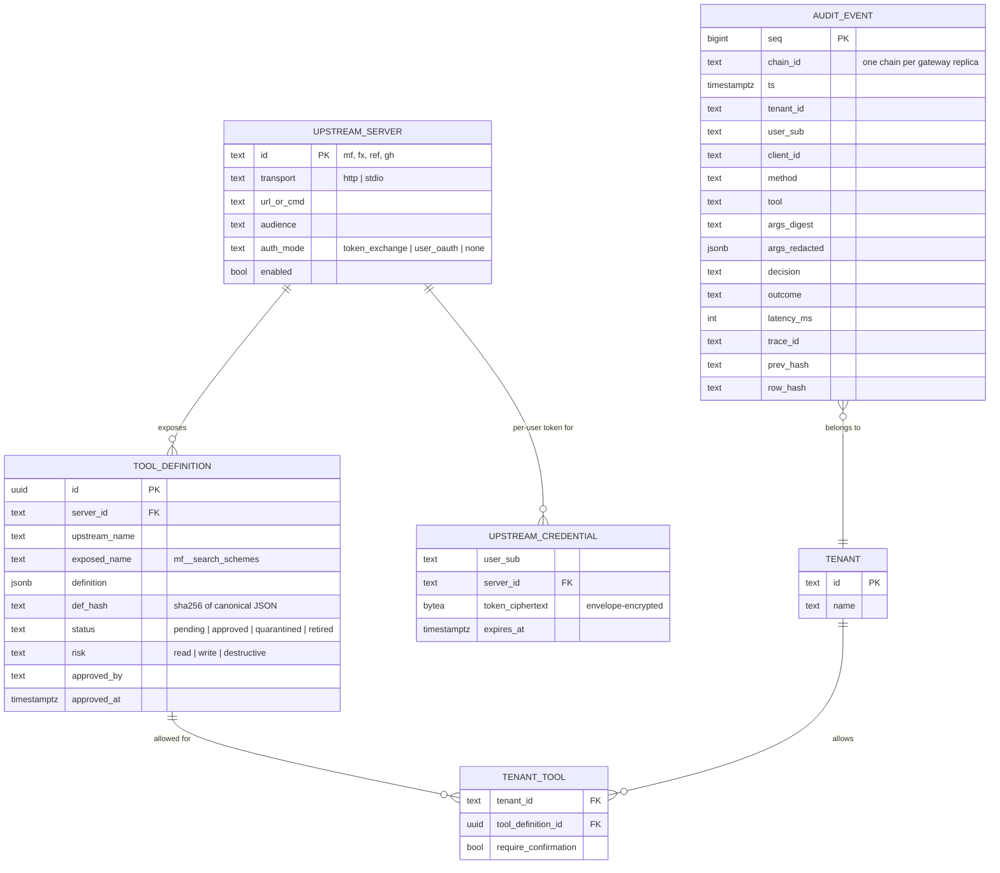
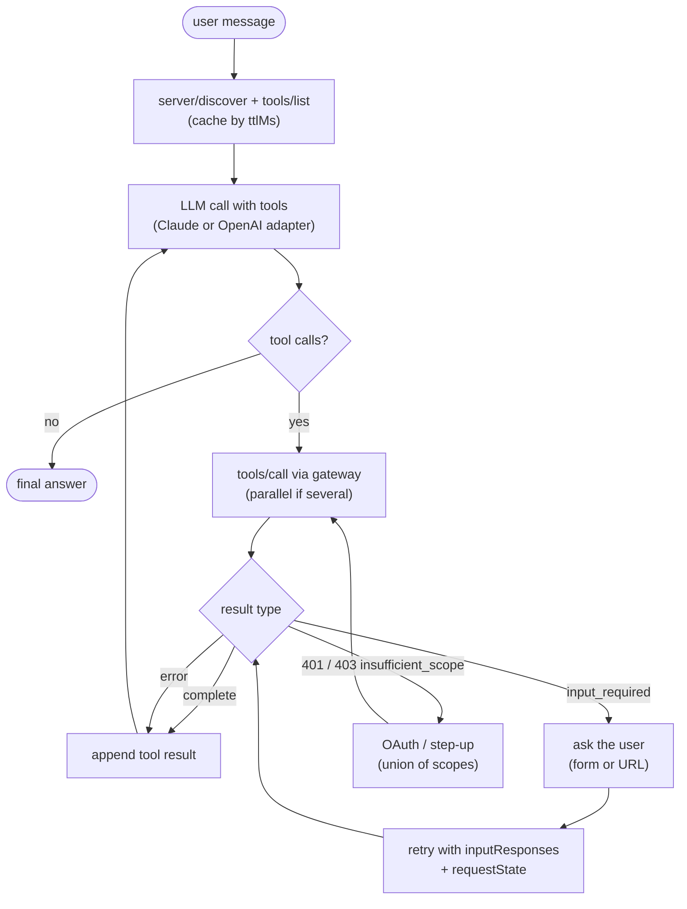

# 3. Low-Level Design

## 3.1 Data model





### Key DDL

```sql
-- NAV history: partitioned by year, BRIN on date for range scans
CREATE TABLE mf.nav (
  scheme_code int NOT NULL REFERENCES mf.scheme(scheme_code),
  nav_date    date NOT NULL,
  nav         numeric(14,4) NOT NULL CHECK (nav > 0),
  PRIMARY KEY (scheme_code, nav_date)
) PARTITION BY RANGE (nav_date);
-- one partition per year, created by migration + yearly job

-- Latest NAV per scheme for fast search results
CREATE MATERIALIZED VIEW mf.latest_nav AS
SELECT DISTINCT ON (scheme_code) scheme_code, nav_date, nav
FROM mf.nav ORDER BY scheme_code, nav_date DESC;

-- Search: trigram index for fuzzy scheme names ("hdfc flexi cap dir gr")
CREATE EXTENSION IF NOT EXISTS pg_trgm;
CREATE INDEX scheme_name_trgm ON mf.scheme USING gin (name gin_trgm_ops);

-- User data is always filtered by owner; row-level security as a second guard
ALTER TABLE mf.holding ENABLE ROW LEVEL SECURITY;
CREATE POLICY holding_owner ON mf.holding
  USING (owner_sub = current_setting('app.user_sub'));

-- Audit: append-only (no UPDATE/DELETE for the app role)
REVOKE UPDATE, DELETE ON audit.audit_event FROM gateway_app;
```

Row-level security means that even a bug in a tool's `WHERE` clause can't return another user's
holdings: the server sets `app.user_sub` from the validated token at the start of each transaction.

## 3.2 Tool catalog: india-mf-mcp (default toolset, variant T1)

| Tool | Scope | Risk | Input (main fields) | Structured output |
|---|---|---|---|---|
| `search_schemes` | `mf:read` | read | `query`, `category?`, `amc?`, `plan?`, `option?`, `limit≤20` | `[{scheme_code, name, amc, category, plan, option, nav, as_of}]` |
| `get_scheme` | `mf:read` | read | `scheme_code` | scheme details + latest NAV + `as_of` |
| `get_nav_history` | `mf:read` | read | `scheme_code`, `start`, `end`, `frequency: daily\|weekly\|monthly` | `{points: [{date, nav}], truncated: bool}` (max 500 points) |
| `compute_returns` | `mf:read` | read | `scheme_code`, `periods: ["1y","3y","5y","10y"]`, `method: cagr\|absolute` | `[{period, return_pct, start_nav, end_nav, start_date, end_date}]` |
| `compare_schemes` | `mf:read` | read | `scheme_codes[2..5]`, `period` | table of returns, volatility, max drawdown |
| `sip_backtest` | `mf:read` | read | `scheme_code`, `monthly_amount`, `start`, `end`, `day_of_month` | `{invested, value, xirr_pct, installments}` |
| `watchlist_list` / `watchlist_add` | `watchlist:read` / `watchlist:write` | read / write | `watchlist_name?`, `scheme_code` | watchlist contents |
| `watchlist_remove` | `watchlist:write` | destructive | `watchlist_name`, `scheme_code` | `{removed: bool}` |
| `portfolio_summary` | `portfolio:read` | read | `as_of?` | holdings with current value, gain, XIRR |
| `portfolio_add_holding` | `portfolio:write` | write | `scheme_code`, `units`, `avg_cost`, `bought_on` | created holding |
| `portfolio_remove_holding` | `portfolio:write` | destructive | `holding_id` | `{removed: bool}` |
| `sip_backtest_batch` *(Tasks)* | `mf:read` | read | up to 50 schemes, same SIP parameters | task handle → results table |

**fx-rates-mcp:** `get_rate(base, quote, date?)`, `convert(amount, from, to, date?)`,
`get_rate_history(base, quote, start, end)`, all `fx:read`. ECB publishes EUR-based reference rates;
cross rates such as INR→USD are computed from them, and AED is derived from its fixed USD peg, with
`source` and `method` fields in every result so the calculation is transparent.

**Description style (for every tool):** one line on what it does; when to use it *and when not to*; units
and date formats; an example call. "Returns data, not investment advice" appears in the server
instructions. The eval compares this style with minimal descriptions (see [04](04-evaluation-design.md)).

**Example: `compute_returns` definition (abridged)**
```json
{
  "name": "compute_returns",
  "title": "Compute fund returns",
  "description": "Point-to-point returns for ONE scheme over standard periods. Use CAGR for periods over 1 year. For several schemes use compare_schemes instead. Dates are ISO (YYYY-MM-DD); returns are percentages.",
  "inputSchema": {
    "type": "object",
    "properties": {
      "scheme_code": { "type": "integer", "description": "AMFI scheme code, from search_schemes" },
      "periods": { "type": "array", "items": { "enum": ["1y","3y","5y","10y"] }, "default": ["1y","3y","5y"] },
      "method": { "enum": ["cagr","absolute"], "default": "cagr" }
    },
    "required": ["scheme_code"]
  },
  "outputSchema": { "type": "object", "properties": { "returns": { "type": "array" }, "as_of": { "type": "string" } } },
  "annotations": { "readOnlyHint": true, "idempotentHint": true, "openWorldHint": false }
}
```

## 3.3 Interactive tools (multi round-trip requests)

| Situation | Who asks | Input request | What happens next |
|---|---|---|---|
| Ambiguous fund name in `watchlist_add` ("add Parag Parikh flexi cap") | india-mf-mcp | Form: choose one of the matching schemes (direct/regular × growth/IDCW) | Retry with the chosen `scheme_code` |
| Missing field (e.g. `units` in `portfolio_add_holding`) | india-mf-mcp | Form with the missing field, typed | Retry with the value |
| Destructive or policy-flagged tool | Gateway | Confirmation form with a human-readable summary of the effect | Retry with `confirm: true` + the signed state |
| Upstream needs the user's own account (GitHub) | Gateway | **URL mode**: open the gateway's consent page in the browser | The gateway stores the upstream token; the client never sees it |

**Signed `requestState` (gateway)**
```
requestState = base64url( payload ) + "." + base64url( HMAC-SHA256(k_active, payload) )
payload = { v: 1, kid: "2026-10", sub, client_id, tool, args_sha256, exp: now+300s, nonce,
            upstream_state?: <opaque state from the upstream, if any> }
```
Checks on retry: signature (with key rotation via `kid`), `exp`, `sub` and `client_id` match the current
token, `args_sha256` matches the retried arguments, and `nonce` is unused (Redis `SET NX` with a TTL equal
to the remaining lifetime).

## 3.4 Gateway request pipeline

| # | Stage | Checks / actions | Failure response |
|---|---|---|---|
| 1 | Edge | TLS, body size ≤ 1 MB, `Mcp-Method`/`Mcp-Name` present, protocol version supported | `400` / JSON-RPC error |
| 2 | Header ↔ body | Headers match `method` and `params.name` in the body | `400` (prevents routing/policy bypass by mismatch) |
| 3 | AuthN | JWT signature (JWKS cached, refreshed on unknown `kid`), `iss`, `aud == gateway resource`, `exp`/`nbf` (60 s leeway), required scope for the method | `401` + `WWW-Authenticate`, or `403 insufficient_scope` |
| 4 | Rate limit | Token buckets: per user (60/min), per user+tool (20/min for writes), per tenant (600/min) | `429` + `Retry-After` |
| 5 | Registry | Resolve `exposed_name` → upstream + definition; status must be `approved`; upstream enabled and healthy | JSON-RPC error "tool not found" (no hint that it exists) |
| 6 | Policy | OPA decision (§3.5), cached 30 s per identical input | deny → error with a reason code; step-up → `403`; confirm → §3.3 |
| 7 | Credentials | Token exchange for the upstream audience (cached until 60 s before expiry), or the stored per-user token, or none | `502` if exchange fails |
| 8 | Upstream call | Timeout per server (default 10 s), circuit breaker (5 failures → open 30 s), trace context propagated | `504` / "upstream unavailable" |
| 9 | Filters | Result size ≤ 256 kB (truncate with notice); `structuredContent` validated against the **pinned** `outputSchema`; injection heuristics; PII redaction | Flag or redact; never silently drop |
| 10 | Audit + telemetry | Audit event (always, including denials); span attributes; metrics | — |

## 3.5 Policy (OPA)

**Input sent to OPA**
```json
{
  "tenant": "demo-retail",
  "user": { "sub": "u-123", "scopes": ["mf:read", "portfolio:read"], "acr": "pwd" },
  "client_id": "https://client.example/cimd.json",
  "tool": { "name": "mf__portfolio_remove_holding", "server": "mf", "risk": "destructive",
            "annotations": { "destructiveHint": true } },
  "args": { "holding_id": 42 },
  "context": { "hour_utc": 14, "calls_last_min": 3 }
}
```

**Output**
```json
{ "decision": "require_confirmation", "reasons": ["destructive_tool"], "required_scope": null }
```
Possible decisions: `allow`, `deny`, `require_confirmation`, `require_scope` (step-up).

**Example rules (Rego, abridged)**
```rego
package mcphub.authz
default decision := {"decision": "deny", "reasons": ["default_deny"]}

allowed_tool if data.tenants[input.tenant].tools[input.tool.name]
has_scope(s) if s in input.user.scopes

decision := {"decision": "require_scope", "required_scope": s} if {
    allowed_tool
    s := data.tool_scopes[input.tool.name]
    not has_scope(s)
}
decision := {"decision": "require_confirmation", "reasons": ["destructive_tool"]} if {
    allowed_tool; has_scope(data.tool_scopes[input.tool.name])
    input.tool.risk == "destructive"
}
decision := {"decision": "allow"} if {
    allowed_tool; has_scope(data.tool_scopes[input.tool.name])
    input.tool.risk != "destructive"
}
```
Policies live in `policies/`, have unit tests (`opa test`), and are shipped as a versioned bundle. The
bundle version is written into every audit event.

## 3.6 Scopes

| Scope | Grants | Notes |
|---|---|---|
| `mf:read` | All read tools on MF data | Also available anonymously on the public server endpoint (rate-limited) |
| `fx:read` | FX tools | |
| `watchlist:read` / `watchlist:write` | Own watchlists | |
| `portfolio:read` / `portfolio:write` | Own holdings | `portfolio:write` requested only when needed (step-up) |
| `gh:read` | Proxied GitHub read tools | Also needs the user's own GitHub consent (URL mode) |
| `hub:admin` | Admin API | Console only; never granted to MCP clients |

## 3.7 Token handling

| Hop | Token | Audience | How obtained |
|---|---|---|---|
| Client → gateway | User access token | `https://hub.example/mcp` | Auth code + PKCE, CIMD client ID |
| Gateway → india-mf-mcp / fx-rates-mcp | Exchanged token (`sub` = user, `act` = gateway) | `https://mf.hub.internal` etc. | RFC 8693 token exchange at Keycloak |
| Gateway → GitHub MCP | The user's GitHub token for the gateway's GitHub app | GitHub | One-time URL-mode consent; stored envelope-encrypted |
| Gateway → stdio server | None (local subprocess) | — | Isolation by process and container instead |

The upstream servers are **resource servers too**: they validate the exchanged token's `aud` and use
`sub` for per-user data, so a request that bypasses the gateway still can't read another user's
holdings.

## 3.8 Gateway endpoints

| Method | Path | Purpose |
|---|---|---|
| `POST` | `/mcp` | MCP endpoint (Streamable HTTP; JSON responses, SSE stream when a response streams) |
| `GET` | `/.well-known/oauth-protected-resource` | Protected Resource Metadata (RFC 9728) |
| `GET` | `/connect/{server}` · `/connect/{server}/callback` | URL-mode consent flow for per-user upstream OAuth |
| `GET/POST` | `/admin/api/servers`, `/tools`, `/tools/{id}/approve`, `/tenants/{id}/tools`, `/audit`, `/audit/verify` | Admin API (`hub:admin`) |
| `GET` | `/healthz`, `/readyz` | Liveness / readiness (DB, Redis, OPA, JWKS) |

## 3.9 Upstream configuration

```yaml
# config/upstreams.yaml
upstreams:
  - id: mf
    transport: http
    url: http://india-mf-mcp:8000/mcp
    audience: https://mf.hub.internal
    auth: token_exchange
    timeout_s: 10
    tool_prefix: mf__
  - id: fx
    transport: http
    url: http://fx-rates-mcp:3000/mcp
    audience: https://fx.hub.internal
    auth: token_exchange
    tool_prefix: fx__
  - id: ref
    transport: stdio
    command: ["uvx", "mcp-server-time"]     # example reference server, pinned version
    auth: none
    tool_prefix: time__
  - id: gh
    transport: http
    url: https://api.githubcopilot.com/mcp/  # verify the current URL when building
    auth: user_oauth
    enabled: false                            # optional (FR-21)
    tool_prefix: gh__
```

**Why `server__tool` names:** OpenAI's function-calling API only accepts `[a-zA-Z0-9_-]` in tool names, so
a dot separator would break the OpenAI client. The prefix also prevents **tool-name collisions** between
servers (a known shadowing attack).

## 3.10 Own client (C4)



- Adapters translate MCP tool definitions to each LLM API's tool format and back.
- Limits: 10 tool rounds, 60 s, token budget per task (same idea as Project 1's agent guard).
- The client records a **trajectory** (every call, arguments, result size, latency), which the eval harness
  scores. The trajectory metric code is reused from Project 1 (F19).

## 3.11 Error model

| Case | Transport response | MCP / JSON-RPC |
|---|---|---|
| No or invalid token | `401` + `WWW-Authenticate: Bearer resource_metadata=…` | — |
| Missing scope | `403` + `error="insufficient_scope", scope="…"` | — |
| Rate limited | `429` + `Retry-After` | — |
| Unknown or unapproved tool | `200` | JSON-RPC error (invalid params) |
| Policy deny | `200` | Tool result with `isError: true` and a reason code the model can read |
| Upstream down | `200` | Tool result `isError: true`, "temporarily unavailable" (the model can tell the user) |
| Tool validation error | `200` | Tool result `isError: true` with the validation message, so the model can fix its arguments |

Tool-level failures are returned as **tool results with `isError`**, not protocol errors, because the model
can read and recover from them.
