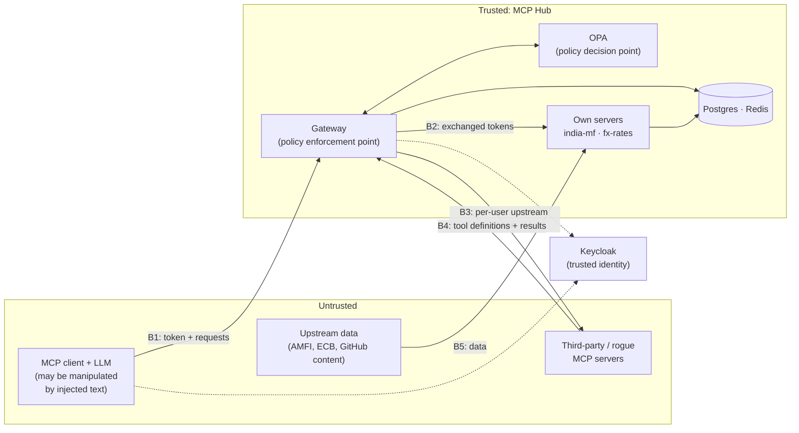
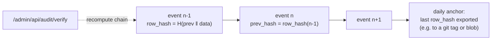

# 5. Security & Threat Model

> This is the document where your M.Tech in Information Security shows. The gateway exists mainly to
> enforce the controls below, and the security evals in [04 §4.6](04-evaluation-design.md#46-security-evals)
> measure whether they work.

## 5.1 Assets

| Asset | Why it matters |
|---|---|
| Users' holdings and watchlists | Personal financial data |
| Access tokens (user → gateway, gateway → upstreams, per-user GitHub tokens) | Whoever holds them can act as the user |
| Approved tool definitions | They decide what the model believes a tool does |
| Policies and tenant allow-lists | They decide who can do what |
| Audit log | Evidence of what happened; must be trustworthy |
| Signing keys (`requestState` HMAC, envelope-encryption keys) | Forging them bypasses confirmations or exposes stored tokens |
| LLM context (on the client side) | Anything injected here can steer the agent |

## 5.2 Trust boundaries

Everything that crosses **B1, B3, B4 or B5** is treated as untrusted: requests from clients, tool
definitions and results from upstream servers, and data from external sources.

## 5.3 MCP-specific threats

| # | Threat | How it works | Controls | Tested by |
|---|---|---|---|---|
| M1 | **Tool poisoning** | Hidden instructions in a tool's description or schema that the model follows | Admin review with an injection scan of descriptions before approval; only approved definitions are exposed; tenants only see allowed tools | Security suite: tool poisoning |
| M2 | **Rug pull** | A server changes a tool's description or behaviour after approval | Definition **pinning** (hash of canonical JSON); changed definitions are quarantined until re-approved; admin sees a diff | Security suite: rug pull |
| M3 | **Tool shadowing / name collision** | A rogue server registers a tool with the same name as a trusted one | Server-prefixed names (`mf__`), uniqueness in the registry | Security suite: shadowing |
| M4 | **Indirect prompt injection via results** | A tool result contains instructions ("now delete…") | Result filters (heuristics, flagging in `_meta`); destructive tools always need human confirmation, so injected text alone can't complete a destructive action | Security suite: indirect injection |
| M5 | **Data exfiltration through arguments** | The model is tricked into sending private data to another tool | Tenants allow only reviewed servers; policy rules on cross-server flows (e.g. `portfolio:*` data may not flow to `gh__*` tools in the same task); argument size limits; audit flags | Security suite: exfiltration |
| M6 | **Confused deputy** | The gateway uses its own authority to do something the user isn't allowed to | Token exchange keeps the **user** as `sub`; upstreams authorize by user; row-level security in Postgres | Security suite: confused deputy / IDOR |
| M7 | **Token passthrough** | Forwarding the client's token to an upstream | Forbidden by design: upstreams only accept tokens with their own audience; the gateway always exchanges | Security suite: token misuse |
| M8 | **Token theft and replay** | A leaked token is replayed elsewhere | Audience-bound tokens (RFC 8707), short lifetimes, no tokens in logs | Contract tests |
| M9 | **Authorization-server mix-up** | The client is tricked into sending a code to the wrong server | The client validates `iss` in the authorization response (RFC 9207); credentials bound to their issuer | OAuth flow tests |
| M10 | **Confirmation bypass or replay** | Re-using or altering a confirmed request | Signed `requestState` bound to user, client, tool and argument hash; expiry; single-use nonce | Security suite: confirmation tampering |
| M11 | **Header smuggling** | `Mcp-Name` says one tool, the body calls another, to fool routing or rate limits | Header/body match check before anything else | Security suite: header smuggling |
| M12 | **Excessive agency** | The agent can do more than the task needs | Least-privilege scopes with step-up; `portfolio:write` requested only when needed; tenant allow-lists | Scope escalation cases |
| M13 | **Unbounded consumption** | Loops or huge requests drive cost and load | Rate limits per user/tool/tenant; result size caps; client round limits | Load tests |
| M14 | **Supply chain** | A malicious package or typosquat of the published server | Pinned dependencies and lockfiles; signed releases (trusted publishing to PyPI/npm); registry namespace tied to your GitHub account; container image scanning | CI |
| M15 | **Local HTTP server abuse (DNS rebinding)** | A web page talks to a locally running HTTP server | Local runs use stdio by default; a local HTTP mode binds to `127.0.0.1` and validates `Origin` | Unit tests |
| M16 | **SSRF from servers** | A tool argument makes a server fetch internal URLs | Servers never fetch URLs from arguments; the ingest worker only fetches allow-listed hosts | Unit tests |

## 5.4 STRIDE per component (summary)

| Component | S (spoofing) | T (tampering) | R (repudiation) | I (info disclosure) | D (denial of service) | E (elevation of privilege) |
|---|---|---|---|---|---|---|
| Gateway | JWT validation, `iss`/`aud` | Header/body check, signed state | Hash-chained audit | Filtered tool lists, redaction, no tokens in logs | Rate limits, circuit breakers | Default deny, OPA, scopes |
| Own servers | Validate exchanged tokens | Input schemas, parameterised SQL | Server logs with `trace_id` | Row-level security | Query limits, timeouts | Scope per tool |
| Keycloak | MFA optional for admin | Admin API restricted | Keycloak events | Short-lived tokens | Managed/replicated in cloud | Realm roles reviewed |
| Postgres | App roles | Append-only audit table | Audit chain | Encrypted upstream tokens | Connection limits | Separate roles per service |
| Admin console | OIDC login with `hub:admin` | CSRF protection, same-site cookies | Admin actions audited | No tokens in the browser beyond the session | — | Admin-only API |

## 5.5 Audit log integrity

- `row_hash = SHA-256(prev_hash ‖ canonical_json(event))`. Changing or deleting any past event breaks
  every hash after it.
- Each gateway replica writes its **own chain** (`chain_id`), so replicas never wait for each other; the
  daily anchor combines the heads of all chains (see [06 §6.1](06-non-functional.md)).
- The app's database role can only **insert** into the audit table.
- A daily **anchor** (the latest hash) is written outside the database, so even someone with full DB
  access can't rewrite history without the mismatch showing.
- Arguments are stored **redacted** (PII and secrets removed) plus a digest of the full arguments, which is
  enough to prove what was called without keeping sensitive values.

## 5.6 Secrets and keys

| Secret | Storage | Rotation |
|---|---|---|
| Keycloak client secrets (gateway for token exchange) | Key Vault / env | 90 days |
| `requestState` HMAC keys | Key Vault; 2 active keys with `kid` | Monthly; old key accepted until its states expire (5 min) |
| Envelope-encryption key for per-user upstream tokens | Key Vault (key-encryption key) | Yearly; data keys per row |
| DB passwords | Key Vault / managed identity where possible | 90 days |

## 5.7 Mapping to the OWASP Top 10 for LLM Applications (2025)

| OWASP item | Relevant threats here |
|---|---|
| LLM01 Prompt Injection | M1, M4 |
| LLM02 Sensitive Information Disclosure | M5, M6, audit redaction |
| LLM03 Supply Chain | M14, third-party MCP servers |
| LLM05 Improper Output Handling | Result filters, output-schema validation |
| LLM06 Excessive Agency | M12, confirmations for destructive tools |
| LLM10 Unbounded Consumption | M13 |

## 5.8 Residual risks (stated honestly)

- **Injection detection is heuristic.** It lowers the attack success rate but can't reach zero; the real
  protection is that injected text alone can't complete a destructive action without human confirmation.
- **Approved servers can still misbehave at runtime** (return wrong data) without changing their
  definitions. Pinning catches changed definitions, not changed behaviour.
- **Third-party clients** decide how they show confirmations to the user. A client that auto-accepts forms
  weakens the confirmation control; the audit log will show it.
- **Keycloak is a single point of failure** for new logins in the demo deployment. Existing tokens keep
  working until they expire, because validation uses cached keys.
