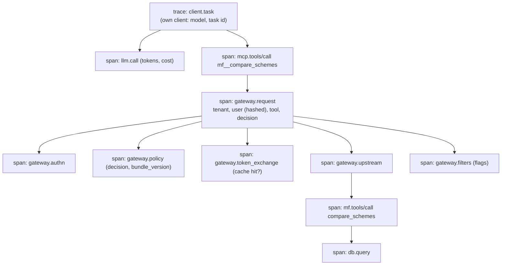

# 6. Non-Functional Design

## 6.1 Latency budget: gateway overhead per `tools/call` (p95 target ≤ 25 ms)

```mermaid
gantt
    title Gateway overhead budget (ms, p95, excluding upstream time)
    dateFormat X
    axisFormat %L
    section Edge
    Parse + header checks        :a1, 0, 1
    section Auth
    JWT verify (cached JWKS)     :a2, after a1, 2
    section Control
    Rate limit (Redis)           :a3, after a2, 2
    Registry lookup (in-memory)  :a4, after a3, 1
    Policy (OPA, cached)         :a5, after a4, 4
    Upstream token (cache hit)   :a6, after a5, 2
    section After upstream
    Filters + schema check       :a7, after a6, 5
    Audit write (async batch)    :a8, after a7, 2
    Telemetry                    :a9, after a8, 1
```

| Stage | p95 budget | Main lever if over budget |
|---|---|---|
| JWT verification | 2 ms | JWKS cached in memory; refresh only on unknown `kid` |
| Rate limit | 2 ms | One Redis round trip (Lua script), pipelined |
| Policy | 4 ms | OPA as a sidecar on localhost; decision cache for identical inputs (30 s) |
| Upstream token | 2 ms (cache hit) | Cached until 60 s before expiry; a cache miss (~50–150 ms token exchange) happens about once per user per upstream per token lifetime |
| Filters | 5 ms | Regex heuristics only on the hot path; heavier classifiers off by default |
| Audit | 2 ms | Written asynchronously in small batches; the hash chain is computed by a single writer to keep ordering |

**Why the audit writer is single-threaded:** the hash chain needs a strict order. A single writer task per
replica batches events, and the chain is per replica (`chain_id = replica`), with a global anchor that
combines the per-replica chain heads. That keeps writes fast without a global lock.

## 6.2 Cost model

| Component | Cost driver | Notes |
|---|---|---|
| Hosting (Azure Container Apps) | vCPU-seconds while active | Scale to zero for servers; gateway min 1 replica during demos |
| Postgres Flexible Server | Instance size + storage (~2 GB NAV data) | Burstable tier is enough |
| Keycloak | One small container | Uses its own small database |
| LLM calls | **Only in the client and evals** | The hub itself calls no LLM; the tool-design full matrix is the largest cost (≈ 1,800 runs), so it runs on demand with the response cache |
| Tokens per agent turn | Size of `tools/list` | Filtering tools per tenant and good descriptions reduce this; measured in the evals |

## 6.3 Observability

**Trace across three hops**

- W3C trace context is propagated in HTTP headers on every hop (and in `_meta` where a hop isn't HTTP,
  e.g. the stdio bridge).
- **Metrics:** `hub_requests_total{method, tool, decision}`, `hub_overhead_seconds` (histogram),
  `hub_upstream_seconds{server}`, `hub_policy_denials_total{reason}`, `hub_confirmations_total{outcome}`,
  `hub_quarantined_tools`, `hub_rate_limited_total`, `hub_token_exchange_seconds`.
- **Logs:** JSON, with `trace_id`; user IDs hashed; tokens and raw arguments never logged.
- **Dashboards:** overhead p50/p95/p99, calls per tool, denials by reason, confirmation acceptance rate,
  upstream health.

## 6.4 Failure modes & degradation

| Failure | Detection | Behaviour |
|---|---|---|
| One upstream down | Circuit breaker (5 failures → open 30 s) | Its tools return `isError` "temporarily unavailable"; other tools unaffected; `tools/list` keeps listing them (so model prompts stay stable) |
| OPA down | Health check / timeout 50 ms | **Fail closed**: deny everything except `server/discover` and `tools/list` |
| Redis down | Connection errors | Rate limiting **fails closed for write tools** and falls back to an in-memory per-replica limiter for reads; confirmation nonces can't be checked, so confirmations are refused |
| Keycloak down | JWKS refresh / token exchange errors | Existing user tokens still validate (cached JWKS); cached upstream tokens keep working; new logins and cache misses fail with a clear error |
| Postgres down | `/readyz` fails | Replica taken out of rotation; audit events buffered in memory up to a limit, then requests are refused (no un-audited calls) |
| Upstream changes a tool definition | Registry refresher hash mismatch | Tool quarantined, admin notified, clients no longer see it |
| AMFI file missing or malformed | Ingest validation | Keep yesterday's data; `as_of` shows the real date; alert |

## 6.5 Scaling path

| Growth | Change |
|---|---|
| More clients | Add gateway replicas: the protocol is stateless and so is the gateway |
| Many upstream servers | Registry refresher sharded by server; per-server connection pools |
| High call volume | Move audit writes to a queue (e.g. Kafka / Event Hubs) with a dedicated chain writer |
| Many tenants | Policy data bundles per tenant; OPA bundle server; per-tenant rate limits |
| Heavy injection scanning | Move the classifier to an async side path that flags rather than blocks |
| Enterprise identity | Adopt the Enterprise Managed Authorization extension with the company IdP |

## 6.6 Testing strategy

| Level | What | Tooling |
|---|---|---|
| Unit | Returns/XIRR maths (property tests), NAV file parser, requestState signing, header checks, hash chain | pytest, hypothesis, vitest (TS) |
| Policy | Every Rego rule, including deny paths | `opa test` |
| Integration | Servers against Postgres; gateway against real Keycloak, Redis, OPA | pytest + testcontainers / compose |
| Contract | MCP messages: `server/discover`, headers, `input_required`, errors; older-protocol negotiation | pytest + MCP SDK client |
| Security | Gateway-level attack suite (every PR), end-to-end suite (nightly) | Custom harness |
| Evals | Tool-design smoke (PR), full matrix (on demand) | Custom harness |
| Load | Overhead, throughput, 2-replica MRTR test | k6 |
| Manual | MCP Inspector, Claude Desktop, Claude Code, VS Code | Checklist in the release template |
