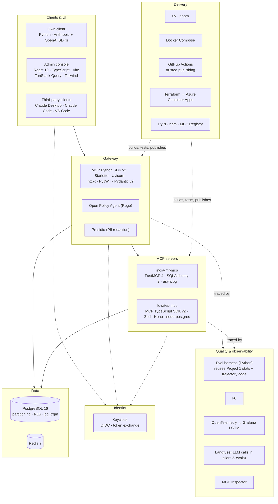

# 8. Tech Stack: What We Use and Why

For every technology in this project, this document answers five questions:
1. **What does it do in this system?**
2. **Why was it chosen?**
3. **What alternatives were considered, and why weren't they chosen?**
4. **What does it add to your profile?**
5. **When would we replace it?**

Selection criteria used throughout (same idea as Project 1, adjusted for a protocol and security project):

| # | Criterion | Meaning |
|---|---|---|
| C1 | **Spec fit** | Supports MCP **2026-07-28** (stateless core, MRTR, routing headers) and the OAuth RFCs it requires |
| C2 | **Security** | Well-maintained, secure by default, lets us see and test each control |
| C3 | **Market value** | Shows up in 2026 Agent / AI Full-stack Engineer JDs (see [01-market-analysis](../../../01-market-analysis.md)) |
| C4 | **Gap-filling** | Covers something your résumé doesn't show yet (see [00-profile-gap-analysis](../../../00-profile-gap-analysis.md)) |
| C5 | **Low ops & cost** | Runs with `docker compose up`; demo cost of a few dollars |
| C6 | **Reuse** | Reuses Project 1's code and patterns where it makes sense |

---

## 8.1 The stack at a glance

## 8.2 Summary table

| Layer | Choice | One-line reason | Main alternative (not chosen) |
|---|---|---|---|
| Language (gateway, main server, client, evals) | **Python 3.12** | Your strongest language; the official MCP Python SDK is Tier 1 | Go (fast gateways, but splits your focus) |
| Language (second server, console) | **TypeScript** (Node 24 LTS) | Shows the official TS SDK and full-stack skill | Only Python (misses the TS SDK signal) |
| MCP server framework (Python) | **FastMCP 4** | First to support 2026-07-28; high-level tools, interactive tools, Tasks | Low-level Python SDK only (more boilerplate) |
| MCP gateway foundation | **MCP Python SDK v2** (low-level) + **Starlette** | Full control of every message for the security pipeline | agentgateway, ContextForge, FastMCP proxy (compared, not built on) |
| MCP server framework (TS) | **MCP TypeScript SDK v2** + **Zod** + **Hono** | Official SDK; Zod schemas become tool schemas | Express (fine, older), NestJS (heavy) |
| HTTP client | **httpx** | Async, HTTP/2, timeouts, used by the SDK | aiohttp |
| JWT validation | **PyJWT** (+ JWKS client) | Small, well-audited, fast | Authlib / joserfc (larger; used if more JOSE features are needed) |
| Validation / config | **Pydantic v2** | Tool schemas, config, API models in one library | dataclasses + jsonschema |
| Authorization server | **Keycloak** | Full OIDC, token exchange, runs locally in Docker | Auth0, Entra ID, WorkOS, Ory Hydra |
| Policy engine | **Open Policy Agent (Rego)** | Separate, testable, versioned policy; widely known | Cedar, hard-coded rules |
| PII redaction | **Microsoft Presidio** | Proven PII detection; matches your Responsible-AI experience | Regex only, cloud PII APIs |
| Database | **PostgreSQL 16** | Partitioning, row-level security, trigram search, JSONB, one DB for everything | TimescaleDB (time-series extras not needed) |
| DB access (Python) | **SQLAlchemy 2 (async) + asyncpg + Alembic** | Typed queries, migrations, async | Raw asyncpg (no migrations story) |
| Cache / rate limits / nonces | **Redis 7** | Atomic Lua scripts for token buckets, `SET NX` nonces | In-memory only (breaks with 2 replicas) |
| Admin console | **React 19 + TypeScript + Vite + TanStack Query + Tailwind** | Your React strength, fast to build, no SSR needed | Next.js (saved for Project 6), Streamlit |
| LLM SDKs (client + evals) | **Anthropic SDK + OpenAI SDK** | Two model families for the tool-design evals | LiteLLM (hides API differences we want to see; used in Project 7) |
| Tracing / metrics / logs | **OpenTelemetry → Grafana LGTM** | Distributed traces across client, gateway and servers in one container | Jaeger + Prometheus separately, vendor APM |
| LLM tracing | **Langfuse** | Same tool as Project 1 for LLM calls and eval runs | LangSmith |
| Load testing | **k6** | Scriptable, good percentile reports | Locust |
| Testing | **pytest, hypothesis, testcontainers, vitest, `opa test`, Playwright** | Each layer tested with its natural tool | — |
| Protocol checking | **MCP Inspector** (+ official conformance tests where available) | The standard debugging tool for MCP | Manual clients only |
| Packaging | **uv** (Python), **pnpm** (TS) | Fast, lockfiles | Poetry, npm |
| Publishing | **PyPI + npm (trusted publishing) + official MCP Registry** | Installable with one command; signed provenance | Only GitHub releases |
| Containers / local stack | **Docker Compose** (with nginx round-robin) | One command; two gateway replicas locally | Kubernetes (overkill here) |
| CI/CD | **GitHub Actions** | Tests, security suite, publishing, deploys | GitLab CI |
| IaC + cloud | **Terraform → Azure Container Apps** | Reuses Project 1's modules; scale to zero | AWS ECS / Lambda (documented alternative) |

---

## 8.3 Detailed rationale

### MCP layer

#### FastMCP 4 (india-mf-mcp)
- **Role:** Defines the fund tools, resources and prompt; runs over stdio and Streamable HTTP;
  interactive tools (disambiguation, missing fields) and the Tasks extension for `sip_backtest_batch`.
- **Why:** FastMCP 4 shipped alongside the 2026-07-28 spec and the rewritten Python SDK v2, with
  per-connection negotiation so old clients keep working (C1). Decorators turn typed Python functions into
  tools with input **and output** schemas, so time goes into the data and the tool design, not into
  protocol plumbing. You've used FastMCP at work, so you can go deeper here quickly (C3).
- **Not chosen:** The low-level SDK for the server (more code for no extra learning, since the gateway
  already covers the low level).
- **Profile:** "Published open-source MCP server on the current protocol" is concrete public proof.
- **Revisit:** If FastMCP's high-level API ever hides something the evals need to vary (e.g. exact
  description text), drop to the low-level API for that tool.

#### MCP Python SDK v2, low level (gateway)
- **Role:** Parses and produces MCP messages for both sides of the gateway: a server towards clients and a
  client towards upstream servers.
- **Why:** The gateway must inspect and control **every** message: headers vs. body, `tools/list`
  rewriting, `input_required` wrapping, error mapping. The low-level SDK gives exact control while still
  handling protocol details correctly (C1, C2).
- **Not chosen:**
  - **agentgateway / IBM ContextForge / Docker MCP Gateway**: mature gateways, but building on them
    shows configuration skills rather than protocol and security design. One of them (agentgateway) is
    used as a **comparison point** in the performance and security reports (ADR-007).
  - **FastMCP proxy / mount:** good for simple aggregation, but the security pipeline would still be
    custom, and the proxy layer would sit between us and the messages we need to control.
- **Revisit:** In a real company, start from an existing gateway and add custom policy plugins; this
  project's report says exactly which controls you'd need to add.

#### Starlette + Uvicorn (gateway HTTP layer)
- **Role:** ASGI app hosting `/mcp`, `/.well-known/oauth-protected-resource`, the consent flow and the
  admin API.
- **Why:** The MCP SDK's Streamable HTTP transport is ASGI-native; Starlette adds only routing and
  middleware with minimal overhead, which matters for the 25 ms overhead budget.
- **Not chosen:** FastAPI (nice for the admin API, but adds a layer on the hot path; the admin API is small
  enough for Starlette + Pydantic).

#### MCP TypeScript SDK v2 + Zod + Hono (fx-rates-mcp)
- **Role:** The second open-source server.
- **Why:** Many Agent and Full-stack JDs mention the TypeScript SDK. Zod schemas double as tool schemas;
  Hono is small and fast and runs on Node, Bun or edge runtimes.
- **Not chosen:** Express (works, but older patterns); writing the second server in Python too (misses
  the TS signal).

### Identity & policy layer

#### Keycloak
- **Role:** Authorization server: user login, scopes, access tokens with audiences, **token exchange**
  (RFC 8693) for the gateway, and admin roles for the console.
- **Why:** Open source, runs locally in Docker, supports OIDC and token exchange, and is common in
  enterprises (C2, C5). Keeping identity outside the hub follows ADR-004.
- **Not chosen:** Auth0 / Entra ID / WorkOS (hosted and polished, but less transparent locally, and free
  tiers limit features like token exchange); Ory Hydra (lighter, but no built-in user management);
  writing our own (security risk).
- **To verify when building:** support for **CIMD** and **resource indicators** in the Keycloak version
  used. Fallbacks: pre-registered client for the own client, DCR for third-party clients, audience mapping
  via client scopes. Record whatever is needed in ADR-004.
- **Revisit:** In Azure production, Entra ID as the identity provider behind Keycloak, or the Enterprise
  Managed Authorization extension.

#### PyJWT (+ cached JWKS)
- **Role:** Validates access tokens at the gateway and servers: signature, `iss`, `aud`, `exp`, scopes.
- **Why:** Small, widely audited, fast; JWKS keys are cached in memory and refreshed only on an unknown
  key ID.
- **Not chosen:** Authlib or joserfc (more features than needed on the hot path); token introspection on
  every call (a network round trip per request).

#### Open Policy Agent (Rego)
- **Role:** The **policy decision point**: allow / deny / require confirmation / require step-up.
- **Why:** Policy separate from code, unit-testable with `opa test`, versioned bundles written into audit
  events; widely used in platform and security teams (C2, C3).
- **Not chosen:** **Cedar** (in-process and formally analysable, a strong choice; less common in JDs);
  hard-coded Python rules (hard to review and test separately).
- **Revisit:** If the sidecar round trip threatens the latency budget, evaluate OPA compiled to Wasm and
  run in-process.

#### Microsoft Presidio
- **Role:** Redacts PII in audit-log arguments and, optionally, in tool results.
- **Why:** Mature, configurable, and continues the story of your Responsible-AI middleware work.
- **Not chosen:** Regex-only (misses names and addresses); cloud PII APIs (extra dependency and cost).
- **Revisit:** Move to an async side path if it becomes the slowest filter.

### Data layer

#### PostgreSQL 16
- **Role:** Fund data (partitioned NAV table, trigram search), user data (with **row-level security**),
  gateway state (servers, tool definitions, tenants, encrypted upstream tokens) and the audit log.
- **Why:** One database covers time series at this size (~25M rows), fuzzy search, JSONB tool
  definitions, RLS and append-only permissions (C5). Same Postgres skills and Terraform modules as
  Project 1 (C6).
- **Not chosen:** TimescaleDB (compression and continuous aggregates not needed at this size); a separate
  store for the audit log (more ops for no benefit here).

#### SQLAlchemy 2 (async) + asyncpg + Alembic
- **Role:** Data access and migrations for the Python services.
- **Why:** Typed queries, async, and proper migrations, including RLS policies and partitions.
- **Not chosen:** Raw asyncpg everywhere (no migration tool); an ORM-heavy approach for analytics
  queries (returns and XIRR queries use SQL window functions directly).

#### Redis 7
- **Role:** Token-bucket rate limits (atomic Lua scripts), single-use confirmation nonces (`SET NX` with a
  TTL), cached upstream tokens, JWKS cache.
- **Why:** Shared state for **multiple stateless replicas**, which in-memory caches can't provide.
- **Not chosen:** Postgres for rate limits (too slow for every request); in-memory only (fails the
  2-replica test).

### Clients & UI

#### Own client: Python + Anthropic SDK + OpenAI SDK (no agent framework)
- **Role:** Tool-calling loop, OAuth (CIMD, PKCE, `iss` check, step-up with scope union), `input_required`
  handling, trajectory recording for the evals.
- **Why:** The tool-design evals need **two model families** and full control of the loop (ADR-014).
  Using the vendor SDKs directly shows the real differences in tool-calling formats.
- **Not chosen:** LangGraph or vendor agent SDKs (compared in Project 3); LiteLLM (hides the API
  differences; used in Project 7).
- **Note:** Use the MCP SDK's OAuth client helpers where they support CIMD and step-up; add the missing
  pieces yourself and document them.

#### Admin console: React 19 + TypeScript + Vite + TanStack Query + Tailwind
- **Role:** Approve tool definitions (with a side-by-side diff), manage tenant allow-lists, browse and
  verify the audit log.
- **Why:** Builds on your React/TypeScript strength (C3) and adds a visible full-stack piece. A single-page
  app is enough for an internal admin tool.
- **Not chosen:** Next.js (server rendering isn't needed; Next.js is the focus of Project 6); Streamlit
  (weaker full-stack signal for this role).

### Quality & observability

#### Eval harness (Python, reusing Project 1)
- **Role:** Tool-design matrix, security suites, reports.
- **Why:** Reuses Project 1's paired bootstrap, trajectory metrics and LLM response cache (C6), so this
  project spends its time on new questions, not on rebuilding statistics.

#### OpenTelemetry → Grafana LGTM
- **Role:** Distributed traces across client → gateway → upstream → database, plus metrics and logs.
- **Why:** The gateway's value is measured in milliseconds and denials; that needs traces and histograms
  across services. `grafana/otel-lgtm` gives Tempo, Prometheus-compatible metrics, Loki and Grafana in
  **one container** locally (C5). OTel keeps it vendor-neutral, so Azure Monitor works in the cloud.
- **Not chosen:** Jaeger + Prometheus + Grafana as separate containers (more setup); Langfuse alone (made
  for LLM traces, not for gateway latency analysis).

#### Langfuse
- **Role:** Traces of LLM calls in the own client and eval runs, as in Project 1.
- **Why:** Same tool, same dashboards; keeps LLM cost and token data separate from infrastructure
  telemetry.

#### k6
- **Role:** Gateway overhead, throughput and the 2-replica statelessness test.
- **Why:** Scripted scenarios with percentile thresholds that can fail CI.
- **Not chosen:** Locust (Python-friendly, but k6's thresholds and reports fit CI better).

#### MCP Inspector (+ official conformance tests)
- **Role:** Manual protocol debugging; automated conformance checks where the official suite covers
  2026-07-28.
- **Why:** The standard tool reviewers and interviewers know.

#### pytest · hypothesis · testcontainers · vitest · `opa test` · Playwright
- pytest + hypothesis for returns/XIRR maths and parsers; testcontainers for real Postgres, Redis and
  Keycloak in integration tests; vitest for the TS server; `opa test` for every policy rule; Playwright for
  the console's approval flow.

### Delivery

#### uv + pnpm
- Fast installs with lockfiles in both languages; `uvx india-mf-mcp` is also how users will run the
  server locally.

#### PyPI + npm with trusted publishing, and the official MCP Registry
- **Role:** Distribution of the open-source servers.
- **Why:** Trusted publishing (GitHub OIDC, no stored tokens) and npm provenance address the
  **supply-chain** threat (M14). The registry's namespace is tied to your GitHub account, so users can
  verify the publisher.

#### Docker Compose (+ nginx round-robin)
- **Role:** The whole system locally, including Keycloak, OPA and **two gateway replicas**.
- **Why:** Statelessness bugs appear on day one instead of in the cloud.

#### GitHub Actions
- **Role:** Lint, tests, policy tests, the gateway-level security suite (must pass 100%), tool-design
  smoke evals, publishing and deploys.

#### Terraform → Azure Container Apps
- **Role:** Cloud deployment of the gateway, servers, Keycloak and the ingest job.
- **Why:** Reuses Project 1's modules (C6); Container Apps scales to zero and supports multiple replicas
  without session affinity.
- **Not chosen:** AKS (overkill); AWS Lambda (a good fit for a stateless protocol, documented as an
  alternative).

---

## 8.4 What this stack adds to your profile

| New on your profile after this project | Evidence produced |
|---|---|
| MCP 2026-07-28: stateless servers, MRTR elicitation, Tasks | Published servers on PyPI/npm + MCP Registry |
| Remote MCP with OAuth 2.1: CIMD, PKCE, RFC 8707/9728/9207, step-up, token exchange | Gateway + client, OAuth flow tests |
| MCP gateway design: registry, pinning, policy, confirmations, audit | Repo, admin console, security report |
| MCP TypeScript SDK | fx-rates-mcp on npm |
| OPA / Rego policy-as-code | Policy bundle with tests |
| MCP security: tool poisoning, rug pulls, confused deputy, injection | Threat model + attack success rates |
| Tool-design evaluation across model families | Tool-design report with CIs |
| OpenTelemetry distributed tracing, k6 load testing | Latency dashboards, overhead numbers |
| Keycloak, Presidio, Postgres RLS | Configuration + tests |

**Deliberately not in this project** (covered elsewhere): A2A (Project 4), sandboxed code execution
(Project 5), Next.js and the Vercel AI SDK (Project 6), LiteLLM and semantic caching (Project 7), agent
frameworks and vendor agent SDKs (Project 3).

## 8.5 Version baseline

Pin exact versions in the lockfiles when you start building. These minimums matter for the design:

| Component | Minimum | Needed for |
|---|---|---|
| MCP protocol | 2026-07-28 | Stateless core, MRTR, `Mcp-Method`/`Mcp-Name`, CIMD |
| MCP Python SDK | v2 | 2026-07-28 support (low-level server and client) |
| FastMCP | 4.x | 2026-07-28, interactive tools, Tasks, version negotiation |
| MCP TypeScript SDK | v2 | 2026-07-28 support |
| Python / Node | 3.12 / 24 LTS | Current runtimes |
| PostgreSQL | 16 | Declarative partitioning, RLS, current managed-service default |
| OPA | 1.x | Rego v1 syntax (`if`, `contains`) |
| Keycloak | Latest 26.x at build time | Token exchange; **check CIMD and resource-indicator support** |
| Redis | 7.x | Lua scripting, `SET NX EX` |
| React | 19 | Current |

## 8.6 Things to verify in the first week of building

| Item | Why | Fallback |
|---|---|---|
| Keycloak CIMD + RFC 8707 support | Core of the OAuth design | Pre-registered client / DCR; audience via client scopes |
| FastMCP 4 interactive tools emit `input_required` exactly as the gateway expects | Gateway wraps upstream `requestState` | Use the low-level SDK for the interactive tools |
| TS SDK v2 support for output schemas and MRTR | fx-rates-mcp parity | Keep fx tools read-only and non-interactive |
| Third-party client support for 2026-07-28 (Claude Desktop, VS Code) | Interoperability matrix | Test through version negotiation with the older protocol |
| AMFI data terms of use | Publishing the server | Serve only calculations + links, or switch data source |
