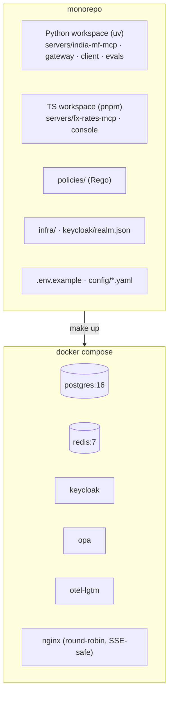
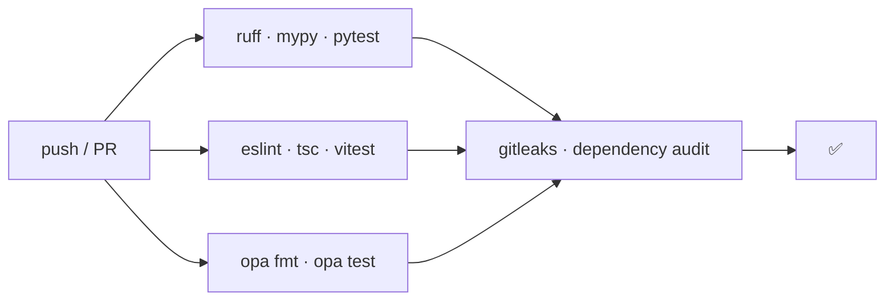

# F0: Project Foundation

| Milestone | Priority | Depends on | Effort | Unblocks |
|---|---|---|---|---|
| M1 | Must | — | 4 h | Everything |

**Goal:** A monorepo where `docker compose up` starts Postgres, Redis, Keycloak, OPA, the observability
stack and placeholder services, with CI running lint and tests for both Python and TypeScript.

## Diagram: repository and local stack



## Diagram: CI pipeline (first version)



## Deliverables / files
```
pyproject.toml (uv workspace) · pnpm-workspace.yaml
docker-compose.yml · nginx/nginx.conf (proxy_buffering off for SSE)
Makefile                        # up, down, test, lint, migrate, seed
.env.example
servers/india-mf-mcp/ · servers/fx-rates-mcp/ · gateway/ · client/ · console/ · evals/ · policies/
migrations/ (Alembic)           # schemas: mf, gateway, audit
.github/workflows/ci.yml
libs/telemetry/                 # shared OTel setup (Python)
```

## Tasks
- [ ] uv workspace (Python 3.12) and pnpm workspace (Node 24)
- [ ] Compose services with health checks; nginx with `proxy_buffering off` so streamed responses aren't held back
- [ ] Alembic with three schemas: `mf`, `gateway`, `audit`; separate DB roles per service
- [ ] Shared telemetry helper: OTel traces + metrics to the collector in `otel-lgtm`
- [ ] CI: lint, types, tests, `opa test`, secret scanning (gitleaks)
- [ ] **Spikes (1 hour total):** confirm FastMCP 4 and the TS SDK v2 install and run a hello-world tool on protocol 2026-07-28

## Acceptance criteria
- `make up` → all containers healthy; Grafana shows a test trace
- CI is green on an empty PR
- Spike results written in `docs/notes/spikes.md`

## Tests
- A smoke test that connects to Postgres, Redis and OPA from a test container

**Interview talking point:** *"From day one the local stack runs the same shape as production: two
gateway replicas behind a plain round-robin proxy, so I couldn't accidentally rely on session state."*
