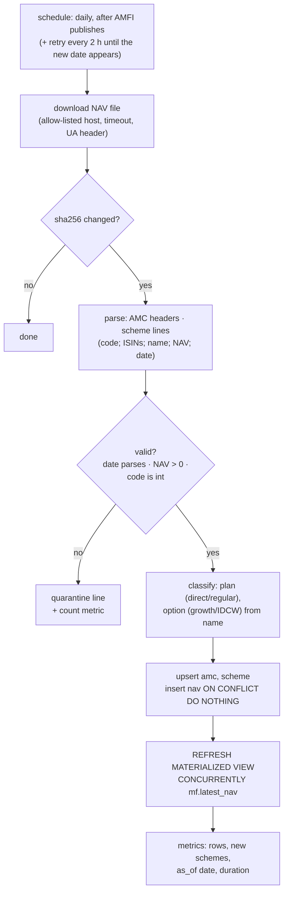
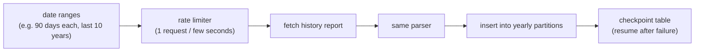

# F1: AMFI Ingestion

| Milestone | Priority | Depends on | Effort | Unblocks |
|---|---|---|---|---|
| M1 | Must | F0 | 5 h | F2 |

**Goal:** Load every Indian mutual-fund scheme and its NAV history into Postgres, then keep it updated
daily, idempotently, without calling AMFI during tool calls.

## Diagram: daily job



## Diagram: history backfill



## Deliverables / files
```
servers/india-mf-mcp/src/india_mf/ingest/fetch.py      # allow-listed HTTP fetch
servers/india-mf-mcp/src/india_mf/ingest/parse.py      # pure parser
servers/india-mf-mcp/src/india_mf/ingest/classify.py   # plan/option from scheme name
servers/india-mf-mcp/src/india_mf/ingest/load.py       # upserts, partitions, view refresh
servers/india-mf-mcp/src/india_mf/ingest/backfill.py   # checkpointed history
migrations/versions/0002_mf_schema.py                  # tables, partitions, pg_trgm, latest_nav
```

## Tasks
- [ ] **Check AMFI's terms of use** for storing and redistributing NAV data; record the result in ADR-001
- [ ] Parser for the daily file format (pure function; fixtures from real files)
- [ ] Plan/option classification with a test table of tricky names
- [ ] Yearly partitions created by migration and by a yearly job
- [ ] Backfill with checkpoints and polite rate limiting
- [ ] CLI: `india-mf ingest daily`, `india-mf ingest backfill --years 10`
- [ ] Freshness metric: `mf_latest_nav_age_days`

## Acceptance criteria
- Running the daily job twice makes no changes the second time
- A malformed line is quarantined and counted, not fatal
- ~10 years of history loaded; `latest_nav` has one row per active scheme

## Tests
- Unit: parser on real and malformed fixtures; classification table
- Property (hypothesis): parse → serialise → parse is stable for valid lines
- Integration: load into a testcontainers Postgres; partition routing works

**Interview talking point:** *"Tools never hit AMFI directly. Ingestion is a separate, idempotent job,
so tool latency and availability don't depend on a third-party website."*
