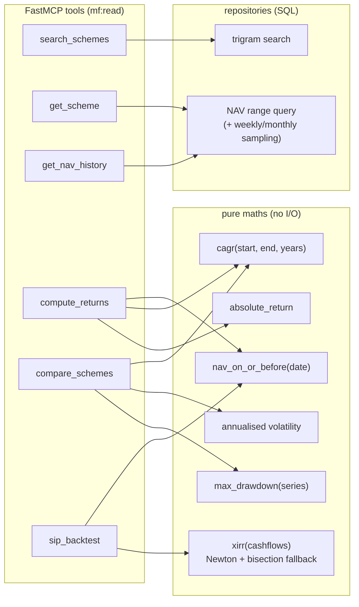
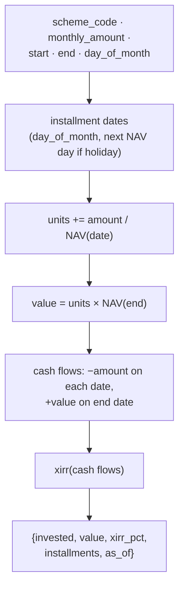

# F2: MF Read Tools & Maths

| Milestone | Priority | Depends on | Effort | Unblocks |
|---|---|---|---|---|
| M1 | Must | F1 | 7 h | F3, F5, F15 |

**Goal:** Six read tools with typed input **and output** schemas, correct financial maths, and
descriptions written for models (what, when, when not, units, example).

## Diagram: tools and the code behind them



## Diagram: SIP back-test



## Deliverables / files
```
servers/india-mf-mcp/src/india_mf/maths/returns.py     # cagr, absolute, drawdown, volatility (pure)
servers/india-mf-mcp/src/india_mf/maths/xirr.py        # pure, robust solver
servers/india-mf-mcp/src/india_mf/repo/schemes.py      # search, details
servers/india-mf-mcp/src/india_mf/repo/nav.py          # ranges, sampling, nav_on_or_before
servers/india-mf-mcp/src/india_mf/tools/read.py        # FastMCP tool definitions
servers/india-mf-mcp/src/india_mf/server.py            # server instructions ("data, not advice")
```

## Tasks
- [ ] Pure maths with thorough tests (holidays, missing NAVs, short histories)
- [ ] Output models (Pydantic) → `outputSchema`; return `structuredContent` plus a short text summary
- [ ] Descriptions following the style guide in [03 §3.2](../03-low-level-design.md); annotations (`readOnlyHint`, etc.)
- [ ] `as_of` and `source: "AMFI"` in every result
- [ ] Result limits: max 20 search results, max 500 history points (with `truncated`)
- [ ] Tool errors as `isError` results with helpful messages ("scheme 123 not found; use search_schemes")

## Acceptance criteria
- Returns and XIRR match a spreadsheet calculation on 5 hand-checked examples
- Every tool validates in MCP Inspector with its output schema
- p95 ≤ 300 ms for read tools on the full dataset

## Tests
- Property (hypothesis): XIRR of a constant-growth series equals the growth rate; CAGR round-trips
- Unit: each tool with a fake repository
- Integration: tools against the real schema with seeded data

**Interview talking point:** *"The maths is pure and property-tested, and every tool returns typed
structured content. Later I measured how much those output schemas actually help models (T5 in the
evals)."*
