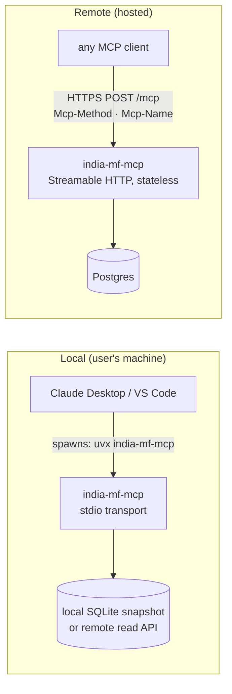
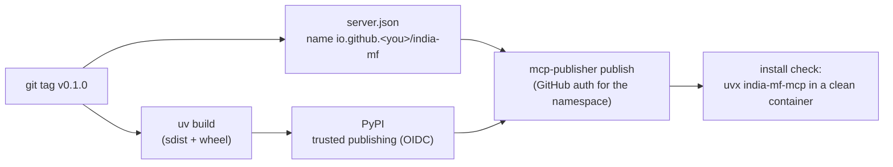

# F3: Transports & Release v0.1

| Milestone | Priority | Depends on | Effort | Unblocks |
|---|---|---|---|---|
| M1 | Must | F2 | 4 h | F6, F8, public users |

**Goal:** Run india-mf-mcp over **stdio** (local) and **Streamable HTTP** (remote) on protocol
2026-07-28 with version negotiation, then publish **v0.1** to PyPI and the official MCP Registry.

## Diagram: two ways to run the same server



**Local data:** the stdio package can't expect users to run Postgres. Two options, decided in this
feature: ship a small **SQLite snapshot** (latest NAVs + limited history, downloaded on first run), or let
the local server call the hosted endpoint for data. The SQLite snapshot is preferred: it works offline and
needs no account.

## Diagram: release pipeline



## Deliverables / files
```
servers/india-mf-mcp/src/india_mf/__main__.py     # --transport stdio|http, --data sqlite|postgres
servers/india-mf-mcp/src/india_mf/snapshot.py     # build + download SQLite snapshot
servers/india-mf-mcp/server.json                  # MCP Registry metadata
servers/india-mf-mcp/README.md                    # install for Claude Desktop, VS Code, Claude Code
.github/workflows/release-india-mf.yml
```

## Tasks
- [ ] stdio and Streamable HTTP entry points; `server/discover` metadata (name, version, instructions)
- [ ] Version negotiation: verify an older-protocol client still works
- [ ] Local HTTP mode binds to `127.0.0.1` and checks `Origin` (DNS-rebinding defence)
- [ ] SQLite snapshot build (CI artifact) and first-run download with checksum
- [ ] PyPI trusted publishing; `server.json`; publish to the MCP Registry
- [ ] README with copy-paste config for Claude Desktop, VS Code and Claude Code

## Acceptance criteria
- Fresh machine: one config snippet → the tools appear in Claude Desktop
- MCP Inspector passes on both transports
- The package and registry entry are live; the install check job passes

## Tests
- Contract: `server/discover`, `tools/list`, `tools/call` over both transports
- Unit: Origin check rejects foreign origins
- CI: install from PyPI in a clean container and call one tool

**Interview talking point:** *"The server was public and installable in week 2. Everything after that
(auth, gateway, evals) was built around a real, published artifact."*
