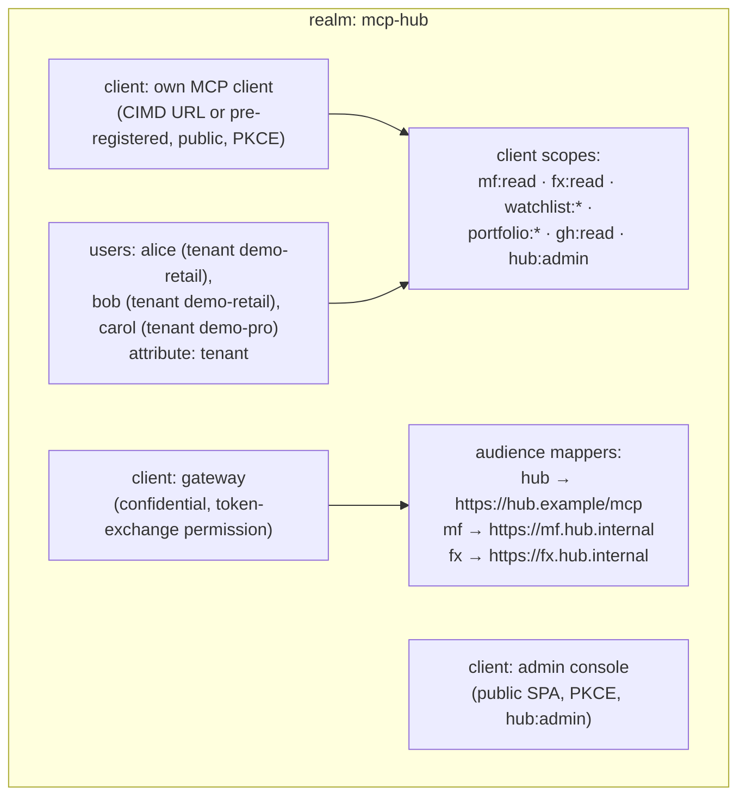
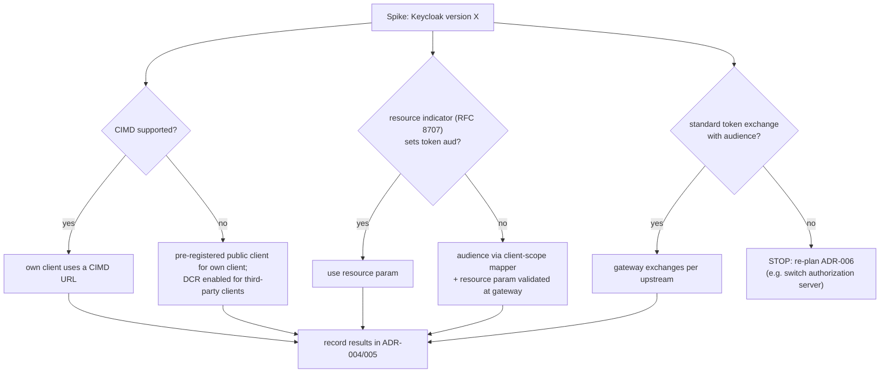

# F4: Keycloak Realm & OAuth Setup

| Milestone | Priority | Depends on | Effort | Unblocks |
|---|---|---|---|---|
| M2 | Must | F0 | 5 h | F5, F6, F7, F13 |

**Goal:** A reproducible Keycloak realm (exported as JSON) with users, tenants, scopes, audiences and
token exchange, plus a verified answer to "which OAuth features does this Keycloak version support?"

## Diagram: realm layout



## Diagram: verification spike (first 2 hours)



## Deliverables / files
```
infra/keycloak/realm-mcp-hub.json      # exported realm (no secrets; secrets via env)
infra/keycloak/README.md               # how to change and re-export
docs/notes/oauth-spike.md              # what this Keycloak version supports, with evidence
scripts/get_token.py                   # dev helper: auth code + PKCE in a browser
```

## Tasks
- [ ] **Spike** the three questions above and record the answers
- [ ] Realm: users with a `tenant` attribute (mapped into tokens), scopes, clients, audience mappers
- [ ] Token lifetimes: access 10 min, refresh 8 h (demo values)
- [ ] Token-exchange permission only for the gateway client, only to the upstream audiences
- [ ] Issuer consistency: the same `iss` from inside Docker and from the host (set Keycloak's hostname explicitly)
- [ ] Realm import on `docker compose up`

## Acceptance criteria
- `scripts/get_token.py` yields a token with the right `aud`, `scope` and `tenant` claim
- The gateway client can exchange a user token for an `mf` token (`sub` = user); no other client can
- The spike note answers all three questions with evidence (request/response examples)

## Tests
- Integration (testcontainers Keycloak): token contents, token-exchange allowed/denied cases

**Interview talking point:** *"Before designing around CIMD and token exchange, I spent two hours proving
what my authorization server actually supports, and wrote the fallbacks into the ADRs."*
