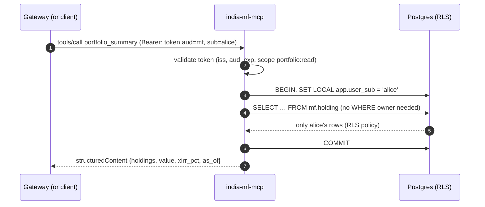
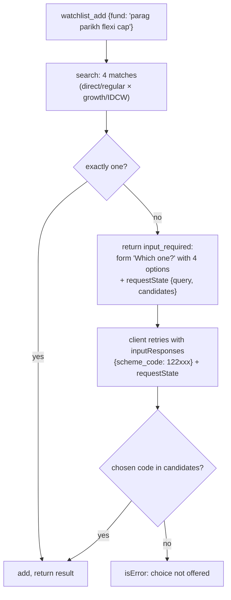

# F5: User Tools, Row-Level Security & Interactive Tools

| Milestone | Priority | Depends on | Effort | Unblocks |
|---|---|---|---|---|
| M2 | Must | F2, F4 | 6 h | F11, F17 |

**Goal:** Watchlist and portfolio tools that are **per user**, protected by token validation in the server
**and** Postgres row-level security, plus interactive tools that use multi round-trip requests for
disambiguation and missing fields.

## Diagram: one user tool call inside the server



## Diagram: disambiguation with `input_required`



## Deliverables / files
```
servers/india-mf-mcp/src/india_mf/auth.py            # token validation (PyJWT + JWKS cache)
servers/india-mf-mcp/src/india_mf/tools/user.py      # watchlist_*, portfolio_*
servers/india-mf-mcp/src/india_mf/tools/interactive.py
migrations/versions/0003_user_tables_rls.py          # tables + RLS policies + roles
```

## Tasks
- [ ] Token validation middleware for the HTTP transport; scopes checked per tool
- [ ] Anonymous mode on the public endpoint: only `mf:read` tools, strict IP rate limit
- [ ] User tables with RLS; `SET LOCAL app.user_sub` per transaction; app role without `BYPASSRLS`
- [ ] Interactive tools with FastMCP's input-required support: scheme disambiguation, missing `units`
- [ ] Server-side check that a retried answer is one of the offered choices
- [ ] Destructive tools marked with `destructiveHint` (the gateway adds confirmations in F11)

## Acceptance criteria
- Alice can't read or delete Bob's holdings, even with a hand-crafted request that skips the gateway
- A disambiguation round trip works in MCP Inspector and in at least one third-party client
- Missing scope → a clear `insufficient_scope` response

## Tests
- Integration: RLS denies cross-user reads/deletes **even with a buggy query** (test deliberately omits the owner filter)
- Contract: `input_required` shape, retry with valid and invalid choices
- Unit: scope mapping per tool

**Interview talking point:** *"Per-user isolation is enforced twice: by the user in the token and by
Postgres row-level security. A bug in one tool's query still can't leak another user's portfolio."*
