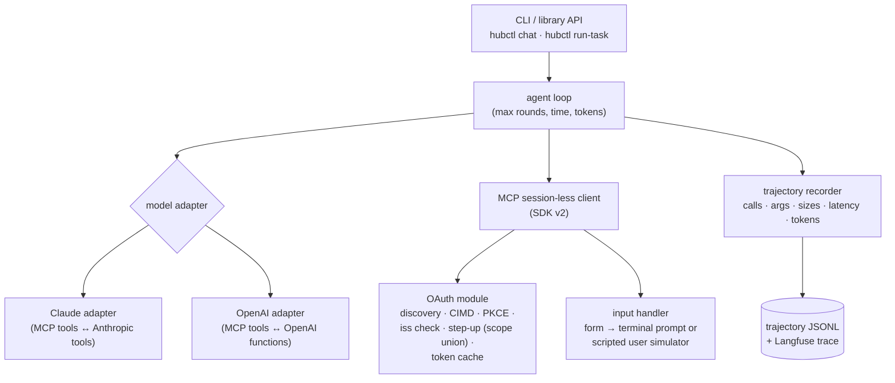
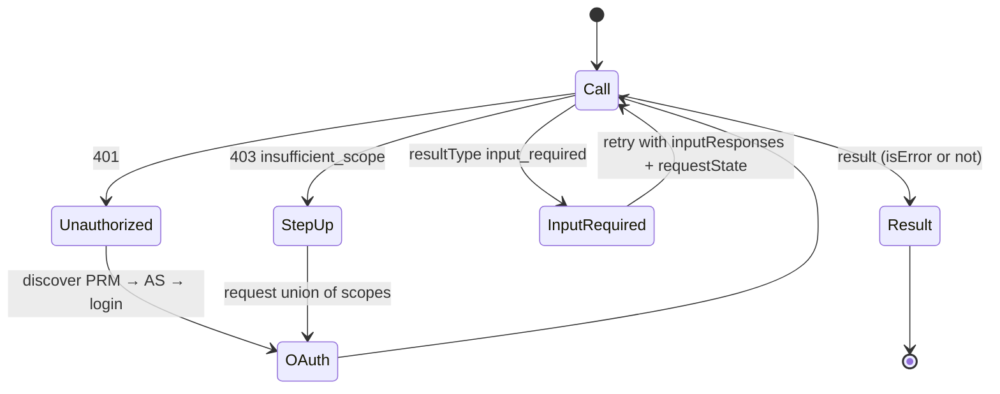

# F6: Own MCP Client (OAuth, MRTR, trajectories)

| Milestone | Priority | Depends on | Effort | Unblocks |
|---|---|---|---|---|
| M2 | Must | F3, F4 | 7 h | F17, F18 |

**Goal:** A small client with no agent framework: a tool-calling loop for **Claude and OpenAI** models,
full OAuth (discovery, CIMD, PKCE, `iss` check, step-up), `input_required` handling, and a recorded
**trajectory** for evals.

## Diagram: client components



## Diagram: handling responses from the hub



## Deliverables / files
```
client/src/hubclient/oauth.py         # discovery, CIMD, PKCE, iss validation, step-up, token cache
client/src/hubclient/mcp.py           # thin wrapper over the SDK client
client/src/hubclient/adapters/claude.py, openai.py
client/src/hubclient/loop.py          # tool-calling loop, budgets, parallel calls
client/src/hubclient/inputs.py        # terminal forms + scripted simulator
client/src/hubclient/trajectory.py    # reuses Project 1 F19 record format
client/cimd/client-metadata.json      # hosted CIMD document (GitHub Pages or the hub)
configs/models.yaml                   # model aliases per family
```

## Tasks
- [ ] OAuth: use the SDK's OAuth helpers where they fit; implement missing pieces (CIMD client ID, `iss` check, scope union)
- [ ] Host the CIMD document at a stable HTTPS URL
- [ ] Adapters: tool schema translation; tool-name constraints (`[a-zA-Z0-9_-]` for OpenAI)
- [ ] Parallel tool calls when the model asks for several
- [ ] `input_required`: interactive terminal mode and scripted simulator mode (for evals)
- [ ] Budgets: 10 rounds, 60 s, token cap; clean stop with a partial answer
- [ ] Trajectory + Langfuse trace per task

## Acceptance criteria
- `hubctl chat` against india-mf-mcp (direct, before the gateway exists) completes login and a multi-step task
- Step-up works: a read-only token gets upgraded when a write tool is called
- The same task runs with a Claude model and an OpenAI model from one config switch

## Tests
- Unit: PKCE, `iss` mismatch rejected, scope union, schema translation for both APIs
- Integration: full OAuth flow against Keycloak in Docker (browser step automated with Playwright)
- Scripted fake LLM that emits fixed tool calls, to test the loop without API costs

**Interview talking point:** *"I wrote the client without a framework, so I know exactly what happens on a
401, a 403 step-up, or an input-required retry, and the same loop drives my evals for two model
families."*
