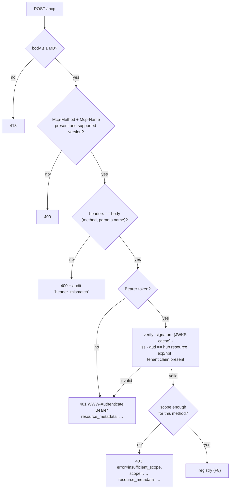
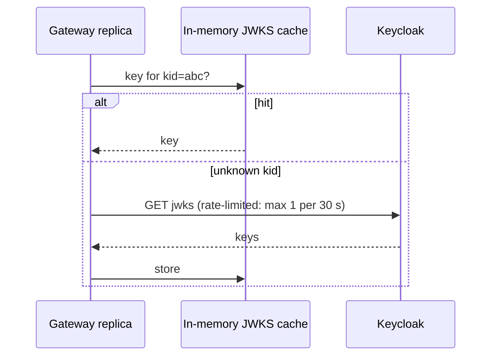

# F7: Gateway Edge & Authentication

| Milestone | Priority | Depends on | Effort | Unblocks |
|---|---|---|---|---|
| M3 | Must | F4 | 5 h | F8 and all later gateway features |

**Goal:** The gateway's front door: a Streamable HTTP `/mcp` endpoint on protocol 2026-07-28, header
checks, Protected Resource Metadata, JWT validation and correct `401` / `403` challenges, running as
**two replicas** behind nginx.

## Diagram: edge + authn pipeline



## Diagram: JWKS cache behaviour



## Deliverables / files
```
gateway/src/mcphub/app.py              # Starlette app, routes, lifespan
gateway/src/mcphub/edge.py             # size, headers, version, header/body match
gateway/src/mcphub/authn.py            # PyJWT validation, JWKS cache, challenges
gateway/src/mcphub/prm.py              # /.well-known/oauth-protected-resource
gateway/src/mcphub/discover.py         # server/discover response (hub identity)
evals/security/gateway_cases/edge_authn.yaml   # attack cases added with this feature
```

## Tasks
- [ ] Starlette app on the MCP SDK v2 low-level server; `server/discover` for the hub
- [ ] Header checks and header/body match
- [ ] PRM document; `401` and `403 insufficient_scope` challenges in the spec's format
- [ ] JWT validation with a 60 s clock-skew leeway; tenant claim required
- [ ] Two replicas behind nginx in compose from this feature on
- [ ] **Attack cases:** missing token, wrong audience, expired, wrong issuer, header smuggling, oversized body

## Acceptance criteria
- A third-party client discovers the authorization server from the `401` alone
- A token for another audience (e.g. the `mf` token) is rejected by the gateway
- All edge/authn attack cases pass; overhead of these stages < 3 ms p95

## Tests
- Unit: header/body matching table, challenge header formatting
- Integration: real Keycloak tokens; JWKS rotation (new key mid-test)

**Interview talking point:** *"The gateway checks that the routing headers match the JSON body before
anything else. Otherwise a request could be rate-limited or routed as a harmless read while the body calls
a write tool."*
