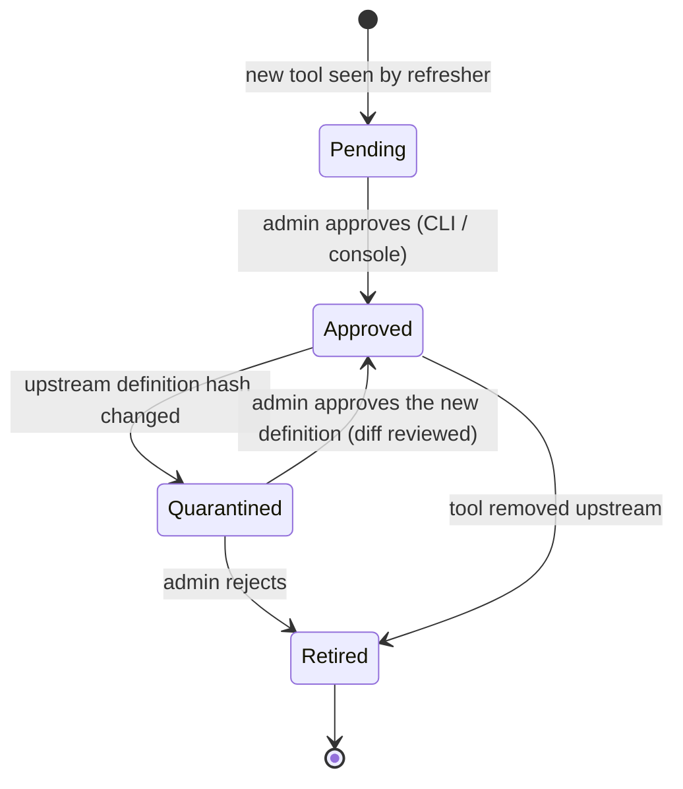
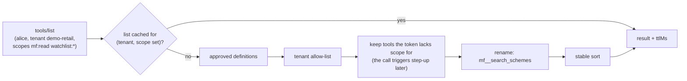

# F8: Registry, Aggregation & Definition Pinning

| Milestone | Priority | Depends on | Effort | Unblocks |
|---|---|---|---|---|
| M3 | Must | F7, F3 | 6 h | F9, F10, F13, F14 |

**Goal:** Know every upstream tool, expose only **approved** definitions under **namespaced** names,
filter the list per caller, and **quarantine** any definition that changes after approval.

## Diagram: registry refresher and tool lifecycle



## Diagram: `tools/list` for one caller



Tools the tenant doesn't allow are **hidden**. Tools the tenant allows but the current token lacks scope
for are **shown**, so the model can call them and trigger step-up.

## Deliverables / files
```
gateway/src/mcphub/registry/upstreams.py   # load config/upstreams.yaml
gateway/src/mcphub/registry/refresher.py   # background poll, respecting cache hints
gateway/src/mcphub/registry/canonical.py   # canonical JSON + sha256 (pure)
gateway/src/mcphub/registry/store.py       # tool_definition table, status transitions
gateway/src/mcphub/registry/listing.py     # filtered, namespaced, cached tools/list
gateway/src/mcphub/cli.py                  # hubctl tools list|diff|approve|reject (console comes in F14)
migrations/versions/0004_gateway_registry.py
```

## Tasks
- [ ] Canonical JSON (sorted keys, normalised whitespace) → sha256; hash covers name, title, description, schemas, annotations
- [ ] Refresher with leader election (Postgres advisory lock) so only one replica writes
- [ ] Status transitions + admin notifications (log + metric `hub_quarantined_tools`)
- [ ] Namespacing and collision detection (two servers can't claim the same exposed name)
- [ ] Filtered list cache keyed by (tenant, scope set, registry version)
- [ ] CLI approvals with a readable diff
- [ ] **Attack cases:** rug pull (definition change), shadowing (duplicate name), unapproved tool call

## Acceptance criteria
- Changing a description in india-mf-mcp makes that tool disappear from `tools/list` within one refresh interval, with a diff available
- Alice and Carol (different tenants) see different tool lists
- Calling an unapproved or hidden tool returns "not found" (no hint that it exists)

## Tests
- Unit (hypothesis): canonical hash ignores key order and whitespace, changes on any content change
- Integration: refresher + two replicas + advisory lock

**Interview talking point:** *"Tool definitions are pinned by hash. If an upstream quietly edits a
description, which is exactly what a rug-pull attack does, the tool is quarantined until someone reviews
the diff."*
