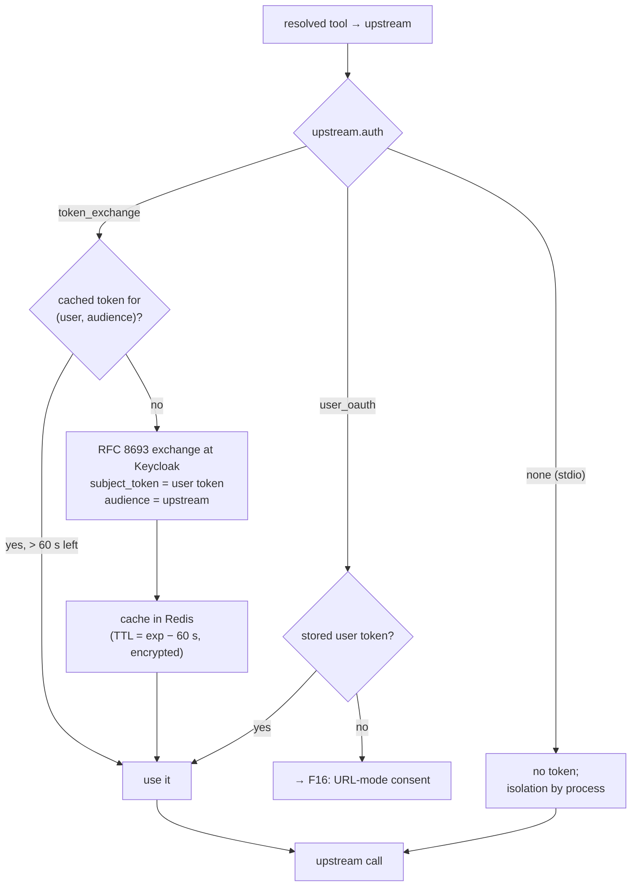
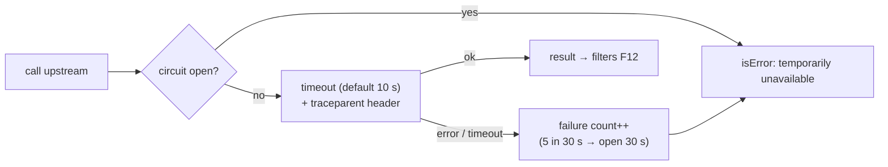

# F9: Routing, Token Exchange & stdio Bridge

| Milestone | Priority | Depends on | Effort | Unblocks |
|---|---|---|---|---|
| M3 | Must | F8 | 6 h | F12, F16, F17 |

**Goal:** Forward each allowed call to the right upstream with the **right credential**: an exchanged,
audience-restricted token (never the client's token), a stored per-user token, or none for a local stdio
server. Protect the gateway from slow or failing upstreams.

## Diagram: credential selection



## Diagram: upstream call protection



## Deliverables / files
```
gateway/src/mcphub/upstream/pool.py        # SDK clients per upstream, connection reuse
gateway/src/mcphub/upstream/breaker.py     # circuit breaker (pure state machine)
gateway/src/mcphub/upstream/stdio.py       # subprocess bridge, restart policy, resource limits
gateway/src/mcphub/credentials/exchange.py # token exchange + Redis cache
gateway/src/mcphub/credentials/vault.py    # envelope encryption for stored tokens
gateway/src/mcphub/router.py               # tools/call path: name → upstream → credential → call
```

## Tasks
- [ ] Router: exposed name → upstream name; pass `_meta` and trace context
- [ ] Token exchange with caching; never forward the client's `Authorization` header (test enforces it)
- [ ] Envelope encryption helper (used for cached and stored tokens)
- [ ] stdio bridge: run the reference `time` server as a subprocess with CPU/memory limits and restart on crash
- [ ] Circuit breaker + per-upstream timeouts; `isError` results on failure
- [ ] **Attack cases:** token passthrough check (upstream sees only exchanged token), replaying a gateway token at an upstream, wrong-audience token at an upstream

## Acceptance criteria
- india-mf-mcp receives tokens with `aud = mf` and `sub = alice`, never the hub token
- Killing an upstream makes only its tools fail; others keep working
- The stdio server's tools work through the gateway like any remote tool

## Tests
- Unit: breaker state machine; credential selection table
- Integration: exchange against Keycloak; stdio bridge restart; header inspection at a test upstream

**Interview talking point:** *"The gateway never forwards the client's token. It exchanges it for a token
scoped to one upstream that still names the user, so upstreams can authorize per user and the audit trail
stays intact."*
