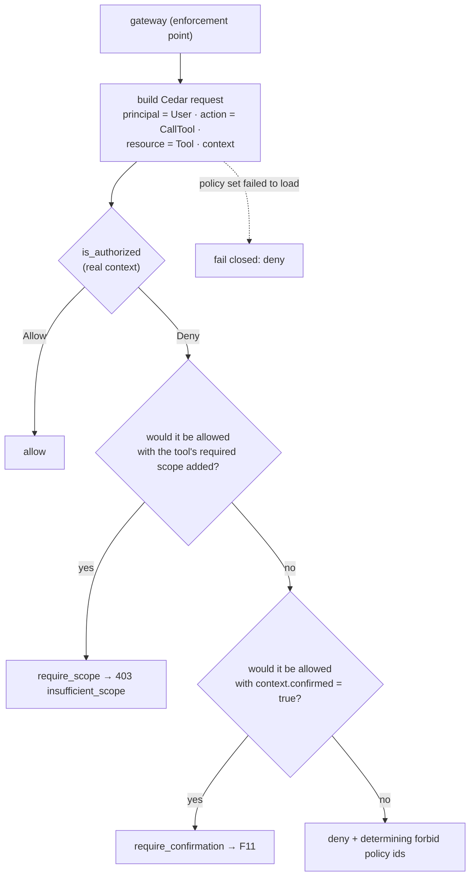
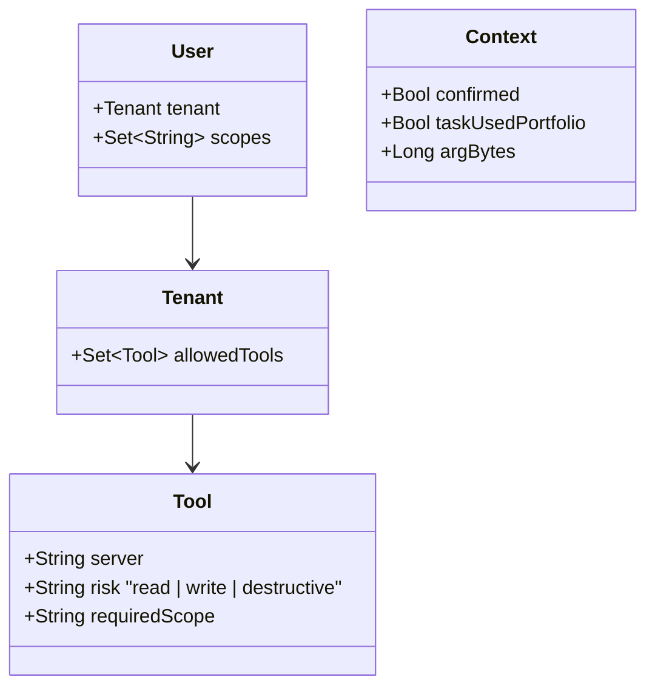

# F10: Policy Engine (Cedar)

| Milestone | Priority | Depends on | Effort | Unblocks |
|---|---|---|---|---|
| M3 | Must | F8 | 4 h | F11, F12 |

**Goal:** Every `tools/call` gets a decision (**allow / deny / require_confirmation / require_scope**) from
**Cedar** policies evaluated **in-process**, based on tenant, user, scopes, tool risk and request context.
Policies are versioned, schema-validated and tested separately from the gateway code, and a key safety
property is **checked exhaustively**: no destructive tool is ever permitted without confirmation.

> **Why Cedar, not OPA:** changed after the [market review](../12-market-alignment-review.md). AWS built
> AgentCore Policy, its MCP gateway policy layer, on Cedar; Cedar is purpose-built for authorization, needs no
> sidecar, and its schema and analysis tooling let you prove properties of policies. OPA/Rego remains the
> documented alternative (ADR-010).

## Diagram: decision flow



Cedar only answers Allow or Deny. The gateway turns that into four outcomes by asking two **"what if"**
questions, which is deterministic and keeps all rules in the policy files.

## Diagram: schema and policy files



```
policies/
├── schema.cedarschema        # entity types above + actions CallTool, ListTools
├── tools.cedar               # permit rules (read/write; destructive only when confirmed)
├── flows.cedar               # forbid: portfolio data → third-party servers in the same task
├── limits.cedar              # forbid: oversized arguments
└── tests/                    # request → expected decision cases (pytest + cedarpy)
```

**Example policies (abridged)**
```cedar
@id("allow-non-destructive")
permit (principal, action == Action::"CallTool", resource)
when {
  principal.tenant.allowedTools.contains(resource) &&
  principal.scopes.contains(resource.requiredScope) &&
  resource.risk != "destructive"
};

@id("allow-destructive-when-confirmed")
permit (principal, action == Action::"CallTool", resource)
when {
  principal.tenant.allowedTools.contains(resource) &&
  principal.scopes.contains(resource.requiredScope) &&
  resource.risk == "destructive" &&
  context.confirmed
};

@id("no-portfolio-data-to-third-party")
forbid (principal, action == Action::"CallTool", resource)
when { context.taskUsedPortfolio && resource.server == "gh" };

@id("argument-size-limit")
forbid (principal, action == Action::"CallTool", resource)
when { context.argBytes > 16384 };
```
Anything not permitted is denied by default, and a `forbid` always wins over a `permit`.

## Deliverables / files
```
policies/*.cedar, policies/schema.cedarschema, policies/tests/*.yaml
gateway/src/mcphub/policy/entities.py   # builds User/Tenant/Tool entities from registry + tenants.json
gateway/src/mcphub/policy/engine.py     # cedarpy evaluation, what-if logic, decision cache, fail-closed
gateway/src/mcphub/policy/context.py    # context from request (arg size, task flags), no raw argument values
tests/policy/test_exhaustive.py         # property check over every tool × risk × scope × confirmed combination
.github/workflows/ci.yml                # + cedar validate (schema) + policy tests
```

## Tasks
- [ ] Schema + `cedar validate` in CI (every policy must type-check against the schema)
- [ ] Entities from the registry (tools, risk, required scope) and `tenants.json` (allow-lists); reload on change without redeploy
- [ ] Context built from **summaries**, not raw argument values (sizes, flags), so policies never see PII
- [ ] What-if evaluation for `require_scope` and `require_confirmation`; decision cache (30 s) keyed by the full request
- [ ] Policy-set version (hash of the files) written into every audit event
- [ ] **Exhaustive property test:** for every tool, scope set and tenant, `destructive ∧ ¬confirmed ⇒ Deny` (the domain is small enough to enumerate); optionally confirm with Cedar's analysis tooling
- [ ] **Attack cases:** scope escalation, IDOR-style argument, disallowed tool for tenant, portfolio → `gh__*` flow, policy set failing to load

## Acceptance criteria
- Schema validation and all policy tests pass in CI; the exhaustive property test covers 100% of combinations
- Changing `tenants.json` changes decisions without a gateway redeploy
- Policy evaluation adds < 1 ms p95 (in-process); a broken policy set fails closed with a clear reason

## Tests
- Policy unit tests (request → decision); gateway integration tests with real policies and entities

**Interview talking point:** *"The gateway enforces, Cedar decides, the same split AWS uses in AgentCore.
Because the policy domain is small, I check exhaustively that no destructive tool can ever be permitted
without a human confirmation, instead of hoping my tests covered it."*
